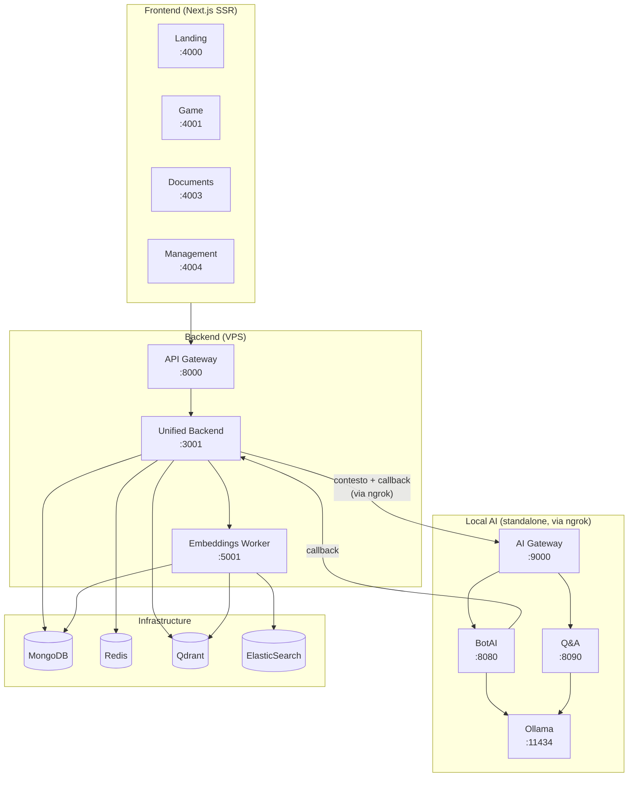

# TenPennyNovels

**Victorian London RPG by Chat Platform**
*Experience immersive roleplay in Victorian London using Call of Cthulhu Rules*

TenPennyNovels is a web-based RPG platform that brings Victorian London to life through real-time chat gameplay, character management, and collaborative storytelling.

## Features

- **Authentic Victorian Experience**: Play in historically accurate 1890s London
- **Call of Cthulhu System**: Full character creation with Victorian-era occupations
- **Real-time Gameplay**: WebSocket-powered chat with dice rolling and character interactions
- **Multiple Gaming Modes**:
  - Location-based in-character chat
  - Victorian postal system for messages
  - Out-of-character chat for players
- **AI-powered NPC Bots**: Intelligent NPCs driven by local Ollama models (zero API costs)
- **Rich Document System**: Setting guides, rules, and historical information with semantic search and AI-powered Q&A
- **Community Forum**: Discuss storylines and coordinate with other players
- **Character Management**: Create, develop, and track your Victorian character
- **Admin Tools**: Comprehensive management interface for game masters

## Technology Stack

- **Frontend**: Next.js 15, React, TypeScript, SCSS Modules
- **Backend**: Node.js 22, Express, TypeScript (unified backend)
- **Real-time**: Socket.IO for WebSocket connections
- **Database**: MongoDB 7 with Mongoose ODM
- **Cache/Pub-Sub**: Redis 7 for sessions, caching, and real-time events
- **Search**: Qdrant (vector DB) + ElasticSearch (full-text) for hybrid semantic search
- **ML**: Python sentence-transformers for document embeddings
- **AI**: Ollama (local LLM inference) via piattaforma Local AI indipendente
- **Authentication**: Custom JWT with HttpOnly cookies

## Architecture

### Overview

The platform consists of 4 frontend applications, 3 backend services, and an independent local AI platform.



**Frontend Applications:**

| App | Port | Domain (prod) | Description |
|-----|------|---------------|-------------|
| Landing | 4000 | tenpennynovels.com | Authentication and character selection |
| Game | 4001 | game.tenpennynovels.com | Main gameplay interface with real-time chat, forum |
| Documents | 4003 | documenti.tenpennynovels.com | Setting guides and rules reference |
| Management | 4004 | gestione.tenpennynovels.com | Game master and admin tools |

**Backend Services (VPS):**

| Service | Port | Description |
|---------|------|-------------|
| API Gateway | 8000 | Centralized routing and proxy to unified-backend |
| Unified Backend | 3001 | All modules: auth, game, admin, documents, tickets, forum, WebSocket |
| Embeddings Worker | 5001 | HTTP API + Python subprocess + Bull queue for semantic embeddings |

**Local AI Platform (macchina locale, esposta via ngrok):**

| Service | Port | Description |
|---------|------|-------------|
| AI Gateway | 9000 | Autenticazione multi-client, routing, rate limiting, validazione |
| BotAI | 8080 | NPC bot responses via Ollama |
| Q&A | 8090 | RAG-based Q&A su documenti di gioco |
| Ollama | 11434 | LLM inference locale (mistral:7b-instruct) |

> La piattaforma Local AI è **completamente indipendente**: non accede al database del gioco, non importa codice dal backend, funziona standalone. Vedi [local-ai/docs/](local-ai/docs/) per la documentazione completa.

## Quick Start

### Prerequisites

- Node.js v22.x (see `.nvmrc`)
- MongoDB 7.x
- Redis 7.x
- Docker (per Local AI e infrastruttura)

### Installation

```bash
# Clone the repository
git clone https://github.com/pagliagen/tenpennynovels.git
cd tenpennynovels

# Install dependencies
npm install

# Configure environment
cp .env.example .env
# Edit .env with your configuration
```

### Start with Docker (recommended)

```bash
# Start all infrastructure + backend services
docker compose up -d

# Verify services are healthy
docker compose ps
```

### Start Local AI (opzionale)

```bash
# Setup e avvio della piattaforma AI locale
cd local-ai
cp .env.example .env
cp clients.json.example clients.json
# Editare clients.json con le API key (vedi local-ai/docs/setup.md)

docker compose up -d
docker compose exec ollama ollama pull mistral:7b-instruct

# Verifica
curl http://localhost:9000/health
```

Per esporre il servizio via ngrok (necessario per l'integrazione con il VPS):

```bash
ngrok start --config ngrok.yml ai-gateway
```

### Start locally (without Docker)

```bash
# Start all backend services
npm run backend:all

# Start all frontend applications (separate terminal)
npm run frontend:all

# Or start everything together
npm run all
```

### Access the Platform

| Service | URL |
|---------|-----|
| Landing/Login | http://localhost:4000 |
| Game Interface | http://localhost:4001 |
| Documents | http://localhost:4003 |
| Management | http://localhost:4004 |
| API Gateway | http://localhost:8000 |
| AI Gateway Health | http://localhost:9000/health |

## Project Structure

```
tenpennynovels/
├── apps/                        # Frontend applications (Next.js)
│   ├── landing/                 # Login and character selection
│   ├── game/                    # Main game interface + forum
│   ├── documents/               # Setting guides and rules
│   └── management/              # Admin/game master interface
│
├── services/                    # Backend services (VPS)
│   ├── api-gateway/             # Centralized routing and proxy
│   ├── unified-backend/         # Main backend (all modules)
│   │   └── src/modules/
│   │       ├── auth/            # Authentication
│   │       ├── game/            # Gameplay logic + WebSocket
│   │       ├── admin/           # Admin panel
│   │       ├── documents/       # Document system
│   │       ├── tickets/         # Support tickets
│   │       └── forum/           # Community forum
│   └── embeddings-worker/       # ML embeddings service
│
├── local-ai/                    # Local AI platform (indipendente)
│   ├── gateway/                 # Multi-client gateway + security
│   ├── services/
│   │   ├── botai/               # NPC bot AI (Ollama)
│   │   ├── qa/                  # RAG Q&A
│   │   ├── item-image-gen/      # Image gen (stub)
│   │   ├── location-image-gen/  # Image gen (stub)
│   │   └── avatar-gen/          # Image gen (stub)
│   ├── shared/                  # Codice condiviso local-ai
│   ├── docs/                    # Documentazione local-ai
│   └── docker-compose.yml       # Stack standalone
│
├── scripts/                     # Seeders and utility scripts
├── deploy/                      # Deployment configs
├── docs/                        # Project documentation
├── _archive/                    # Archived code (reference only)
├── docker-compose.yml           # Docker Compose for local dev
└── ecosystem.config.js          # PM2 config for production
```

## Development

### Available Scripts

```bash
# Individual services
npm run backend:gateway          # API Gateway
npm run backend:unified          # Unified Backend
npm run backend:embeddings       # Embeddings Worker

# Groups
npm run backend:all              # All backends
npm run frontend:all             # All frontends
npm run all                      # Everything

# Local AI
npm run local-ai:start           # Start local AI (Docker)
npm run local-ai:stop            # Stop local AI
npm run local-ai:dev             # Dev mode (Ollama + MongoDB + servizi)
npm run local-ai:logs            # View local AI logs

# Build
npm run build:all                # Build everything for production
npm run build:backend:all        # Build all backends
npm run build:frontend:all       # Build all frontends

# Seeders
npm run seed:users               # Seed default users
npm run seed:documents           # Seed documents
```

### Docker Commands

```bash
# Game stack (VPS)
docker compose up -d             # Start all services
docker compose down              # Stop all services
docker compose ps                # Check status

# Local AI stack (standalone)
cd local-ai
docker compose up -d             # Start AI services
docker compose down              # Stop AI services
docker compose logs -f           # View logs
```

## Production Deployment

**Game Platform** — runs on an OVH VPS with PM2 and Nginx:

| Domain | Service |
|--------|---------|
| tenpennynovels.com | Landing |
| game.tenpennynovels.com | Game |
| documenti.tenpennynovels.com | Documents |
| gestione.tenpennynovels.com | Management |
| api.tenpennynovels.com | API Gateway |
| ws.tenpennynovels.com | WebSocket |

**Local AI** — runs sulla macchina locale, esposto al VPS via ngrok:

| URL | Service |
|-----|---------|
| https://\*.ngrok-free.dev | AI Gateway (porta 9000) |

See [deploy/](deploy/) and [docs/06-operations/deployment-guide.md](docs/06-operations/deployment-guide.md) for game deployment.
See [local-ai/docs/](local-ai/docs/) for Local AI setup and deployment.

## Documentation

- [docs/INDEX.md](docs/INDEX.md) — Complete documentation index
- [docs/00-getting-started/](docs/00-getting-started/) — Tech stack and project structure
- [docs/01-infrastructure/](docs/01-infrastructure/) — Docker, environment variables, MongoDB schemas
- [docs/02-backend/](docs/02-backend/) — Backend architecture and API documentation
- [docs/03-game-systems/](docs/03-game-systems/) — Game mechanics and systems
- [docs/04-ai-ml/](docs/04-ai-ml/) — AI/ML integrations (embeddings, bots, Q&A)
- [docs/06-operations/](docs/06-operations/) — Deployment and operations
- [local-ai/docs/](local-ai/docs/) — Local AI: architettura, sicurezza, API, deployment

## Security

- JWT-based authentication with secure HttpOnly cookies
- Two-tier authorization system (user roles + character gameplay roles)
- Granular admin permissions with per-character overrides
- Rate limiting and input sanitization
- HTTPS enforcement in production
- **AI Gateway**: multi-client API key authentication, optional HMAC signing per-client, per-client rate limiting, Zod payload validation

## License

This project is licensed under the MIT License - see the [LICENSE](LICENSE) file for details.

---

Made with care for Victorian London RPG enthusiasts
