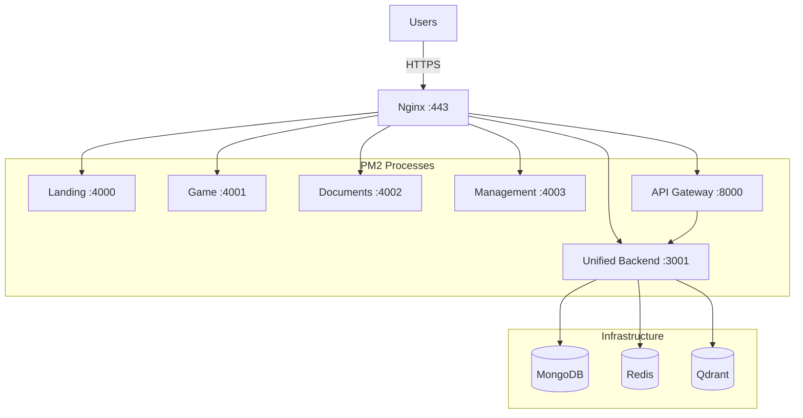

# TenPennyNovels - Deployment

**Last Updated**: 2026-03-15 | **Status**: ✅ Production Ready

Documentazione completa per il deployment di TenPennyNovels su VPS Ubuntu con PM2, Nginx e GitHub Actions.

---

## 🚀 Quick Start

### Setup Nuovo Server da Zero

```bash
# 1. Provisioning VPS Ubuntu 22.04+
# 2. Follow step-by-step: docs/01-ubuntu-from-zero.md
# 3. Configure GitHub Actions: docs/02-github-setup.md
# 4. Deploy automatically via git push to master
```

**Estimated Time**: 2-3 ore primo setup | 15-20 minuti deploy successivi

---

## 📚 Documentation

Vedi [docs/INDEX.md](./docs/INDEX.md) per l'indice completo della documentazione.

### Guide Principali

| # | Document | Description |
|---|----------|-------------|
| [01](./docs/01-ubuntu-from-zero.md) | **Ubuntu Setup da Zero** | VPS provisioning completo |
| [02](./docs/02-github-setup.md) | **GitHub Actions Setup** | CI/CD configuration |
| [05](./docs/05-pm2-configuration.md) | **PM2 Configuration** | Process manager |
| [07](./docs/07-cdn-setup.md) | **CDN Setup** | Image upload + FTP |
| [99](./docs/99-troubleshooting.md) | **Troubleshooting** | Common issues |

---

## 🗂️ Structure

```
deploy/
├── README.md                    # This file
├── docs/                        # Complete documentation
│   ├── INDEX.md                 # Documentation index
│   ├── 01-ubuntu-from-zero.md
│   ├── 02-github-setup.md
│   ├── 05-pm2-configuration.md
│   ├── 07-cdn-setup.md
│   └── 99-troubleshooting.md
├── env-templates/               # .env.production templates
├── nginx-configs/               # Nginx reverse proxy configs
└── scripts/                     # Deployment utility scripts
    ├── install-all.sh
    └── copy-env-files.sh
```

---

## 🏗️ Architecture Overview



### 7 Subdomains

- `tenpennynovels.com` → Landing (4000)
- `game.tenpennynovels.com` → Game (4001)
- `documenti.tenpennynovels.com` → Documents (4002)
- `gestione.tenpennynovels.com` → Management (4003)
- `api.tenpennynovels.com` → API Gateway (8000)
- `ws.tenpennynovels.com` → WebSocket (3001)
- `cdn.tenpennynovels.com` → CDN static files

---

## 🛠️ Common Commands

### Deployment

```bash
# First time setup (sul VPS)
./deploy/scripts/install-all.sh
./deploy/scripts/copy-env-files.sh
# Edit .env.production files with secrets
npm run build:frontend:all
npm run build:backend:all
pm2 startOrRestart ecosystem.config.js --env production
pm2 save
```

### PM2

```bash
pm2 status                      # Status
pm2 logs [name] --lines 50      # Logs
pm2 restart [name]              # Restart
pm2 monit                       # Monitor
```

### Nginx

```bash
sudo nginx -t                   # Test config
sudo systemctl reload nginx     # Reload
sudo tail -f /var/log/nginx/error.log
```

---

## 📊 Requirements

- **OS**: Ubuntu 22.04 LTS
- **CPU**: 4 vCPU
- **RAM**: 8 GB
- **Storage**: 100 GB SSD
- **Node.js**: v22.13.1
- **MongoDB**: 7.0+
- **Redis**: 7.2+
- **Qdrant**: 1.17+

---

## 🔗 Links

- [Full Documentation](./docs/INDEX.md)
- [Project Docs](../docs/INDEX.md)
- [GitHub Workflows](../.github/workflows/)

---

**Made with ❤️ by TenPennyNovels Team**
