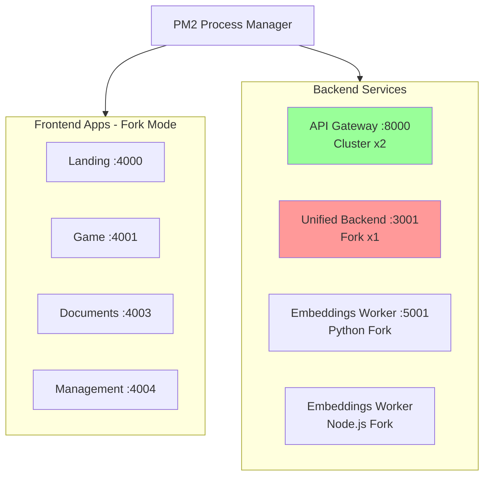
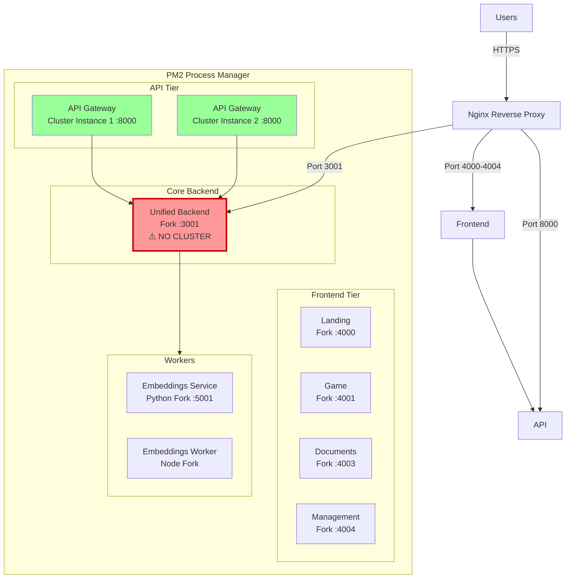

# PM2 Configuration Guide

**Navigation**: [Deploy Hub](./README.md) > PM2 Guide

**Status**: ✅ Production Ready | **Last Updated**: 2026-03-15

Guida completa alla configurazione PM2 per TenPennyNovels in produzione.

---

## Overview

PM2 è il process manager per Node.js che mantiene i servizi attivi 24/7, li riavvia automaticamente in caso di crash, e gestisce il load balancing.



---

## File Configuration: ecosystem.config.js

**Location**: `/Users/gennaropaglia/Documents/SitiPersonali/tenpennynovels/ecosystem.config.js`

**Purpose**: Definisce tutti i processi PM2 con configurazione, porte, mode, risorse.

```javascript
module.exports = {
  apps: [
    // Frontend Applications (4)
    // Backend Services (3)
    // Python Service (1)
  ]
};
```

---

## Processi PM2

### Process 1: Landing App

```javascript
{
  name: 'tenpennynovels-landing',
  cwd: './apps/landing',
  script: 'node_modules/.bin/next',
  args: 'start -p 4000',
  instances: 1,
  exec_mode: 'fork',
  autorestart: true,
  watch: false,
  max_memory_restart: '512M',
  env_production: {
    NODE_ENV: 'production',
    PORT: 4000,
  },
}
```

**Campo per Campo**:

- **name**: `tenpennynovels-landing`
  - Identificatore univoco del processo
  - Usato in comandi PM2: `pm2 restart tenpennynovels-landing`

- **cwd**: `./apps/landing`
  - Working directory (Current Working Directory)
  - Tutti i path relativi partono da qui

- **script**: `node_modules/.bin/next`
  - Binario Next.js da eseguire
  - Path relativo a `cwd`

- **args**: `start -p 4000`
  - Argomenti passati al comando `next`
  - `next start -p 4000` → Avvia Next.js server su porta 4000

- **instances**: `1`
  - Numero di istanze del processo
  - `1` = singola istanza (no load balancing)

- **exec_mode**: `'fork'`
  - Modalità esecuzione: `'fork'` o `'cluster'`
  - **fork**: Single process, no load balancing
  - **cluster**: Multiple processes con load balancing (solo per HTTP servers)

- **autorestart**: `true`
  - Se `true`: PM2 riavvia automaticamente il processo se crasha
  - **CRITICO** per produzione

- **watch**: `false`
  - Se `true`: PM2 riavvia quando rileva modifiche ai file
  - `false` in produzione (hot reload non necessario)

- **max_memory_restart**: `'512M'`
  - Riavvia processo se supera 512 MB di RAM
  - Previene memory leaks

- **env_production**: Variabili d'ambiente
  - `NODE_ENV: 'production'` → Next.js usa build ottimizzato
  - `PORT: 4000` → Porta di ascolto

**Port**: 4000
**URL**: https://tenpennynovels.com (via Nginx reverse proxy)
**Mode**: Fork (Next.js SSR, single instance OK)

---

### Process 2: Game App

```javascript
{
  name: 'tenpennynovels-game',
  cwd: './apps/game',
  script: 'node_modules/.bin/next',
  args: 'start -p 4001',
  instances: 1,
  exec_mode: 'fork',
  autorestart: true,
  watch: false,
  max_memory_restart: '512M',
  env_production: {
    NODE_ENV: 'production',
    PORT: 4001,
  },
}
```

**Identico a Landing** con differenze:
- **name**: `tenpennynovels-game`
- **cwd**: `./apps/game`
- **args**: `start -p 4001`
- **env_production.PORT**: `4001`

**Port**: 4001
**URL**: https://game.tenpennynovels.com (via Nginx reverse proxy)
**Mode**: Fork (Next.js SSR, single instance OK)

---

### Process 3: Documents App

```javascript
{
  name: 'tenpennynovels-documenti',
  cwd: './apps/documents',
  script: 'node_modules/.bin/next',
  args: 'start -p 4003',
  instances: 1,
  exec_mode: 'fork',
  autorestart: true,
  watch: false,
  max_memory_restart: '512M',
  env_production: {
    NODE_ENV: 'production',
    PORT: 4003,
  },
}
```

**Port**: 4003
**URL**: https://documenti.tenpennynovels.com (via Nginx reverse proxy)
**Mode**: Fork (Next.js SSR, single instance OK)

**Note**: Porta 4002 skippata (reserved per future use).

---

### Process 4: Management App

```javascript
{
  name: 'tenpennynovels-gestione',
  cwd: './apps/management',
  script: 'node_modules/.bin/next',
  args: 'start -p 4004',
  instances: 1,
  exec_mode: 'fork',
  autorestart: true,
  watch: false,
  max_memory_restart: '512M',
  env_production: {
    NODE_ENV: 'production',
    PORT: 4004,
  },
}
```

**Port**: 4004
**URL**: https://gestione.tenpennynovels.com (via Nginx reverse proxy)
**Mode**: Fork (Next.js SSR, single instance OK)

---

### Process 5: API Gateway

```javascript
{
  name: 'tenpennynovels-api-gateway',
  cwd: './services/api-gateway',
  script: 'dist/index.js',
  instances: 2,
  exec_mode: 'cluster',
  autorestart: true,
  watch: false,
  max_memory_restart: '512M',
  env_production: {
    NODE_ENV: 'production',
    PORT: 8000,
  },
}
```

**Differenze Chiave**:

- **script**: `dist/index.js`
  - File JavaScript compilato (TypeScript → JavaScript durante build)
  - Path relativo a `cwd`

- **instances**: `2`
  - **2 istanze** del processo API Gateway
  - Load balancing tra le 2 istanze

- **exec_mode**: `'cluster'`
  - **Cluster mode**: PM2 crea 2 processi, distribuisce richieste HTTP tra loro
  - **Zero-downtime reload**: `pm2 reload` riavvia istanze una alla volta

- **max_memory_restart**: `'512M'`
  - Ogni istanza può usare max 512 MB
  - Totale API Gateway: ~1 GB RAM

**Port**: 8000
**URL**: https://api.tenpennynovels.com (via Nginx reverse proxy)
**Mode**: Cluster x2 (load balancing, alta disponibilità)

**Perché Cluster Mode**:
- API Gateway gestisce TUTTE le richieste HTTP da frontend
- Load balancing migliora performance sotto carico
- Se un'istanza crasha, l'altra continua a servire richieste

---

### Process 6: Unified Backend (CRITICAL)

```javascript
{
  // FORK mode required: cluster mode crashes with Redis adapter for Socket.IO
  name: 'tenpennynovels-unified-backend',
  cwd: './services/unified-backend',
  script: 'bootstrap.js',
  instances: 1,
  exec_mode: 'fork',
  autorestart: true,
  watch: false,
  max_memory_restart: '1G',
  env_production: {
    NODE_ENV: 'production',
    PORT: 3001,
  },
}
```

**CRITICO - Perché Fork Mode (NON Cluster)**:

**Problema**: Socket.IO con Redis adapter NON è compatibile con PM2 cluster mode.

**Dettagli Tecnici**:
- unified-backend usa Socket.IO per WebSocket real-time
- Socket.IO usa Redis adapter per sync tra istanze (se cluster)
- PM2 cluster mode + Redis adapter = crash loop infinito

**Soluzione**: **SEMPRE fork mode, 1 istanza**

**Comment nel Codice**:
```javascript
// FORK mode required: cluster mode crashes with Redis adapter for Socket.IO
```

**Differenze Chiave**:

- **script**: `'bootstrap.js'`
  - Nuovo pattern (da commit 9fd9e2b): bootstrap.js registra esplicitamente module-alias prima di caricare server
  - Sostituisce vecchio pattern `node -r module-alias/register dist/server.js`
  - Garantisce risoluzione path (`@config`, `@database`, ecc.) indipendentemente da dove viene eseguito
  - Vedi sezione "Bootstrap.js Architecture" sotto per dettagli

- **instances**: `1`
  - **Single instance** (NON scalabile orizzontalmente)

- **exec_mode**: `'fork'`
  - **Fork mode** (CRITICO per Socket.IO + Redis)

- **max_memory_restart**: `'1G'`
  - Limite memoria più alto (unified-backend è il servizio principale)

**Port**: 3001
**URL**: https://ws.tenpennynovels.com (via Nginx reverse proxy)
**Mode**: Fork x1 (REQUIRED per Socket.IO)

**Scaling Strategy**:
- Unified backend NON può scalare orizzontalmente con PM2 cluster
- Alternativa: Vertical scaling (CPU/RAM più potenti)
- O: Sticky sessions + Redis adapter avanzato (complesso, non implementato)

---

### Bootstrap.js Module Resolution

**Nuovo Pattern** (implementato da commit 9fd9e2b):

`bootstrap.js` è un file di inizializzazione che registra esplicitamente module-alias prima di caricare il server principale.

**File**: `services/unified-backend/bootstrap.js`

```javascript
// Registra module-alias paths PRIMA di caricare il server
require('module-alias/register');

// Ora carica il server con paths risolti
require('./dist/server.js');
```

**Perché il Cambio dal Vecchio Pattern**:

**Vecchio** (OBSOLETO):
```javascript
{
  script: 'dist/server.js',
  args: '-r module-alias/register',  // ❌ Problematico
}
```

**Nuovo** (ATTUALE):
```javascript
{
  script: 'bootstrap.js',  // ✅ Affidabile
  // args non più necessari
}
```

**Vantaggi**:

1. **Maggiore affidabilità**: Registrazione esplicita elimina race conditions
2. **Debuggability**: Errori di risoluzione path più chiari nel stack trace
3. **Compatibilità**: Funziona identicamente in PM2, standalone, e Docker
4. **Semplicità**: Un solo entry point, nessun flag da ricordare

**Path Aliases Risolti**:
- `@config/*` → `dist/config/*`
- `@database/*` → `dist/database/*`
- `@modules/*` → `dist/modules/*`
- `@shared/*` → `dist/shared/*`
- `@` → `dist/`

**Troubleshooting**:

Se vedi errori tipo `Cannot find module '@config/logger'`:
1. Verifica che `bootstrap.js` esista in `services/unified-backend/`
2. Verifica che `package.json` abbia section `_moduleAliases`
3. Verifica che PM2 usi `script: 'bootstrap.js'` (NON `dist/server.js`)

---

### Process 7: Embeddings Worker (Node.js)

```javascript
{
  name: 'tenpennynovels-embeddings-worker',
  cwd: './services/embeddings-worker',
  script: 'dist/index.js',
  instances: 1,
  exec_mode: 'fork',
  autorestart: true,
  watch: false,
  max_memory_restart: '512M',
  env_production: {
    NODE_ENV: 'production',
  },
}
```

**Purpose**: Bull queue worker che processa job di embedding da Redis.

**No PORT**: Worker non è HTTP server, consuma job da Redis queue.

**Mode**: Fork (background worker, no HTTP)

**Note**:
- Lavora in tandem con embeddings-service (Python)
- Node.js worker → chiama Python service → salva risultato

---

## Fork vs Cluster Mode

### Fork Mode

**Caratteristiche**:
- Single process
- No load balancing
- Memoria NON condivisa tra istanze (perché c'è 1 sola istanza)
- Restart sequenziale (downtime durante restart)

**Quando Usare**:
- Next.js SSR apps (OK con 1 istanza per app)
- WebSocket servers (Socket.IO + Redis adapter)
- Background workers (Bull queue)
- Python/Non-Node.js processes

**Processi con Fork Mode**:
- tenpennynovels-landing
- tenpennynovels-game
- tenpennynovels-documenti
- tenpennynovels-gestione
- tenpennynovels-unified-backend (REQUIRED)
- tenpennynovels-embeddings-worker

---

### Cluster Mode

**Caratteristiche**:
- Multiple processes (load balancing)
- PM2 distribuisce richieste HTTP tra istanze
- Zero-downtime reload (riavvia 1 istanza alla volta)
- Usa più CPU cores

**Quando Usare**:
- HTTP REST APIs stateless
- Alto throughput richiesto
- Load balancing necessario

**Processi con Cluster Mode**:
- tenpennynovels-api-gateway (x2 istanze)

**Incompatibilità**:
- ❌ Socket.IO + Redis adapter
- ❌ Background workers con state condiviso
- ❌ Python processes

---

## Memory Limits

| Processo | Limit | Reason |
|----------|-------|--------|
| **Frontend Apps** (4x) | 512 MB | Next.js SSR lightweight |
| **API Gateway** (x2) | 512 MB per istanza | Stateless proxy |
| **Unified Backend** | 1 GB | Main backend, Socket.IO |
| **Embeddings Service** | 2 GB | ML models (sentence-transformers) |
| **Embeddings Worker** | 512 MB | Background queue worker |

**Total RAM Used**: ~4.5 GB (su 8 GB disponibili)

**Overhead**: 3.5 GB per OS, MongoDB, Redis, Qdrant, cache

---

## PM2 Commands

### Avvio e Restart

```bash
# Avvia tutti i processi da ecosystem.config.js
pm2 startOrRestart ecosystem.config.js --env production

# Avvia solo se non esistono, altrimenti restart
# --env production: usa env_production variables

# Restart singolo processo
pm2 restart tenpennynovels-game

# Restart tutti i processi
pm2 restart all

# Reload (zero-downtime, solo cluster mode)
pm2 reload tenpennynovels-api-gateway
```

**Differenza Restart vs Reload**:
- **restart**: Kill processo → start nuovo processo (downtime ~1-2 secondi)
- **reload**: Cluster mode only, riavvia istanze una alla volta (zero downtime)

---

### Stop e Delete

```bash
# Stop processo (rimane nella lista PM2)
pm2 stop tenpennynovels-game

# Stop tutti
pm2 stop all

# Delete processo dalla lista PM2
pm2 delete tenpennynovels-game

# Delete tutti
pm2 delete all
```

**Nota**: `pm2 delete` rimuove processo dalla lista, ma NON elimina file.

---

### Status e Monitoring

```bash
# Status tutti i processi (tabella)
pm2 status

# Status dettagliato singolo processo
pm2 describe tenpennynovels-unified-backend

# Monitoring real-time (CPU, RAM)
pm2 monit

# List processi (formato JSON)
pm2 list --json
```

**Output pm2 status**:
```
┌─────┬───────────────────────────────────┬─────────────┬─────────┬─────────┬──────────┬────────┬──────┬───────────┬──────────┬──────────┬──────────┬──────────┐
│ id  │ name                              │ namespace   │ version │ mode    │ pid      │ uptime │ ↺    │ status    │ cpu      │ mem      │ user     │ watching │
├─────┼───────────────────────────────────┼─────────────┼─────────┼─────────┼──────────┼────────┼──────┼───────────┼──────────┼──────────┼──────────┼──────────┤
│ 0   │ tenpennynovels-landing            │ default     │ 1.0.0   │ fork    │ 12345    │ 2h     │ 0    │ online    │ 0.1%     │ 150.2mb  │ deploy   │ disabled │
│ 1   │ tenpennynovels-game               │ default     │ 1.0.0   │ fork    │ 12346    │ 2h     │ 0    │ online    │ 0.2%     │ 180.5mb  │ deploy   │ disabled │
│ 2   │ tenpennynovels-documenti          │ default     │ 1.0.0   │ fork    │ 12347    │ 2h     │ 0    │ online    │ 0.1%     │ 140.8mb  │ deploy   │ disabled │
│ 3   │ tenpennynovels-gestione           │ default     │ 1.0.0   │ fork    │ 12348    │ 2h     │ 0    │ online    │ 0.1%     │ 160.3mb  │ deploy   │ disabled │
│ 4   │ tenpennynovels-api-gateway        │ default     │ 1.0.0   │ cluster │ 12349    │ 2h     │ 0    │ online    │ 0.3%     │ 220.1mb  │ deploy   │ disabled │
│ 5   │ tenpennynovels-api-gateway        │ default     │ 1.0.0   │ cluster │ 12350    │ 2h     │ 0    │ online    │ 0.3%     │ 215.7mb  │ deploy   │ disabled │
│ 6   │ tenpennynovels-unified-backend    │ default     │ 1.0.0   │ fork    │ 12351    │ 2h     │ 0    │ online    │ 0.5%     │ 450.3mb  │ deploy   │ disabled │
│ 7   │ tenpennynovels-embeddings-worker  │ default     │ 1.0.0   │ fork    │ 12353    │ 2h     │ 0    │ online    │ 0.1%     │ 120.5mb  │ deploy   │ disabled │
└─────┴───────────────────────────────────┴─────────────┴─────────┴─────────┴──────────┴────────┴──────┴───────────┴──────────┴──────────┴──────────┴──────────┘
```

**Colonne**:
- **id**: PM2 process ID (0-8)
- **name**: Nome processo
- **mode**: `fork` o `cluster`
- **pid**: OS process ID
- **uptime**: Tempo online
- **↺**: Numero restart (0 = mai crashato)
- **status**: `online`, `stopped`, `errored`
- **cpu**: % CPU usage
- **mem**: RAM usage

---

### Logs

```bash
# Log real-time tutti i processi
pm2 logs

# Log singolo processo
pm2 logs tenpennynovels-unified-backend

# Log ultimi 50 linee
pm2 logs tenpennynovels-game --lines 50

# Log solo errori
pm2 logs --err

# Flush logs (pulisci file)
pm2 flush
```

**Log Locations**:
- **stdout**: `~/.pm2/logs/tenpennynovels-<nome>-out.log`
- **stderr**: `~/.pm2/logs/tenpennynovels-<nome>-error.log`

---

### Auto-Start al Boot

```bash
# Setup PM2 startup script (esegui UNA VOLTA)
pm2 startup

# Output: comando "sudo env PATH=..." da eseguire
# Copia e incolla il comando suggerito

# Esempio output:
sudo env PATH=$PATH:/home/deploy/.nvm/versions/node/v22.13.1/bin /home/deploy/.nvm/versions/node/v22.13.1/lib/node_modules/pm2/bin/pm2 startup systemd -u deploy --hp /home/deploy

# Esegui il comando suggerito

# Salva processo list corrente (esegui DOPO aver avviato tutti i processi)
pm2 save

# Questo salva lo stato attuale in ~/.pm2/dump.pm2
# Al reboot, PM2 riavvierà automaticamente tutti i processi salvati
```

**Verifica Auto-Start**:
```bash
# Reboot VPS
sudo reboot

# Dopo reboot, riconnettiti
ssh deploy@<IP_VPS>

# Verifica PM2 status (dovrebbe mostrare tutti i processi online)
pm2 status
```

---

### Update Environment Variables

```bash
# Modifica .env.production di un servizio
nano ~/tenpennynovels/services/unified-backend/.env.production

# Restart processo con nuove env vars
pm2 restart tenpennynovels-unified-backend --update-env

# --update-env: ricarica variabili d'ambiente
```

**IMPORTANTE per Frontend Apps**:
- Variabili `NEXT_PUBLIC_*` sono **compilate** durante build
- Modificare `.env.production` richiede **rebuild** + restart:
  ```bash
  cd ~/tenpennynovels/apps/game
  npm run build
  pm2 restart tenpennynovels-game
  ```

---

## Troubleshooting

### Processo "errored"

**Sintomo**: `pm2 status` mostra `status: errored`

**Diagnosi**:
```bash
pm2 logs tenpennynovels-<nome> --lines 100
```

**Cause Comuni**:

1. **Porta già in uso**
   ```bash
   sudo netstat -tulpn | grep <porta>
   # Se vedi altro processo: kill -9 <PID> o cambia porta
   ```

2. **.env.production mancante**
   ```bash
   ls -la ~/tenpennynovels/services/unified-backend/.env.production
   # Se non esiste: copia da template
   ```

3. **MongoDB connection failed**
   ```bash
   # Verifica MongoDB running
   systemctl status mongod

   # Test connessione
   mongosh -u tenpennynovels -p PASSWORD --authenticationDatabase tenpennynovels
   ```

4. **Dipendenza mancante**
   ```bash
   cd ~/tenpennynovels/services/unified-backend
   npm install
   pm2 restart tenpennynovels-unified-backend
   ```

---

### High Restart Count (↺ > 5)

**Sintomo**: Colonna ↺ in `pm2 status` mostra valore > 5

**Cause**:
- Memory leak → processo raggiunge `max_memory_restart`
- Crash loop (bug nel codice)
- Connection failures ripetuti (MongoDB, Redis)

**Diagnosi**:
```bash
# Controlla log per pattern crash
pm2 logs tenpennynovels-<nome> --lines 200 | grep -i error

# Monitora memoria real-time
pm2 monit

# Se memory leak: aumenta max_memory_restart temporaneamente
pm2 restart tenpennynovels-<nome> --max-memory-restart 2G
```

---

### Unified Backend Crash Loop (Cluster Mode Errore)

**Sintomo**: unified-backend crasha immediatamente dopo start

**Causa**: Cluster mode abilitato (incompatibile con Socket.IO + Redis)

**Fix**:
```bash
# Verifica ecosystem.config.js
cat ~/tenpennynovels/ecosystem.config.js | grep -A 10 unified-backend

# Deve avere:
# exec_mode: 'fork'
# instances: 1

# Se ha exec_mode: 'cluster', modifica:
nano ~/tenpennynovels/ecosystem.config.js

# Cambia cluster → fork, instances → 1
# Salva e restart:
pm2 restart tenpennynovels-unified-backend
```

---

### PM2 Non Parte al Reboot

**Sintomo**: Dopo reboot VPS, `pm2 status` mostra lista vuota

**Causa**: `pm2 save` non eseguito, o startup script non configurato

**Fix**:
```bash
# Avvia processi manualmente
pm2 startOrRestart ~/tenpennynovels/ecosystem.config.js --env production

# Salva stato
pm2 save

# Riconfigura startup (se necessario)
pm2 startup
# Esegui comando suggerito dall'output
```
 
---

## Performance Tuning

### CPU Usage

```bash
# Monitora CPU usage
pm2 monit

# Se API Gateway usa >80% CPU: aumenta instances
nano ~/tenpennynovels/ecosystem.config.js

# Modifica api-gateway:
instances: 4  // Da 2 a 4

pm2 restart tenpennynovels-api-gateway
```

**Regola**: `instances` ≤ numero di CPU cores

**VPS con 4 vCPU**: max 4 instances api-gateway

---

### Memory Usage

```bash
# Visualizza memoria per processo
pm2 describe tenpennynovels-unified-backend

# Se usa consistentemente >80% di max_memory_restart: aumenta limite
pm2 restart tenpennynovels-unified-backend --max-memory-restart 1.5G
```

---

### Log Rotation

PM2 include log rotation di default, ma può essere configurato:

```bash
# Installa PM2 log rotate module
pm2 install pm2-logrotate

# Configura max size log
pm2 set pm2-logrotate:max_size 10M

# Configura retention
pm2 set pm2-logrotate:retain 7

# Configura compression
pm2 set pm2-logrotate:compress true
```

---

## Best Practices

### 1. Usa pm2 save Dopo Ogni Modifica

```bash
# Dopo aver fatto modifiche alla lista processi
pm2 startOrRestart ecosystem.config.js --env production
pm2 save

# pm2 save: salva stato corrente per auto-start al reboot
```

---

### 2. Monitor Restart Count

```bash
# Check restart count regolarmente
pm2 status

# Se ↺ > 10 per un processo: investiga cause
pm2 logs tenpennynovels-<nome> --lines 200
```

---

### 3. Backup ecosystem.config.js

```bash
# Backup file prima di modifiche
cp ~/tenpennynovels/ecosystem.config.js ~/ecosystem.config.js.backup

# Se modifiche causano problemi: restore
cp ~/ecosystem.config.js.backup ~/tenpennynovels/ecosystem.config.js
pm2 restart all
```

---

### 4. Use pm2 monit per Troubleshooting Real-Time

```bash
# Avvia monit in terminale separato durante debugging
pm2 monit

# Vedi CPU/RAM real-time mentre riproduci problema
```

---

### 5. Test Modifiche Localmente Prima di Deploy

```bash
# Sul tuo computer locale
cd ~/path/to/tenpennynovels

# Test ecosystem.config.js syntax
node -e "console.log(require('./ecosystem.config.js'))"

# Dovrebbe stampare configurazione JSON senza errori
```

---

## Advanced: Custom Process Script

Esempio: Aggiungere processo custom (esempio: cron job)

```javascript
// ecosystem.config.js
module.exports = {
  apps: [
    // ... processi esistenti ...

    // Custom cron job
    {
      name: 'tenpennynovels-daily-cleanup',
      cwd: './scripts',
      script: 'daily-cleanup.js',
      instances: 1,
      exec_mode: 'fork',
      autorestart: false,  // NO autorestart (esegue una volta)
      cron_restart: '0 3 * * *',  // Cron: ogni giorno alle 3 AM
      watch: false,
      env_production: {
        NODE_ENV: 'production',
      },
    },
  ]
};
```

**cron_restart**: PM2 avvia processo in base a cron schedule.

---

## PM2 Ecosystem Visualization



---

## Related Documentation

- [Ubuntu From Zero](./ubuntu-from-zero.md) - Setup server e PM2 installation
- [GitHub Setup](./github-setup.md) - CI/CD con PM2 restart automatico
- [Nginx Guide](./nginx-guide.md) - Reverse proxy per PM2 processes
- [VPS Troubleshooting](./vps-deployment-guide.md) - PM2 cluster crash fix
- [Deployment Overview](../docs/06-operations/deployment-guide.md) - Panoramica generale
