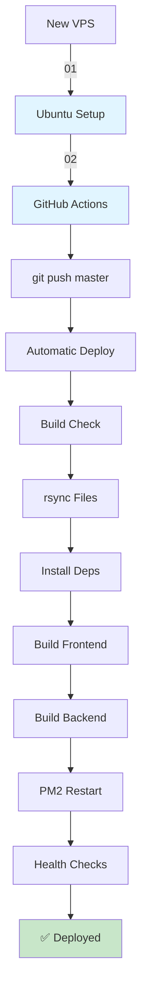

# TenPennyNovels - Deployment Documentation Index

**Last Updated**: 2026-03-15

Indice completo della documentazione di deployment per TenPennyNovels.

---

## 📖 Guide Complete

### Setup Iniziale

| # | Document | Status | Description |
|---|----------|--------|-------------|
| [01](./01-ubuntu-from-zero.md) | ✅ Complete | **Ubuntu Setup da Zero** | Setup VPS completo da provisioning a deployment operativo (26 steps, 1030 linee) |
| [02](./02-github-setup.md) | ✅ Complete | **GitHub Actions Setup** | Configurazione CI/CD con 4 secrets, workflow spiegato stage-by-stage (719 linee) |
| [03](./03-environment-variables.md) | 📝 TODO | **Environment Variables** | Guida completa a tutti i .env.production (unified-backend, api-gateway, frontend apps) |

### Configurazione Servizi

| # | Document | Status | Description |
|---|----------|--------|-------------|
| [04](./04-nginx-configuration.md) | 📝 TODO | **Nginx Configuration** | 7 subdomini, reverse proxy, WebSocket handling, SSL integration |
| [05](./05-pm2-configuration.md) | ✅ Complete | **PM2 Configuration** | ecosystem.config.js line-by-line, 8 processi, fork vs cluster (961 linee) |
| [06](./06-ssl-certificates.md) | 📝 TODO | **SSL Certificates** | Certbot setup, auto-renewal, troubleshooting, wildcard certs |

### Servizi Aggiuntivi

| # | Document | Status | Description |
|---|----------|--------|-------------|
| [07](./07-cdn-setup.md) | ✅ Complete | **CDN Setup** | Image upload, FTP sync Serverplan, produzione + development |
| [08](./08-semantic-search-setup.md) | ✅ Complete | **Semantic Search Setup** | Qdrant + ElasticSearch + embeddings-worker, forum/chat search con filtri |

### Operations

| # | Document | Status | Description |
|---|----------|--------|-------------|
| [99](./99-troubleshooting.md) | ✅ Complete | **Troubleshooting** | Common issues, PM2 crash, WebSocket, database, Nginx 502 |

---

## 🎯 Quick Navigation

### Per Caso d'Uso

**🆕 Primo Setup Server**
1. [01 - Ubuntu from Zero](./01-ubuntu-from-zero.md) - Parti qui
2. [02 - GitHub Setup](./02-github-setup.md) - Poi configura CI/CD
3. Deploy automatico via `git push`

**🔧 Configurazione Esistente**
- [05 - PM2](./05-pm2-configuration.md) - Modifica processi
- [04 - Nginx](./04-nginx-configuration.md) - Modifica subdomini *(TODO)*
- [03 - Env Variables](./03-environment-variables.md) - Aggiorna secrets *(TODO)*

**🚨 Problemi**
- [99 - Troubleshooting](./99-troubleshooting.md) - Risoluzione problemi comuni

**📸 CDN e Media**
- [07 - CDN Setup](./07-cdn-setup.md) - Upload immagini, FTP

**🔍 Semantic Search**
- [08 - Semantic Search Setup](./08-semantic-search-setup.md) - Qdrant, ElasticSearch, embeddings-worker

---

## 📊 Documentation Status

| Status | Count | Documents |
|--------|-------|-----------|
| ✅ Complete | 6 | 01, 02, 05, 07, 08, 99 |
| 📝 TODO | 3 | 03, 04, 06 |
| **Total** | **9** | All deployment docs |

**Completion**: 66.7% (6/9)

---

## 🚀 Deployment Workflow

---

## 📝 Document Summaries

### 01 - Ubuntu from Zero

**Length**: 1030 lines | **Completeness**: ✅ 100%

Setup VPS Ubuntu 22.04+ da zero:
- Provisioning (OVH, DigitalOcean, Hetzner)
- User creation (non-root)
- SSH key authentication
- Firewall (ufw)
- Software install (Node.js 22.13.1, PM2, Nginx, MongoDB 7.0, Redis 7.2, Python)
- Qdrant + ElasticSearch (vedi [08 - Semantic Search](./08-semantic-search-setup.md))
- Environment variables setup
- Build processo
- Nginx + SSL
- PM2 startup
- Backup automation

**Checklist**: 32 steps

### 02 - GitHub Setup

**Length**: 719 lines | **Completeness**: ✅ 100%

CI/CD con GitHub Actions:
- 4 GitHub Secrets (SSH_HOST, SSH_PORT, SSH_USERNAME, SSH_PRIVATE_KEY)
- Workflow stages spiegazione (9 stages)
- Deploy timeline (25-35 min)
- Troubleshooting (7 common errors)
- Rollback procedure

**Workflow**: `git push master` → automatic deploy

### 05 - PM2 Configuration

**Length**: 961 lines | **Completeness**: ✅ 100%

Process manager PM2:
- ecosystem.config.js line-by-line
- 8 processi (4 frontend, 3 backend, 1 Python)
- Fork vs Cluster mode
- **CRITICAL**: unified-backend MUST use fork (NOT cluster)
- Memory limits
- Commands reference
- Troubleshooting

**Processes**: 8 PM2 apps

### 07 - CDN Setup

**Length**: 268 lines | **Completeness**: ✅ 100%

CDN per immagini:
- Upload via unified-backend
- FTP sync a Serverplan
- Cache locale OVH
- Development (Docker volume)
- Production (FTP + Apache)

**Endpoints**: POST /admin/cdn/upload

### 08 - Semantic Search Setup

**Length**: 950+ lines | **Completeness**: ✅ 100%

Sistema di ricerca semantica completo:
- **Qdrant** (vector database) - Docker setup, collections, backup
- **ElasticSearch** (full-text search) - Docker setup, indices, mappings
- **Embeddings Worker** - Python venv, TypeScript worker, Bull queue
- **Forum Search** - Semantic + keyword con filtri (topic, discussion, author)
- **Chat Search** - Semantic + keyword con filtri (location, character, date)
- **Monitoring** - Health checks, resource usage, statistics
- **Troubleshooting** - 5+ common issues con soluzioni
- **Performance Tuning** - HNSW config, ElasticSearch optimization

**Architecture**: Redis Pub/Sub → Bull Queue → Python Embeddings → Qdrant + ElasticSearch

**Collections**: document_chunks, forum_posts, chat_messages

### 99 - Troubleshooting

**Length**: 583 lines | **Completeness**: ✅ 100%

Risoluzione problemi comuni:
- PM2 crash loop
- WebSocket non si connette
- Database naming issues
- Nginx 502
- CSP errors
- Cluster mode crash (unified-backend)

**Issues Covered**: 15+ common problems

---

## 📂 Related Files

### Configuration Files

- `../env-templates/` - Environment variable templates (7 files)
- `../nginx-configs/` - Nginx configurations (7 subdomains)
- `../../ecosystem.config.js` - PM2 configuration
- `../../.github/workflows/deploy.yml` - GitHub Actions workflow

### Scripts

- `../scripts/install-all.sh` - Install dependencies all apps/services
- `../scripts/copy-env-files.sh` - Copy .env templates

---

## 🔗 External Links

- [PM2 Documentation](https://pm2.keymetrics.io/docs/)
- [Nginx Documentation](https://nginx.org/en/docs/)
- [Certbot Documentation](https://eff-certbot.readthedocs.io/)
- [MongoDB Documentation](https://www.mongodb.com/docs/)
- [Redis Documentation](https://redis.io/docs/)
- [Qdrant Documentation](https://qdrant.tech/documentation/)

---

## ✍️ Contributing

Per aggiornare la documentazione:

1. Modifica il file `.md` appropriato
2. Aggiorna questo INDEX.md se necessario
3. Commit con messaggio descrittivo
4. Test deployment su VPS di staging (se disponibile)

---

**Navigation**: [Deploy Hub](../README.md) | [Project Docs](../../docs/INDEX.md)
