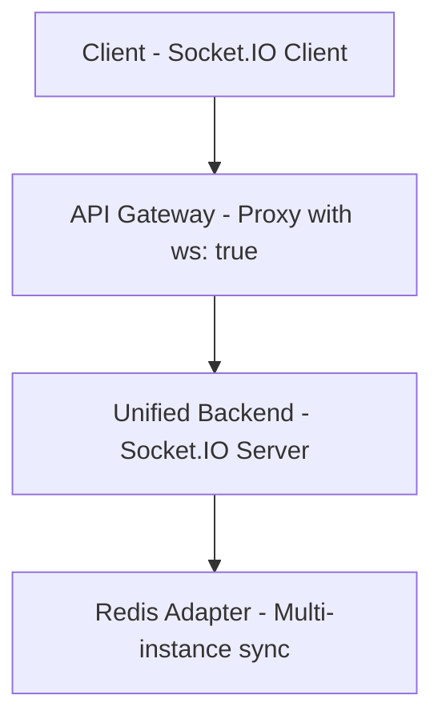
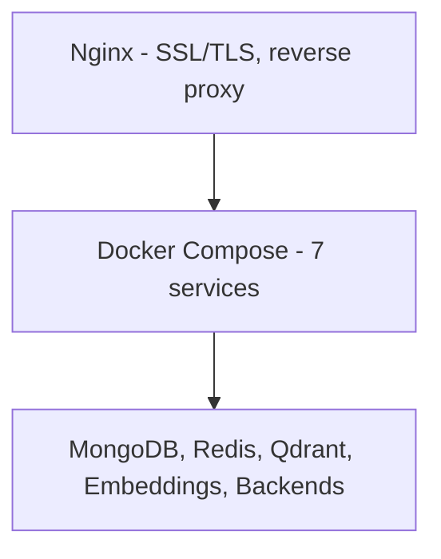

# Technology Stack

**Navigation**: [Home](../INDEX.md) > [Getting Started](./README.md) > Tech Stack

**Status**: ✅ Production Ready | **Last Updated**: 2026-03-01

Complete technology stack di TenPennyNovels - frontend, backend, infrastructure, AI/ML.

---

## Overview

TenPennyNovels è costruito su uno stack moderno full-stack JavaScript/TypeScript con focus su performance, scalability e developer experience.

**Philosophy**:
- **TypeScript First**: Type safety in tutto il codebase
- **Monorepo Structure**: Unified versioning, shared tooling
- **Docker Everything**: Consistent dev/prod environments
- **Hot-Reload Dev**: Fast iteration cycle
- **Modern Stack**: Latest stable versions

---

## Core Technologies

### Runtime & Language

#### Node.js 22.13.1

**Why Node 22?**
- ✅ **Latest LTS**: Long-term support fino 2027
- ✅ **Performance**: V8 engine improvements
- ✅ **Native Test Runner**: Built-in testing
- ✅ **Watch Mode**: `node --watch` for hot-reload
- ✅ **ES Modules**: Full ESM support

**Version Management**:
```bash
# .nvmrc at project root
cat .nvmrc
# 22.13.1

# Switch version
nvm use
# Now using node v22.13.1
```

**Installation**:
```bash
# Via nvm (recommended)
nvm install 22.13.1
nvm use 22.13.1

# Verify
node --version
# v22.13.1
```

---

#### TypeScript 5.7.2

**Configuration**: `tsconfig.json` per service

```json
{
  "compilerOptions": {
    "target": "ES2022",
    "module": "NodeNext",
    "moduleResolution": "NodeNext",
    "esModuleInterop": true,
    "strict": true,
    "skipLibCheck": true,
    "resolveJsonModule": true
  }
}
```

**Why TypeScript?**
- ✅ **Type Safety**: Catch errors at compile-time
- ✅ **IntelliSense**: Better IDE autocomplete
- ✅ **Refactoring**: Safe code changes
- ✅ **Documentation**: Types as documentation

---

## Frontend Stack

### Framework - Next.js 16.0.2

**Why Next.js 16?**
- ✅ **Server Components**: RSC for performance
- ✅ **App Router**: File-based routing
- ✅ **Static Export**: Pre-rendering for hosting
- ✅ **Image Optimization**: Automatic image optimization
- ✅ **TypeScript Native**: First-class TS support

**Features Used**:
- Static Site Generation (SSG) for documents
- Client-Side Rendering (CSR) for game UI
- API Routes (minimal, most logic in backend)
- Image optimization con `next/image`

**Apps**:
```text
apps/
├── landing/      - Landing page (login, registration, character select)
├── game/         - Main gameplay interface
├── documents/    - Documentation browser
└── management/   - Admin panel
```

---

### UI Library - React 18.3.1 / 19.0.0

**React 18** (landing, documents, management):
- Concurrent rendering
- Automatic batching
- Transitions API
- Suspense for data fetching

**React 19** (game app, experimental):
- Server Components
- Server Actions
- Improved Suspense
- Use hook

**Why React?**
- ✅ **Component-Based**: Reusable UI components
- ✅ **Ecosystem**: Massive library ecosystem
- ✅ **Performance**: Virtual DOM optimization
- ✅ **Developer Tools**: Excellent debugging

---

### State Management

#### Zustand 5.0.3

**Why Zustand over Redux?**
- ✅ **Simplicity**: No boilerplate
- ✅ **Size**: 1KB (vs 20KB Redux)
- ✅ **TypeScript**: Excellent TS inference
- ✅ **DevTools**: Redux DevTools compatible

**Example**:
```typescript
import { create } from 'zustand';

interface GameState {
  currentLocation: Location | null;
  setLocation: (location: Location) => void;
}

export const useGameStore = create<GameState>((set) => ({
  currentLocation: null,
  setLocation: (location) => set({ currentLocation: location })
}));
```

---

#### TanStack Query 5.64.4 (React Query)

**Purpose**: Server state management, caching

**Why TanStack Query?**
- ✅ **Automatic Caching**: Smart cache invalidation
- ✅ **Background Refetch**: Keep data fresh
- ✅ **Optimistic Updates**: Instant UI feedback
- ✅ **DevTools**: Query inspection

**Example**:
```typescript
const { data: characters, isLoading } = useQuery({
  queryKey: ['characters'],
  queryFn: () => fetch('/api/game/characters').then(r => r.json()),
  staleTime: 60000  // Cache 1 minute
});
```

---

### WebSocket - Socket.IO 4.8.3

**Purpose**: Real-time communication (location updates, chat, turn-based)

**Features**:
- ✅ **Automatic Reconnection**: Network resilience
- ✅ **Room-Based Broadcasting**: Targeted events
- ✅ **Fallback Transport**: HTTP long-polling if WS fails
- ✅ **Binary Support**: Efficient data transfer

**Architecture**:


**Details**: [WebSocket Patterns](../05-frontend/websocket-patterns.md)

---

### Styling

#### Sass 1.83.4

**Why Sass?**
- ✅ **Variables**: Reusable colors, sizes
- ✅ **Nesting**: Clean, hierarchical styles
- ✅ **Mixins**: Reusable style patterns
- ✅ **Modules**: CSS organization

**Structure**:
```scss
// Victorian theme variables
$primary-color: #8B4513;      // Saddle Brown
$secondary-color: #2F4F4F;    // Dark Slate Gray
$accent-gold: #DAA520;        // Goldenrod

// Mixins
@mixin victorian-border {
  border: 2px solid $accent-gold;
  border-radius: 4px;
}

// Usage
.character-card {
  @include victorian-border;
  background: $primary-color;
}
```

---

#### CSS Modules

**Why CSS Modules?**
- ✅ **Scoped Styles**: No global namespace pollution
- ✅ **Type Safety**: TypeScript definitions
- ✅ **Tree Shaking**: Unused styles removed

**Example**:
```tsx
import styles from './CharacterCard.module.scss';

export function CharacterCard() {
  return <div className={styles.card}>...</div>;
}
```

---

## Backend Stack

### Framework - Express 5.2.1

**Why Express 5?**
- ✅ **Promise Support**: Async/await in routes
- ✅ **Mature**: Battle-tested framework
- ✅ **Middleware**: Rich ecosystem
- ✅ **Performance**: Fast routing

**Migration from Express 4**:
- Automatic promise rejection handling
- No more `next()` in async functions
- Improved error handling

**Example**:
```typescript
// Express 5 - async/await without try/catch
app.get('/characters', async (req, res) => {
  const characters = await Character.find();
  res.json({ success: true, data: characters });
});

// Error middleware catches rejections automatically
app.use((err, req, res, next) => {
  res.status(500).json({ success: false, error: err.message });
});
```

---

### Database - MongoDB 7.0

**Why MongoDB?**
- ✅ **Flexible Schema**: Easy iteration
- ✅ **JSON-Native**: Perfect for Node.js
- ✅ **Horizontal Scaling**: Sharding support
- ✅ **Rich Queries**: Aggregation pipeline
- ✅ **Indexes**: Performance optimization

**Features Used**:
- Aggregation pipeline per analytics
- Geospatial queries per location system
- Text indexes per search
- TTL indexes per auto-cleanup (WebSocketEvent)

**Details**: [MongoDB Schemas](../01-infrastructure/mongodb-schemas.md)

---

### ORM - Mongoose 9.2.1

**Why Mongoose?**
- ✅ **Schema Validation**: Type safety at DB level
- ✅ **Middleware**: Hooks (pre/post save)
- ✅ **Population**: Easy ref resolution
- ✅ **Virtuals**: Computed properties
- ✅ **TypeScript**: First-class TS support

**Example**:
```typescript
const CharacterSchema = new Schema<ICharacter>({
  name: { type: String, required: true },
  userId: { type: Schema.Types.ObjectId, ref: 'User', required: true },
  status: {
    type: String,
    enum: ['pending', 'approved', 'rejected'],
    default: 'pending'
  }
}, { timestamps: true });

// Middleware
CharacterSchema.pre('save', async function(next) {
  if (this.isModified('name')) {
    this.slug = slugify(this.name);
  }
});

export const Character = model<ICharacter>('Character', CharacterSchema);
```

---

### Cache - Redis 7.2-alpine

**Use Cases**:
1. **Session Store**: JWT token storage
2. **Socket.IO Adapter**: Multi-instance WebSocket sync
3. **Bull Queue**: Job queue per embeddings worker
4. **Pub/Sub**: Inter-service event messaging
5. **Cache**: API response caching

**Channels**:
```
character:updated
location:action
document:created
embedding:requested
turn:changed
```

**Details**: [Redis Pub/Sub](../01-infrastructure/redis-pubsub.md)

---

### Validation - Joi 17.x / Zod

**Joi** (backend):
```typescript
import Joi from 'joi';

const createCharacterSchema = Joi.object({
  name: Joi.string().min(3).max(50).required(),
  occupation: Joi.string().pattern(/^[0-9a-fA-F]{24}$/).required(),
  background: Joi.string().max(5000)
});

// Validate
const { error, value } = createCharacterSchema.validate(req.body);
```

**Zod** (frontend + backend):
```typescript
import { z } from 'zod';

const loginSchema = z.object({
  email: z.string().email(),
  password: z.string().min(8)
});

type LoginData = z.infer<typeof loginSchema>;
```

---

## Infrastructure

### Containerization - Docker 24.0+

**Why Docker?**
- ✅ **Consistency**: Identical dev/prod environments
- ✅ **Isolation**: Services in separate containers
- ✅ **Scalability**: Easy horizontal scaling
- ✅ **Portability**: Run anywhere

**Services**:
```
mongodb (7.0)
redis (7.2-alpine)
qdrant (1.17.0)
embeddings-service (Flask)
embeddings-worker (Node.js)
unified-backend (Node.js 22)
api-gateway (Node.js 22)
```

**Details**: [Docker Compose](../01-infrastructure/docker-compose.md)

---

### Orchestration - Docker Compose

**Configuration**: `docker-compose.yml`

**Networks**: `tenpennynovels-network` (bridge)
**Volumes**: 4 persistent (mongodb_data, redis_data, qdrant_storage, mongodb_config)

**Commands**:
```bash
docker compose up -d      # Start all services
docker compose logs -f    # Follow logs
docker compose ps         # Status
docker compose down       # Stop all
```

---

### Reverse Proxy - Nginx

**Production Setup**:
```nginx
# API Gateway proxy
location / {
  proxy_pass http://localhost:8000;
  proxy_http_version 1.1;
  proxy_set_header Upgrade $http_upgrade;
  proxy_set_header Connection "upgrade";
}
```

**Features**:
- SSL/TLS termination (Let's Encrypt)
- Static file serving (frontend builds)
- Load balancing (future)
- Rate limiting
- Gzip compression

---

## AI/ML Stack

### Embeddings Model

**Model**: `paraphrase-multilingual-MiniLM-L12-v2`
**Source**: sentence-transformers (Hugging Face)
**Dimension**: 384D
**Languages**: Multilingual (EN, IT, FR, DE, ES, etc.)

**Performance**:
- First generation: ~1.5s
- Cached: ~50ms
- Batch processing: ~100ms per embedding

---

### Vector Database - Qdrant 1.17.0

**Why Qdrant?**
- ✅ **Performance**: ANN search < 100ms
- ✅ **Filtering**: Metadata filters + vector search
- ✅ **Scalability**: Horizontal scaling
- ✅ **API**: REST + gRPC
- ✅ **Open Source**: Self-hosted

**Collections**:
- `documents` (384D vectors)
- Future: `characters`, `locations`

**Details**: [Qdrant Vector DB](../01-infrastructure/qdrant-vector-db.md)

---

### Embeddings Service - Flask 3.1.0

**Tech**:
- **Framework**: Flask 3.1.0
- **ML Library**: sentence-transformers
- **Server**: Gunicorn (production)
- **Port**: 5001

**API**:
```http
POST /embed
Content-Type: application/json

{
  "text": "Victorian London historical document"
}

Response:
{
  "embedding": [0.123, -0.456, ...],  // 384D vector
  "dimension": 384
}
```

---

### Job Queue - Bull 4.x

**Purpose**: Async processing (embeddings generation)

**Features**:
- ✅ **Redis-Backed**: Persistent queue
- ✅ **Retry Logic**: 3 attempts with exponential backoff
- ✅ **Concurrency**: 5 parallel jobs
- ✅ **Priority**: Job prioritization
- ✅ **Monitoring**: Bull Dashboard

**Example**:
```typescript
import Bull from 'bull';

const embeddingQueue = new Bull('embeddings', {
  redis: { host: 'redis', port: 6379 }
});

// Add job
await embeddingQueue.add({ documentId: '123', text: '...' });

// Process
embeddingQueue.process(5, async (job) => {
  const { documentId, text } = job.data;
  const embedding = await generateEmbedding(text);
  await storeInQdrant(documentId, embedding);
});
```

---

### BotAI - Ollama (Local AI)

**Model**: Mistral 7B Instruct (via Ollama, locale e gratuito)
**Integration**: Gateway con HMAC + callback
**Status**: Attivo tramite Local AI Platform (`local-ai/`)

**Features**:
- Psychology system (6 axes, central wound)
- Semantic memory retrieval
- Victorian-era speech patterns
- Anti-repetition mechanisms

**Details**: [BotAI Backend](../02-backend/botai-backend.md)

---

## Development Tools

### Hot-Reload - tsx + tsx watch

**Backend**:
```bash
# tsx watch for TypeScript execution
tsx watch src/index.ts
```

**Benefits**:
- ✅ **Fast**: Incremental compilation
- ✅ **No Build Step**: Direct TS execution
- ✅ **Watch Mode**: Auto-restart on file change
- ✅ **Source Maps**: Proper error stack traces

---

### Package Manager - npm 10+

**Why npm over yarn/pnpm?**
- ✅ **Built-in**: Comes with Node.js
- ✅ **Workspaces**: Monorepo support
- ✅ **Lock File**: package-lock.json
- ✅ **Scripts**: Powerful npm scripts

**Workspaces**:
```json
{
  "workspaces": [
    "apps/*",
    "services/*"
  ]
}
```

---

### Linting - ESLint 9.x

**Configuration**: `.eslintrc.json`

```json
{
  "extends": [
    "eslint:recommended",
    "plugin:@typescript-eslint/recommended",
    "next/core-web-vitals"
  ],
  "rules": {
    "@typescript-eslint/no-unused-vars": "warn",
    "@typescript-eslint/no-explicit-any": "warn"
  }
}
```

---

### Formatting - Prettier 3.x

**Configuration**: `.prettierrc`

```json
{
  "semi": true,
  "singleQuote": true,
  "tabWidth": 2,
  "trailingComma": "es5"
}
```

**Integration**: Pre-commit hook con Husky (future)

---

## Testing Stack

### API Testing - Bash Scripts

**Location**: `./scripts/test-*-endpoints.sh`

**Scripts**:
```bash
./scripts/test-auth-endpoints.sh        # Authentication
./scripts/test-game-endpoints.sh        # Game logic
./scripts/test-housing-endpoints.sh     # Housing system
./scripts/test-documents-endpoints.sh   # Documents
```

**Example**:
```bash
#!/bin/bash
# Test character creation
curl -X POST http://localhost:8000/game/characters \
  -H "Content-Type: application/json" \
  -H "Cookie: auth_token=$TOKEN" \
  -d '{"name":"John Watson","occupation":"'$PHYSICIAN_ID'"}'
```

**Details**: [API Testing Scripts](../07-testing/api-testing-scripts.md)

---

### UI Testing - Manual

**Character Wizard**:
- Multi-step form validation
- Stat distribution (400 points)
- Skill selection
- Occupation bonuses

**Details**: [Character Wizard Testing](../07-testing/wizard-testing-guide.md)

---

## Version Control

### Git

**Branching Strategy**: Git Flow (light)
```
main          - Production-ready code
develop       - Integration branch
feature/*     - Feature branches
hotfix/*      - Production hotfixes
```

**Commit Convention**:
```
feat: Add housing system rent collection
fix: Resolve location occupants bug
docs: Update deployment guide
refactor: Consolidate BotAI services
chore: Update dependencies
```

---

## Deployment Stack

### Static Hosting - Vercel (Recommended)

**Apps**:
- `apps/landing` → https://tenpennynovels.com
- `apps/game` → https://game.tenpennynovels.com
- `apps/documents` → https://documenti.tenpennynovels.com
- `apps/management` → https://gestione.tenpennynovels.com

**Why Vercel?**
- ✅ **Next.js Native**: Zero-config
- ✅ **Edge Network**: Global CDN
- ✅ **Automatic HTTPS**: SSL certificates
- ✅ **Preview Deployments**: Per-branch previews
- ✅ **Analytics**: Web Vitals monitoring

**Alternative**: Nginx self-hosted

---

### Backend Hosting - VPS + Docker

**Recommended VPS**:
- **Provider**: Hetzner, DigitalOcean, Linode
- **Specs**: 4 vCPU, 8GB RAM, 100GB SSD
- **OS**: Ubuntu 22.04 LTS

**Stack**:


**Details**: [Deployment Guide](../06-operations/deployment-guide.md)

---

## Monitoring & Logging

### Logging - Winston 3.x

**Levels**: error, warn, info, http, debug

**Configuration**:
```typescript
import winston from 'winston';

export const logger = winston.createLogger({
  level: process.env.LOG_LEVEL || 'info',
  format: winston.format.combine(
    winston.format.timestamp(),
    winston.format.json()
  ),
  transports: [
    new winston.transports.File({ filename: 'error.log', level: 'error' }),
    new winston.transports.File({ filename: 'combined.log' }),
    new winston.transports.Console({ format: winston.format.simple() })
  ]
});
```

---

### HTTP Logging - Morgan

**Format**: Apache Combined Log Format

```typescript
import morgan from 'morgan';

app.use(morgan('combined', {
  stream: httpLoggerStream  // Winston stream
}));
```

---

### Error Tracking - Sentry (Optional)

**Integration**:
```typescript
import * as Sentry from '@sentry/node';

Sentry.init({
  dsn: process.env.SENTRY_DSN,
  environment: process.env.NODE_ENV
});

// Express error handler
app.use(Sentry.Handlers.errorHandler());
```

---

## Security Stack

### Authentication - JWT

**Token Types**:
1. **auth_token** - User authentication (24h)
2. **refresh_token** - Token refresh (30 days)
3. **character_context** - Character selection (24h)

**Libraries**:
- `jsonwebtoken` - JWT signing/verification
- `bcryptjs` - Password hashing

**Details**: [Authentication System](../02-backend/authentication-system.md)

---

### Security Middleware - Helmet.js

```typescript
import helmet from 'helmet';

app.use(helmet({
  crossOriginResourcePolicy: { policy: "cross-origin" }
}));
```

**Headers Added**:
- `X-Content-Type-Options: nosniff`
- `X-Frame-Options: SAMEORIGIN`
- `X-XSS-Protection: 1; mode=block`
- `Strict-Transport-Security` (production)

---

### Rate Limiting - express-rate-limit

```typescript
import rateLimit from 'express-rate-limit';

const limiter = rateLimit({
  windowMs: 60 * 1000,  // 1 minute
  max: 30,              // 30 requests per minute
  message: 'Too many requests'
});

app.use('/documents', limiter);
```

---

### CORS - cors

```typescript
import cors from 'cors';

app.use(cors({
  origin: [
    'https://tenpennynovels.com',
    'https://game.tenpennynovels.com'
  ],
  credentials: true
}));
```

---

## Performance Stack

### Compression - compression

```typescript
import compression from 'compression';

app.use(compression());  // gzip/deflate responses
```

---

### Caching

**Layers**:
1. **Redis Cache**: API responses (1h TTL)
2. **TanStack Query**: Client-side cache (1min staleTime)
3. **CDN**: Static assets (Vercel Edge)
4. **Browser**: HTTP cache headers

---

### Image Optimization - next/image

```tsx
import Image from 'next/image';

<Image
  src="/avatar.png"
  alt="Character Avatar"
  width={200}
  height={200}
  priority
/>
```

**Features**:
- Automatic WebP/AVIF conversion
- Lazy loading
- Responsive images
- Blur placeholder

---

## Related Documentation

- [Project Structure](./project-structure.md) - Repository organization
- [Docker Compose](../01-infrastructure/docker-compose.md) - Service architecture
- [Deployment Guide](../06-operations/deployment-guide.md) - Production deployment
- [API Reference](../02-backend/api-reference.md) - Backend APIs

---

## Quick Reference

**Node.js**: 22.13.1
**TypeScript**: 5.7.2
**Frontend**: Next.js 16, React 18/19, Zustand, TanStack Query
**Backend**: Express 5.2.1, Mongoose 9.2.1, Socket.IO 4.8.3
**Database**: MongoDB 7.0, Redis 7.2, Qdrant 1.17.0
**AI/ML**: sentence-transformers, Flask, Bull
**Infrastructure**: Docker, Docker Compose, Nginx
**Deployment**: Vercel (frontend), VPS + Docker (backend)
