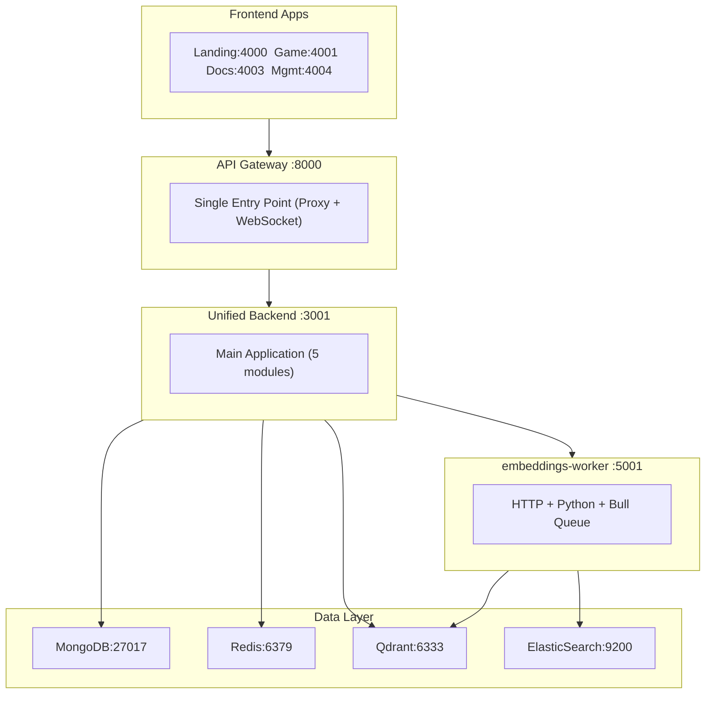

# Infrastructure

**Navigation**: [Home](../INDEX.md) > Infrastructure

**Status**: ✅ Production Ready | **Last Updated**: 2026-03-08

Overview of TenPennyNovels infrastructure: Docker, database, caching, vector search, event systems.

---

## Overview

TenPennyNovels infrastructure is fully dockerized for consistency between development and production. It uses 7 containerized services orchestrated via Docker Compose.

---

## Architecture Diagram



---

## Services

### 1. MongoDB (Port 27017)

**Purpose**: Persistent data storage for all application data.

**Technology**: MongoDB 7.0

**Key Features**:
- 44+ schemas (User, Character, Location, Document, Corporation, etc.)
- Indexes for performance optimization
- Replica set ready (production)
- Automatic backups (production)

**Volumes**:
- `mongodb_data:/data/db` - Database files
- `mongodb_config:/data/configdb` - Configuration

**Health Check**: `mongosh ping`

**Details**: [MongoDB Schemas](./mongodb-schemas.md)

---

### 2. Redis (Port 6379)

**Purpose**: Caching, session storage, pub/sub messaging, WebSocket adapter.

**Technology**: Redis 7.2 Alpine

**Key Features**:
- Session storage (auth tokens, character context)
- Event pub/sub channels (CHARACTER_EVENTS, LOCATION_EVENTS, etc.)
- WebSocket adapter per multi-instance Socket.IO
- Bull queue jobs storage
- Cache layer (1h TTL for embeddings)

**Persistence**: AOF (Append-Only File) enabled

**Volumes**:
- `redis_data:/data` - Persistent storage

**Health Check**: `redis-cli ping`

**Details**: [Redis Pub/Sub](./redis-pubsub.md)

---

### 3. Qdrant (Port 6333)

**Purpose**: Vector database for semantic search.

**Technology**: Qdrant 1.17.0

**Key Features**:
- Approximate Nearest Neighbor (ANN) search <100ms
- Collections: `document_chunks`, `locations`, `location_actions`
- 384-dimensional vectors (paraphrase-multilingual-MiniLM-L12-v2)
- Point payloads with metadata filtering

**Volumes**:
- `qdrant_storage:/qdrant/storage` - Vector data

**Health Check**: `/healthz`

**Details**: [Qdrant Vector DB](./qdrant-vector-db.md)

---

### 4. ElasticSearch (Port 9200)

**Purpose**: Full-text search for hybrid search (keyword + semantic).

**Technology**: ElasticSearch 8.11.0

**Key Features**:
- Indices: `tenpennynovels_document_chunks`, `tenpennynovels_locations`, `tenpennynovels_location_actions`
- Combined with Qdrant via RRF (Reciprocal Rank Fusion)
- Single-node mode (development)

**Details**: [Qdrant Vector DB](./qdrant-vector-db.md) (hybrid search)

---

### 5. Embeddings Worker (Port 5001)

**Purpose**: Unified embedding service (HTTP + Python subprocess + Bull queue). Replaces legacy Flask embeddings-service.

**Technology**: Node.js, Python (sentence-transformers), Bull Queue

**Key Features**:
- HTTP server on port 5001 for sync embedding and hybrid search
- Python subprocess for paraphrase-multilingual-MiniLM-L12-v2
- Bull queue for async processing (concurrency: 5)
- Dead Letter Queue for failed jobs
- Redis cache (1h TTL)
- Endpoints: `/embed`, `/search` (hybrid), `/health`

**Events Subscribed**:
- `embedding:document:*`, `embedding:location:*`, `embedding:location_action:*`

**Details**: [Embeddings Architecture](../04-ai-ml/embeddings-architecture.md)

---

### 6. Unified Backend (Port 3001)

**Purpose**: Main application backend with modular architecture.

**Technology**: Node.js 22, Express 5.2.1, TypeScript 5.9.3, Mongoose 9.2.1

**Modules**:
- **auth** - Authentication, users, JWT management
- **game** - Characters, locations, gameplay, housing, corporations
- **admin** - Management panel APIs
- **forum** - Forum system (archived)
- **documents** - Content management, semantic search

**Key Features**:
- Socket.IO WebSocket server
- Event publishing to Redis
- MongoDB connection pooling
- Middleware stack (auth, validation, logging)

**Health Check**: `GET /health`

**Details**: [Unified Backend Architecture](../02-backend/unified-backend-architecture.md)

---

### 7. API Gateway (Port 8000)

**Purpose**: Single entry point for all client requests.

**Technology**: Node.js 22, Express 5.2.1, http-proxy-middleware v3

**Key Features**:
- Proxy routing to unified-backend
- CORS configuration (4 frontend origins)
- Rate limiting (tiered: auth vs unauth)
- WebSocket upgrade handling
- Request logging (Morgan)

**Routes**:
- `/auth/*` → unified-backend:3001/auth
- `/game/*` → unified-backend:3001/game
- `/admin/*` → unified-backend:3001/admin
- `/documents/*` → unified-backend:3001/documents
- `/socket.io/**` → unified-backend:3001 (WebSocket)

**Health Check**: `GET /health`

**Details**: [API Gateway](../02-backend/api-gateway.md)

---

## Network

**Name**: `tenpennynovels-network`

**Type**: Bridge

**Services Discovery**: All services communicate via service name (e.g., `mongodb:27017`, `redis:6379`)

---

## Volumes

Persistent volumes per data preservation:

| Volume | Service | Purpose |
|--------|---------|---------|
| `mongodb_data` | MongoDB | Database files |
| `mongodb_config` | MongoDB | Configuration |
| `redis_data` | Redis | AOF persistence |
| `qdrant_storage` | Qdrant | Vector database |
| `elasticsearch_data` | ElasticSearch | Full-text indices |
| `cdn_storage` | unified-backend, api-gateway | CDN assets |

**Backup Strategy**: [Backup & Restore](../06-operations/backup-restore.md)

---

## Environment Variables

Tutte le environment variables sono documentate in dettaglio:

**Reference**: [Environment Variables](./environment-variables.md)

**Key Variables**:
- `MONGODB_URI` - MongoDB connection string
- `REDIS_HOST`, `REDIS_PORT`, `REDIS_URL` - Redis connection
- `QDRANT_URL` - Qdrant API URL
- `ELASTICSEARCH_URL` - ElasticSearch endpoint (embeddings-worker)
- `EMBEDDINGS_SERVICE_URL` - Embeddings worker HTTP endpoint (http://embeddings-worker:5001)
- `JWT_SECRET` - JWT signing secret
- `NODE_ENV` - Environment (development/production)

---

## Development vs Production

### Development

- Hot-reload enabled (volume mounts src:ro)
- Debug logging
- CORS permissive (localhost:4000-4005)
- No SSL/TLS
- Single-instance services

### Production

- Build-optimized images
- Production logging
- CORS restricted (specific domains)
- SSL/TLS enabled
- Replica sets (MongoDB)
- Redis Sentinel (high availability)
- Load balancing (API Gateway)

**Production Deployment**: [Deployment Guide](../06-operations/deployment-guide.md)

---

## Common Commands

```bash
# Start all services
npm run docker:all:start

# Start infrastructure only (MongoDB, Redis, Qdrant, embeddings)
npm run docker:infra:start

# Check service health
npm run docker:check

# View logs (all services)
npm run docker:logs

# View logs (specific service)
docker logs tenpennynovels-mongodb
docker logs tenpennynovels-unified-backend

# Stop all services
npm run docker:all:stop

# Restart service (after code change)
docker restart tenpennynovels-unified-backend

# Rebuild service (after Dockerfile change)
docker compose stop unified-backend
docker compose build unified-backend
docker compose up -d unified-backend

# Clean volumes (WARNING: deletes data)
docker compose down -v
```

---

## Files in This Section

- [README.md](./README.md) - This file
- [Docker Compose](./docker-compose.md) - Service orchestration details
- [MongoDB Schemas](./mongodb-schemas.md) - Database schema reference
- [Redis Pub/Sub](./redis-pubsub.md) - Event channels
- [Qdrant Vector DB](./qdrant-vector-db.md) - Vector search setup
- [Environment Variables](./environment-variables.md) - Complete env reference

---

## Related Documentation

- [Getting Started](../00-getting-started/README.md) - Setup guide
- [Unified Backend](../02-backend/unified-backend-architecture.md) - Backend modules
- [API Gateway](../02-backend/api-gateway.md) - Proxy configuration
- [Embeddings Architecture](../04-ai-ml/embeddings-architecture.md) - ML pipeline
- [Docker Troubleshooting](../06-operations/docker-troubleshooting.md) - Common issues
