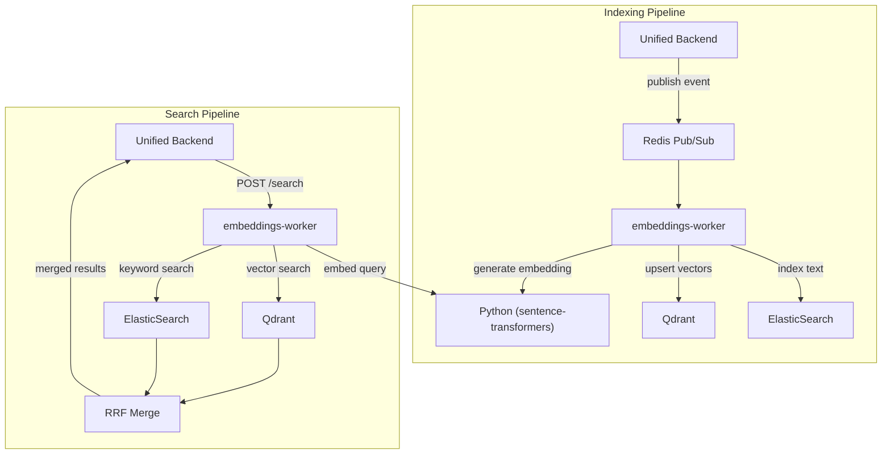
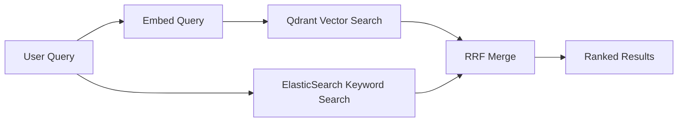

# Qdrant Vector Database

**Navigation**: [Home](../INDEX.md) > [Infrastructure](./README.md) > Qdrant Vector DB

**Status**: ✅ Production Ready | **Last Updated**: 2026-03-08

Documentation of Qdrant usage in TenPennyNovels for semantic vector search, including collections, embedding model, and hybrid search with ElasticSearch.

---

## Overview

Qdrant is the vector database used for **semantic search** in TenPennyNovels. It stores 384-dimensional embeddings generated by the paraphrase-multilingual-MiniLM-L12-v2 model and enables Approximate Nearest Neighbor (ANN) search for natural language queries.

**Key characteristics**:
- **Port 6333**: HTTP API
- **Port 6334**: gRPC (optional, for high-throughput)
- **Distance metric**: Cosine similarity
- **Vector dimensions**: 384

---

## Architecture Diagram



---

## Collections

| Collection | Purpose | Vector Size | Payload |
|------------|---------|-------------|---------|
| `document_chunks` | Document section embeddings (H2/H3 chunks) | 384 | chunkId, documentId, slug, heading, type, parentSlug |
| `locations` | Location embeddings | 384 | locationId, name, slug, district |
| `location_actions` | Location action embeddings (NPC actions) | 384 | locationActionId, locationId, characterId, actionType |

### Collection Configuration

All collections use the same vector configuration:

```json
{
  "vectors": {
    "size": 384,
    "distance": "Cosine"
  }
}
```

The `384` dimension matches the output of `paraphrase-multilingual-MiniLM-L12-v2`.

---

## Embedding Model

| Property | Value |
|----------|-------|
| Model | `sentence-transformers/paraphrase-multilingual-MiniLM-L12-v2` |
| Dimensions | 384 |
| Distance | Cosine similarity |
| Languages | Multilingual (EN, IT, FR, DE, ES, etc.) |
| Runtime | Python subprocess in embeddings-worker |

---

## Service Integration

### embeddings-worker (Indexing)

- **Creates** collections if they don't exist
- **Subscribes** to Redis embedding events
- **Generates** embeddings via Python sentence-transformers
- **Upserts** vectors to Qdrant with payload metadata
- **Indexes** same content in ElasticSearch for keyword search

### unified-backend (Searching)

- **Calls** embeddings-worker `POST /search` endpoint for hybrid search
- Does **not** connect to Qdrant directly for search
- Search flow: unified-backend → embeddings-worker → Qdrant + ElasticSearch → RRF merge → response

---

## Hybrid Search (Qdrant + ElasticSearch)

TenPennyNovels uses **hybrid search** combining semantic (Qdrant) and keyword (ElasticSearch) results.



### Reciprocal Rank Fusion (RRF)

Results from both engines are merged using **Reciprocal Rank Fusion**:

```
RRF_score(d) = Σ 1 / (k + rank(d))
```

Where `k` is a constant (typically 60) and `rank(d)` is the document's rank in each result set. Documents appearing in both result sets receive higher combined scores.

### Benefits

- **Semantic**: Finds conceptually similar content (natural language questions)
- **Keyword**: Catches exact term matches, proper nouns, IDs
- **Combined**: Best of both approaches with RRF ranking

---

## Ports and Access

| Port | Protocol | Purpose |
|------|----------|---------|
| 6333 | HTTP | REST API (collections, search, points) |
| 6334 | gRPC | High-throughput operations (optional) |

**Docker internal**: `http://qdrant:6333`
**Host access**: `http://localhost:6333`

---

## Health Check

```bash
curl -s http://localhost:6333/healthz
```

Returns `{"title":"qdrant - vector search engine","version":"1.17.0"}` when healthy.

---

## Related Documentation

- [Docker Compose](./docker-compose.md) - Qdrant container configuration
- [Redis Pub/Sub](./redis-pubsub.md) - Event flow for embedding indexing
- [Embeddings Architecture](../04-ai-ml/embeddings-architecture.md) - Full ML pipeline
- [Semantic Search](../04-ai-ml/semantic-search.md) - Search strategy and API usage
- [Environment Variables](./environment-variables.md) - QDRANT_URL configuration
