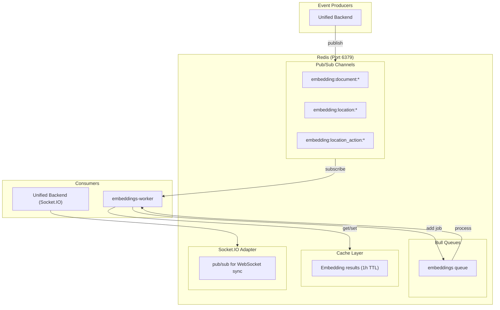
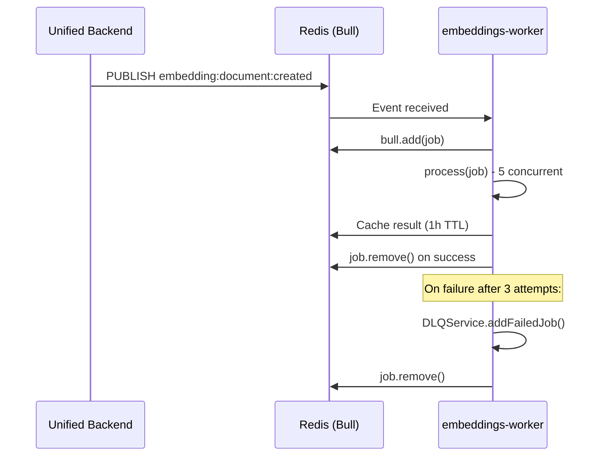
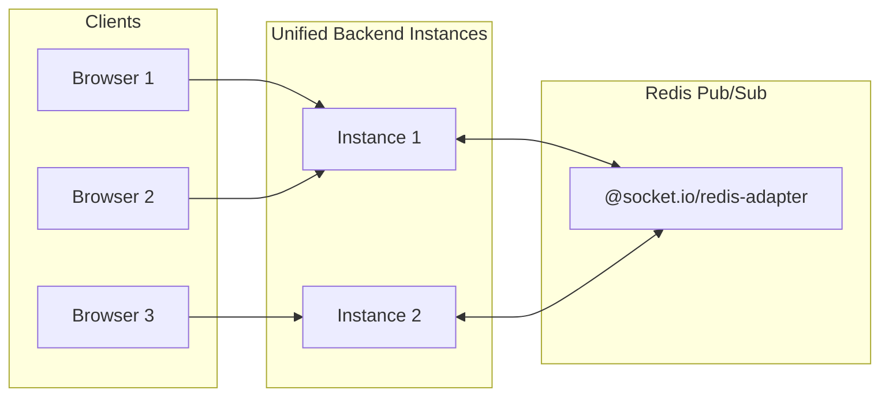
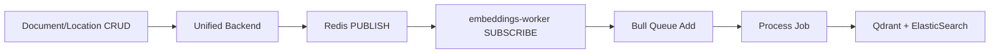

# Redis Pub/Sub and Queues

**Navigation**: [Home](../INDEX.md) > [Infrastructure](./README.md) > Redis Pub/Sub

**Status**: ✅ Production Ready | **Last Updated**: 2026-03-08

Documentation of Redis usage in TenPennyNovels: Socket.IO adapter, Bull job queues, Pub/Sub for real-time events, and caching.

---

## Overview

Redis is a critical infrastructure component used for multiple purposes:

- **Socket.IO Adapter**: Horizontal scaling of WebSocket connections across multiple backend instances
- **Bull Job Queues**: Async embedding processing with Dead Letter Queue for failed jobs
- **Pub/Sub**: Real-time event broadcasting for embedding generation triggers
- **Caching**: Embedding result cache (1h TTL) to avoid redundant computation

---

## Architecture Diagram



---

## Connection Configuration

### Environment Variables

| Variable | Description | Example |
|----------|-------------|---------|
| `REDIS_HOST` | Redis server hostname | `redis` (Docker) or `localhost` |
| `REDIS_PORT` | Redis server port | `6379` |
| `REDIS_URL` | Full connection URL (preferred) | `redis://redis:6379` |

### Usage by Service

- **Unified Backend**: Uses `REDIS_HOST` + `REDIS_PORT` for Socket.IO adapter; `REDIS_URL` for sessions/caching
- **embeddings-worker**: Uses `REDIS_URL` for Bull queue, Pub/Sub subscription, and cache
- **API Gateway**: No direct Redis connection (proxies to unified-backend)

---

## Bull Job Queues

### Embeddings Queue

The `embeddings` queue processes async embedding generation jobs.



### Queue Configuration

| Setting | Value | Description |
|---------|-------|-------------|
| Queue name | `embeddings` | Bull queue identifier |
| Concurrency | 5 | Parallel job processing |
| Attempts | 3 | Retries before DLQ |
| Backoff | Exponential (2s base) | Delay between retries |
| removeOnComplete | 100 | Keep last 100 completed jobs |
| removeOnFail | false | Preserve failed jobs for DLQ |

### Dead Letter Queue (DLQ)

Jobs that fail after 3 attempts are moved to the Dead Letter Queue (stored in MongoDB via `DLQService`). This allows:

- Manual inspection of failed jobs
- Retry of transient failures
- Debugging of permanent errors

---

## Socket.IO Redis Adapter

### Purpose

When running multiple instances of unified-backend (horizontal scaling), the Socket.IO Redis adapter ensures WebSocket messages are broadcast to all connected clients across instances.



### Implementation

```typescript
// services/unified-backend/src/server.ts
import { createAdapter } from '@socket.io/redis-adapter';
import { createClient } from 'redis';

const pubClient = createClient({ socket: { host: REDIS_HOST, port: REDIS_PORT } });
const subClient = pubClient.duplicate();
await Promise.all([pubClient.connect(), subClient.connect()]);
io.adapter(createAdapter(pubClient, subClient));
```

### Note on Cluster Mode

The unified-backend must run in **fork mode** (not cluster mode). Cluster mode can cause crashes with the Socket.IO Redis adapter. Use PM2 with `instances: 1` or multiple processes via load balancer.

---

## Pub/Sub Channels

### Embedding Events

Events published by unified-backend when content is created/updated/deleted:

| Channel | Trigger | Consumer |
|---------|---------|----------|
| `embedding:document:created` | New document saved | embeddings-worker |
| `embedding:document:updated` | Document content changed | embeddings-worker |
| `embedding:document:deleted` | Document removed | embeddings-worker |
| `embedding:location:created` | New location | embeddings-worker |
| `embedding:location:updated` | Location updated | embeddings-worker |
| `embedding:location:deleted` | Location removed | embeddings-worker |
| `embedding:location_action:created` | New location action | embeddings-worker |
| `embedding:location_action:updated` | Location action updated | embeddings-worker |
| `embedding:location_action:deleted` | Location action removed | embeddings-worker |

### Event Flow



---

## Caching

### Embedding Cache

The embeddings-worker caches embedding results in Redis to avoid redundant computation:

- **Key pattern**: Hash of input text
- **TTL**: 3600 seconds (1 hour)
- **Use case**: Repeated queries with same/similar text

---

## Persistence

Redis is configured with **AOF (Append-Only File)** persistence:

```yaml
command: redis-server --appendonly yes
volumes:
  - redis_data:/data
```

This ensures queue state and cached data survive container restarts.

---

## Related Documentation

- [Docker Compose](./docker-compose.md) - Service orchestration and Redis container
- [Environment Variables](./environment-variables.md) - REDIS_* configuration
- [Qdrant Vector DB](./qdrant-vector-db.md) - Vector search (consumes embedding jobs)
- [Unified Backend Architecture](../02-backend/unified-backend-architecture.md) - Event publishing
- [Embeddings Architecture](../04-ai-ml/embeddings-architecture.md) - Embedding pipeline
- [WebSocket Patterns](../05-frontend/websocket-patterns.md) - Client-side Socket.IO usage
