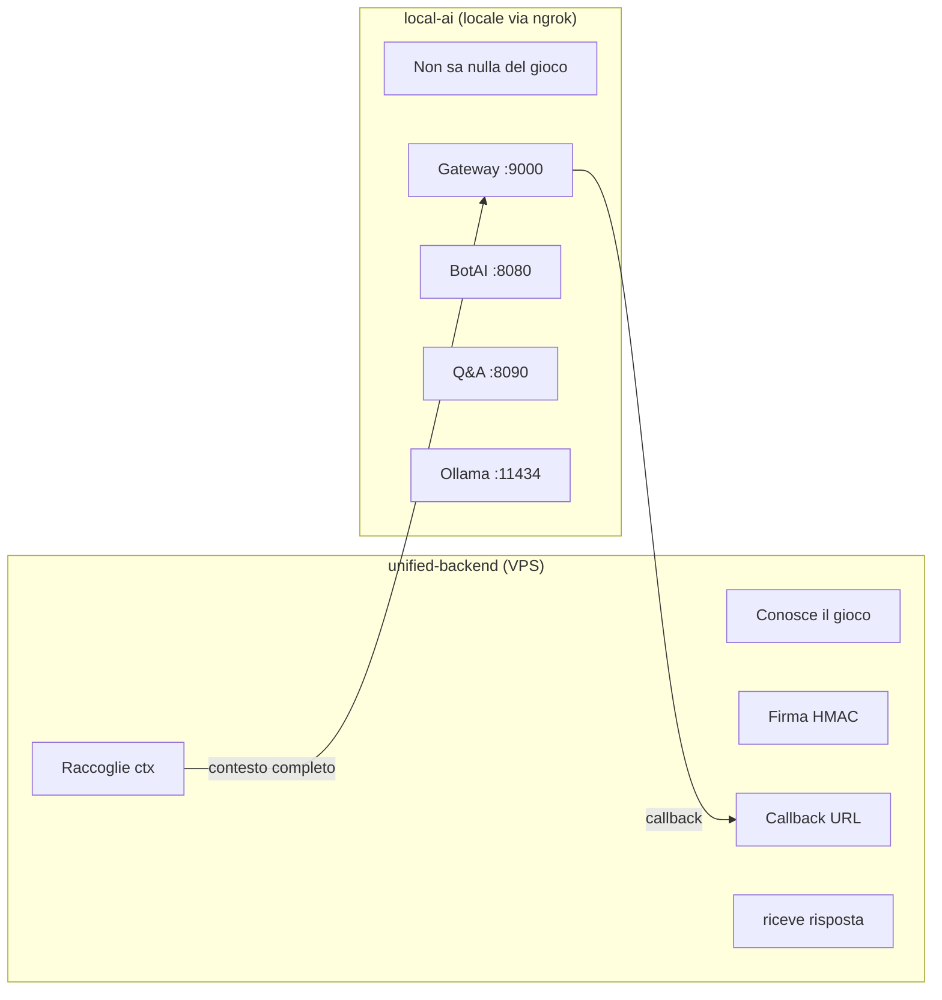

# Local AI Platform

**Navigation**: [Home](../INDEX.md) > [Backend](./README.md) > Local AI Platform

**Status**: ✅ Active | **Last Updated**: 2026-03-08 | **Version**: 2.0

Piattaforma AI locale indipendente per NPC bot, Q&A su documenti, e generazione immagini (futura).

---

## Overview

**Local AI** è una piattaforma standalone (`local-ai/`) che fornisce servizi AI locali tramite Ollama. Non ha accesso al database del gioco, non chiama il game-backend, non importa tipi da unified-backend.

**Principio**: il mondo esterno gli dice cosa fare, lui lo fa.

**Key Features**:
- ✅ **Bot NPC con Ollama**: Risposte generate localmente (zero costi API)
- ✅ **Q&A RAG**: Risposte a domande basate su contesto fornito dal caller
- ✅ **Gateway sicuro**: Multi-client con API key, HMAC opzionale per-client, rate limiting, Zod validation
- ✅ **Completamente indipendente**: Avviabile standalone con `docker compose up`
- 🔜 **Image Generation**: Stub per item, location, avatar (futura implementazione)

---

## Architecture

### Flusso Unidirezionale



### Differenze dalla v1 (vecchio botai-backend)

| Aspetto | v1 (Archivio) | v2 (Local AI) |
|---------|---------------|---------------|
| LLM | Claude API (a pagamento, rimosso) | Ollama locale (gratuito) |
| Dipendenze | Chiamava game-backend | Zero dipendenze esterne |
| Contesto | Andava a cercare nel DB gioco | Riceve tutto dal caller |
| Sicurezza | Header spoofabile | Multi-client + HMAC per-client + API key |
| Architettura | Monolite | Microservizi con gateway |

---

## Servizi

### Gateway (porta 9000)

Entry point unico con:
- **Porta 9000**: Esposta all'esterno, raggiungibile via ngrok
- HMAC opzionale **per-client** (configurato nel `clients.json`)
- Service registry con routing dinamico
- Zod validation su tutti i payload
- Rate limiting per-client (configurabile via `clients.json`)

### BotAI (porta 8080)

Genera risposte NPC con Ollama:
- `POST /respond`: Riceve contesto completo, genera risposta (sempre asincrono)
- `POST /bots`: CRUD bot
- `POST /bots/generate`: Genera bot con AI (sempre asincrono)
- MongoDB dedicato per bot, memorie, relazioni

### Q&A (porta 8090)

RAG senza dipendenze da search engine:
- `POST /ask`: Riceve domanda + contesto (chunks), genera risposta
- Il caller si occupa della ricerca semantica

### Stub Image Gen (porte 8100/8110/8120)

Struttura pronta, endpoint che rispondono 501 (profilo Docker `image-gen`):
- `item-image-gen`: Immagini oggetti
- `location-image-gen`: Immagini location
- `avatar-gen`: Avatar personaggi

---

## API Contracts

### POST /botai/respond

L'endpoint è **sempre asincrono**: risponde `202 Accepted` e processa in background. Il campo `callback` è **obbligatorio**.

```bash
curl -X POST http://localhost:9000/botai/respond \
  -H "X-API-Key: your-api-key" \
  -H "X-Client-Id: tpn-dev" \
  -H "Content-Type: application/json" \
  -d '{
    "requestId": "uuid",
    "bot": { "id": "bot-id", "name": "Detective Morrison" },
    "context": {
      "location": { "id": "loc-123", "name": "The Rusty Anchor Pub" },
      "actions": [
        {
          "characterId": "char-001",
          "characterName": "John Smith",
          "content": "*entra nel pub* Buonasera"
        }
      ],
      "presentCharacters": [
        { "id": "char-001", "name": "John Smith" }
      ]
    },
    "callback": {
      "url": "https://api.example.com/webhook",
      "method": "POST",
      "headers": { "Content-Type": "application/json" }
    }
  }'
```

Risposta immediata `202 Accepted`:
```json
{
  "success": true,
  "requestId": "uuid",
  "status": "queued",
  "queue": { "pending": 0, "size": 1 }
}
```

Callback con risposta completa inviata alla URL fornita.

### POST /qa/ask

```bash
curl -X POST http://localhost:9000/qa/ask \
  -H "X-API-Key: your-api-key" \
  -H "X-Client-Id: tpn-dev" \
  -H "Content-Type: application/json" \
  -d '{
    "question": "Come funzionano le armi da fuoco?",
    "context": [
      { "heading": "Armi", "content": "Le armi richiedono..." }
    ]
  }'
```

---

## Setup

### Avvio Standalone

```bash
cd local-ai
cp .env.example .env
cp clients.json.example clients.json
# Editare clients.json con chiavi generate (openssl rand -hex 32)

docker compose up -d
docker compose exec ollama ollama pull mistral:7b-instruct

# Verifica
curl http://localhost:9000/health
```

### Variabili d'ambiente (local-ai)

| Variabile | Descrizione |
|-----------|-------------|
| `OLLAMA_URL` | URL Ollama (`http://ollama:11434`) |
| `OLLAMA_MODEL` | Modello (`mistral:7b-instruct`) |
| `MONGODB_URI` | MongoDB interno local-ai |
| `GATEWAY_PORT` | Porta del gateway (default: `9000`) |
| `CLIENTS_FILE` | Path al file `clients.json` (opzionale) |
| `CORS_ORIGIN` | Origini CORS consentite (opzionale) |
| `LOG_LEVEL` | Livello di log (opzionale) |

L'autenticazione (API key, HMAC, permessi, rate limit) è gestita tramite `clients.json`, non tramite variabili d'ambiente. Vedi [documentazione interna local-ai](../../local-ai/docs/security.md).

### Variabili per unified-backend

| Variabile | Descrizione |
|-----------|-------------|
| `AI_GATEWAY_URL` | URL ngrok del gateway |
| `AI_GATEWAY_CLIENT_ID` | Client ID (es. `tpn-prod`) |
| `AI_GATEWAY_API_KEY` | API key (deve corrispondere a `clients.json`) |
| `AI_GATEWAY_HMAC_SECRET` | Segreto HMAC (deve corrispondere a `clients.json`) |
| `AI_GATEWAY_WEBHOOK_SECRET` | Auth per callback |

---

## Related Documentation

- [Documentazione interna local-ai](../../local-ai/docs/README.md) - Architettura, sicurezza, API reference, setup dettagliato
- [Embeddings Architecture](../04-ai-ml/embeddings-architecture.md) - Sistema di ricerca semantica
- [Unified Backend](./unified-backend-architecture.md) - Integrazione con game backend
- Vecchia documentazione: `_archive/botai-backend/`
