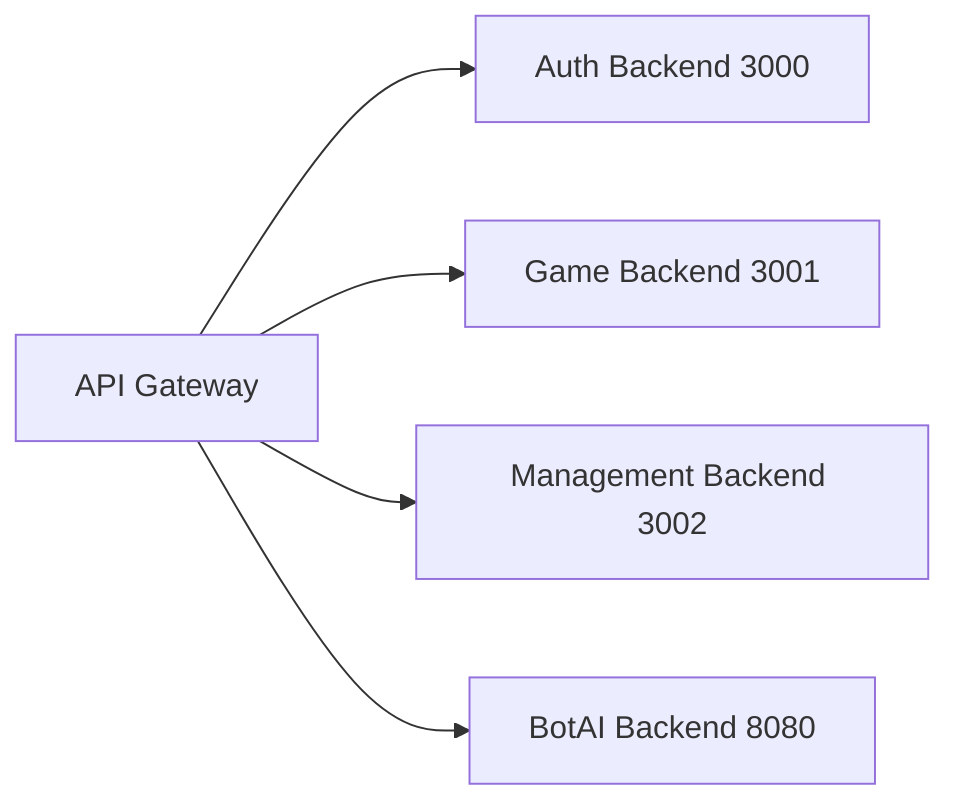
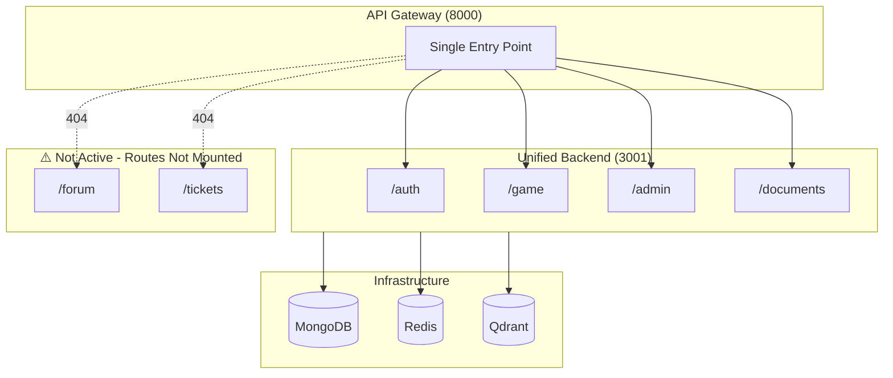
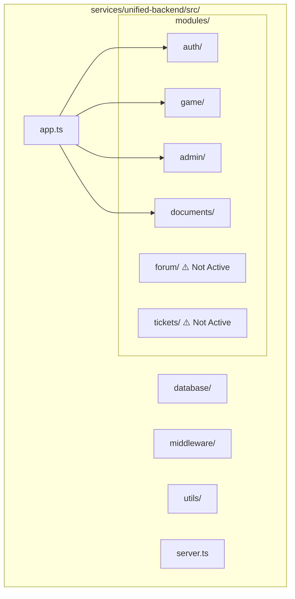
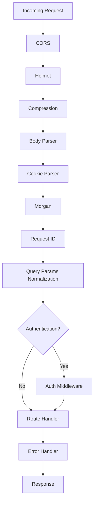
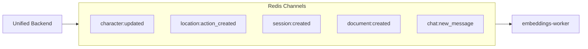

# Unified Backend Architecture

**Navigation**: [Home](../INDEX.md) > [Backend](./README.md) > Unified Backend Architecture

**Status**: ✅ Production Ready | **Last Updated**: 2026-03-08

Complete documentation of the TenPennyNovels Unified Backend architecture — modular structure with all services consolidated in a single Express application.

---

## Overview

TenPennyNovels uses a **Unified Backend** that consolidates all backend modules (authentication, game, admin, documents) in a single Express service. Forum and Tickets modules have code implemented but **routes are not mounted** — requests to `/forum` and `/tickets` return 404.

**Key Benefits**:
- ✅ **Single Deployment**: One process, one port (3001)
- ✅ **Shared Resources**: MongoDB connection pool, Redis client, shared middleware
- ✅ **Zero Breaking Changes**: API Gateway maintains same path prefixes
- ✅ **Simplified Infrastructure**: Fewer containers, less complexity
- ✅ **Hot-Reload Dev**: tsx watch for rapid development

**Previous Architecture** (deprecated):


**Current Architecture**:


> **CRITICAL**: Only **4 modules** are mounted in `app.ts`: `auth`, `documents`, `game`, `admin`. The API Gateway exposes `/forum` and `/tickets` but the backend does not mount these routes — requests return **404**.

---

## Entry Point & Technology Stack

| Component | Version |
|-----------|---------|
| **Entry Point** | `src/server.ts` → `src/app.ts` |
| **Port** | 3001 |
| **Node.js** | 22.x |
| **Express** | 5.2.1 |
| **TypeScript** | 5.9 |
| **Mongoose** | 9.2.1 |
| **Socket.IO** | 4.8.3 |

---

## Module Structure

### Root Directory



```
services/unified-backend/
├── src/
│   ├── modules/              # Feature modules
│   │   ├── auth/             # Authentication & User management ✅ Mounted
│   │   ├── game/             # Core gameplay logic ✅ Mounted
│   │   ├── admin/            # Administrative operations ✅ Mounted
│   │   ├── documents/        # Document management ✅ Mounted
│   │   ├── forum/            # Forum system ⚠️ In Development (routes NOT mounted)
│   │   └── tickets/          # Support tickets ⚠️ In Development (routes NOT mounted)
│   ├── database/
│   │   ├── models/           # 42 Mongoose schemas
│   │   ├── migrations/       # Database migrations
│   │   └── index.ts          # MongoDB connection
│   ├── middleware/
│   │   ├── auth.ts           # JWT authentication
│   │   ├── errorHandler.ts   # Global error handler
│   │   ├── validation.ts     # Request validation
│   │   └── requireMaster.ts  # Master role check
│   ├── utils/
│   │   ├── logger.ts         # Winston logger
│   │   ├── apiResponse.ts    # Standardized API responses
│   │   └── events/           # Redis event publishers
│   ├── app.ts                # Express app setup
│   └── server.ts             # Server entry point
├── logs/                     # Winston logs
├── Dockerfile.dev            # Development container
├── package.json
└── tsconfig.json
```

---

## Modules

### 1. Authentication Module (`/auth`) ✅ Active

**Purpose**: User management, JWT token system, password reset

**Structure**:
```
src/modules/auth/
├── controllers/
│   ├── AuthController.ts         # Login, logout, token refresh
│   ├── RegistrationController.ts # User registration
│   ├── PasswordController.ts     # Password reset workflow
│   ├── ProfileController.ts     # User profile management
│   └── SecurityController.ts    # Account deletion
├── routes/
│   └── auth.ts                  # Auth router (mounted at /auth)
└── services/
    └── EmailService.ts          # Email notifications
```

**Key Features**:
- **Dual-Token JWT**: `auth_token` (user) + `character_context` (character selection)
- **Password Reset**: Email-based with secure tokens
- **Email Verification**: Required before full access
- **Account Deletion**: GDPR-compliant deletion workflow

**Endpoints**:
```typescript
POST   /auth/register           - User registration
POST   /auth/login              - User login
POST   /auth/logout             - User logout
POST   /auth/refresh            - Refresh JWT
POST   /auth/forgot-password    - Request password reset
POST   /auth/reset-password/:token - Reset password
GET    /auth/verify-email/:token - Verify email
DELETE /auth/delete-account/:token - Delete account
POST   /auth/select-character   - Select character (character_context token)
GET    /auth/profile            - Get profile
PUT    /auth/profile            - Update profile
GET    /auth/occupations        - List occupations
```

**Details**: [Authentication System](./authentication-system.md)

---

### 2. Game Module (`/game`) ✅ Active

**Purpose**: Core gameplay logic, characters, locations, housing, sessions

**Structure**:
```
src/modules/game/
├── controllers/
│   ├── CharacterController.ts          # Character CRUD
│   ├── CharacterCrudController.ts      # Admin character ops
│   ├── CharacterLifecycleController.ts # Approval workflow
│   ├── CharacterLocationController.ts   # Location join/leave
│   ├── CharacterSkillsController.ts    # Skill management
│   ├── CharacterCorporationsController.ts # Corporation membership
│   ├── LocationController.ts           # Location operations
│   ├── HousingController.ts           # Housing system
│   ├── SessionController.ts            # Gaming sessions
│   ├── CorporationController.ts        # Corporations
│   ├── SkillController.ts              # Skills
│   ├── OccupationController.ts         # Occupations
│   ├── RelationshipController.ts       # Relationships
│   └── ... (20+ controllers)
├── routes/
│   └── index.ts                        # Game router (mounted at /game)
├── services/
│   ├── LocationService.ts              # Location business logic
│   ├── TurnManager.ts                  # Turn-based system
│   └── ...
└── websocket/
    ├── index.ts                        # Socket.IO server setup
    ├── gameHandlers.ts                 # Game event handlers
    └── chatHandlers.ts                 # Chat event handlers
```

**Key Features**:
- **Character Management**: Complete character lifecycle (creation, approval, progression)
- **Location System**: Hierarchical locations with join/leave mechanics
- **Housing System**: Property rental/purchase with automated rent collection
- **Gaming Sessions**: Turn-based sessions with Master tools
- **Messaging**: On-game postal system + off-game chat
- **Corporations**: Corporate management with treasury
- **WebSocket**: Real-time updates via Socket.IO

**Details**:
- [Character System](../03-game-systems/character-system.md)
- [Location System](../03-game-systems/location-system.md)
- [Housing System](../03-game-systems/housing-system.md)
- [Session Management](../03-game-systems/session-management.md)
- [WebSocket Patterns](../05-frontend/websocket-patterns.md)

---

### 3. Admin Module (`/admin`) ✅ Active

**Purpose**: Administrative operations, analytics, oversight

**Structure**:
```
src/modules/admin/
├── controllers/
│   ├── CharacterApprovalController.ts  # Character review
│   ├── UserManagementController.ts     # User management
│   ├── DocumentManagementController.ts # Document management
│   ├── ForumManagementController.ts    # Forum moderation
│   ├── TicketManagementController.ts    # Ticket management
│   └── ... (15+ controllers)
├── routes/
│   └── index.ts                        # Admin router (mounted at /admin)
└── middleware/
    └── adminAuth.ts                    # Admin role verification
```

**Key Features**:
- **Character Approval**: Review and approve pending characters
- **User Management**: Ban/unban users, permission management
- **Analytics**: System-wide statistics and reports
- **Moderation**: Chat monitoring and moderation actions
- **System Config**: Global settings management

---

### 4. Documents Module (`/documents`) ✅ Active

**Purpose**: Game documentation (ambientazione, regolamento), semantic search

**Structure**:
```
src/modules/documents/
├── controllers/
│   └── DocumentController.ts       # Document operations + semantic search
└── routes/
    └── index.ts                    # Documents router (mounted at /documents)
```

**Key Features**:
- **Hierarchical Documents**: Sections and subsections
- **Semantic Search**: Qdrant-powered vector search
- **Favorites**: User favorite documents
- **Visibility Control**: Public, authenticated, admin

**Endpoints**:
```typescript
GET    /documents/routes/list           - List documents
GET    /documents/routes/list-hierarchical - Hierarchical sidebar
GET    /documents/semantic-search       - Semantic search (Qdrant)
GET    /documents/ask                   - AI-powered Q&A
GET    /documents/:type/:path           - Get document by path
GET    /documents/favorites             - User favorites
POST   /documents/:type/:path/favorite - Toggle favorite
```

**Details**: [Semantic Search](../04-ai-ml/semantic-search.md)

---

### 5. Forum Module (`/forum`) ⚠️ In Development — Not Active

**Purpose**: Community discussions, announcements, bookmarks, reactions, follows, notifications

**Status**: Code exists (10 files with controllers for bookmarks, reactions, follows, notifications, subscriptions) but **routes are NOT mounted** in `app.ts`. The API Gateway exposes `/forum` but requests return **404**.

**Existing Structure**:
```
src/modules/forum/
├── controllers/
│   ├── ForumController.ts           # Topics, discussions, posts
│   ├── ForumBookmarkController.ts   # Bookmarks
│   ├── ForumReactionController.ts  # Reactions
│   ├── ForumFollowController.ts    # Character follows
│   ├── ForumSubscriptionController.ts # Discussion subscriptions
│   └── ForumNotificationController.ts # Notifications
├── routes/
│   └── forum.ts                    # Forum router (NOT mounted)
└── services/
    └── NotificationService.ts
```

**Planned Endpoints** (when mounted):
- Topics, discussions, posts CRUD
- Bookmarks, reactions, follows
- Subscriptions, notifications

---

### 6. Tickets Module (`/tickets` or `/game/tickets`) ⚠️ In Development — Not Active

**Purpose**: Support ticket system for character assistance

**Status**: Code exists (3 files: TicketController, routes, logger) but **routes are NOT mounted**. The ticket routes would be mounted under `/game` (e.g. `/game/tickets`). The API Gateway may expose `/tickets` or `/game/tickets` — in both cases requests return **404** because the backend does not mount the ticket routes.

**Existing Structure**:
```
src/modules/tickets/
├── controllers/
│   └── TicketController.ts    # User tickets, categories, messages
├── routes/
│   └── tickets.ts            # Ticket router (NOT mounted in game routes)
└── logger.ts
```

**Note**: Admin ticket management (`/admin/tickets/*`) **is active** — it is part of the Admin module. Only the user-facing ticket creation and management endpoints are not mounted.

---

## Technology Stack

### Framework — Express 5.2.1

**Why Express 5?**
- ✅ **Promise Support**: Automatic promise rejection handling
- ✅ **Async/Await**: No more `next()` callbacks in async routes
- ✅ **Performance**: Improved routing performance

**Example**:
```typescript
// Express 5 - automatic error handling
app.get('/characters', async (req, res) => {
  const characters = await Character.find();
  res.json({ success: true, data: characters });
  // If promise rejects, error middleware catches it automatically
});
```

---

### ORM — Mongoose 9.2.1

**Connection**:
```typescript
// src/database/index.ts
import mongoose from 'mongoose';

export async function connectDatabase() {
  await mongoose.connect(process.env.MONGODB_URI!, {
    maxPoolSize: 10,
    minPoolSize: 2,
    serverSelectionTimeoutMS: 5000
  });
  logger.info('MongoDB connected successfully');
}
```

**Details**: [MongoDB Schemas](../01-infrastructure/mongodb-schemas.md)

---

### WebSocket — Socket.IO 4.8.3

**Features**:
- **Room-Based Broadcasting**: Targeted events per location/session
- **Redis Adapter**: Multi-instance synchronization
- **Automatic Reconnection**: Client resilience

**Details**: [WebSocket Patterns](../05-frontend/websocket-patterns.md)

---

## Database Architecture

### MongoDB — 42 Collections

**Categories**:
1. **Core** (3): User, CharacterSession, SystemConfiguration
2. **Characters** (4): Character, CharacterProgression, CharacterFinances, BackgroundQuestion
3. **Locations & Gameplay** (5): Location, LocationAction, LocationTag, Route, BlockNotes
4. **Housing & Economy** (4): HousingProperty, EstateTransaction, Economy, FinancialTransaction
5. **Messaging** (7): OnGameMessage, OnGameMessageView, OffGameChat, OffGameChatMessage, etc.
6. **Documents** (3): Document, DocumentSection, DocumentChunk
7. **Gaming Sessions** (4): GamingSession, SessionManagement, SessionTemplate, Campaign
8. **Tickets** (3): Ticket, TicketMessage, TicketNotification
9. **Corporations** (2): Corporation, Relationship
10. **Game Rules** (3): Occupation, Skill, SocialClassConfig
11. **Items** (1): Item
12. **Experience** (1): ExperienceGrant
13. **Moderation** (2): ChatModerationAction, BroadcastMessage
14. **System** (1): WebSocketEvent

---

## Middleware Stack

### Request Flow



---

## Event-Driven Architecture

### Redis Pub/Sub Channels



---

## Development Workflow

### Hot-Reload Setup

```bash
# Start development server
npm run dev

# tsx watch automatically reloads on file changes
# No build step needed
```

---

## Quick Reference

| Property | Value |
|----------|-------|
| **Port** | 3001 |
| **Entry Point** | `src/server.ts` → `src/app.ts` |
| **Framework** | Express 5.2.1 |
| **ORM** | Mongoose 9.2.1 |
| **WebSocket** | Socket.IO 4.8.3 |
| **Node** | 22.x |
| **TypeScript** | 5.9 |
| **Mounted Modules** | auth, documents, game, admin |
| **Not Active** | forum, tickets (code exists, routes not mounted) |

---

## Related Documentation

- [API Gateway](./api-gateway.md) - Proxy routing
- [Authentication System](./authentication-system.md) - JWT system
- [API Reference](./api-reference.md) - Complete endpoint list
- [MongoDB Schemas](../01-infrastructure/mongodb-schemas.md) - Database structure
- [WebSocket Patterns](../05-frontend/websocket-patterns.md) - Real-time events
- [Deployment Guide](../06-operations/deployment-guide.md) - Production deployment
