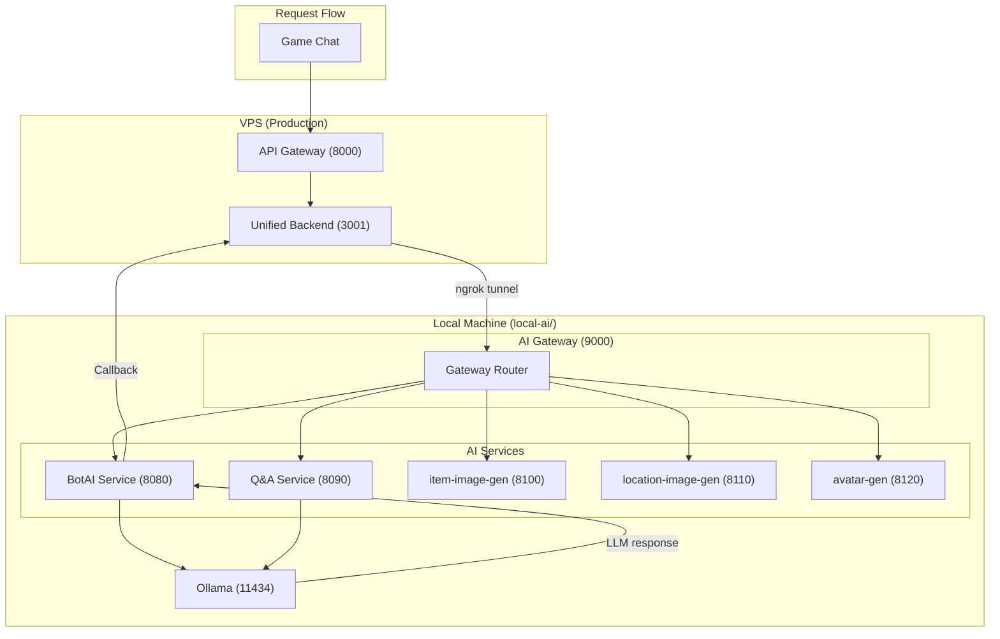
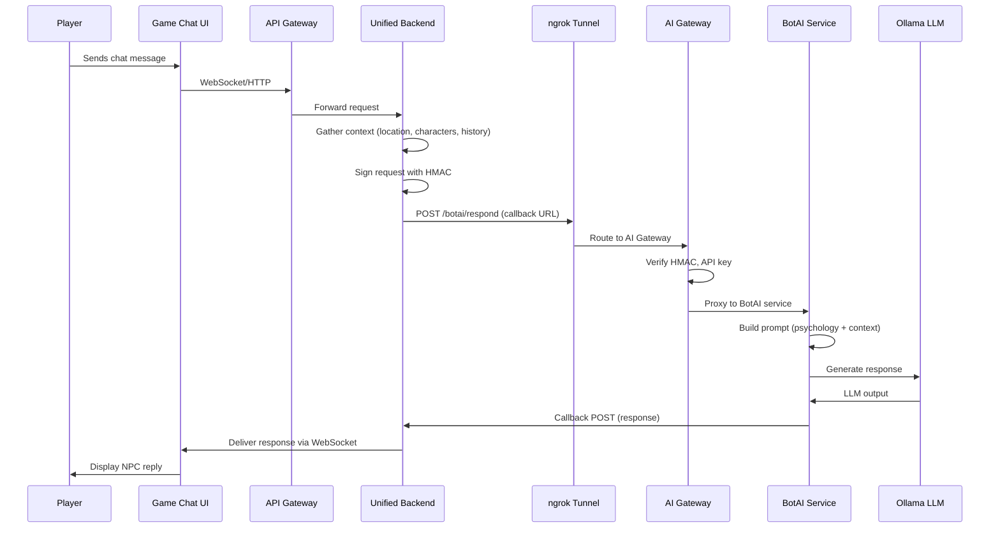

# BotAI Psychology System

**Navigation**: [Home](../INDEX.md) > [AI & ML](./README.md) > BotAI Psychology

**Status**: 🚧 In Development | **Last Updated**: 2026-03-08

Documentation of the BotAI psychology system for NPC characters: personality axes, central wound, and contextual response generation.

---

## Overview

The BotAI system powers intelligent NPC (Non-Player Character) behavior in TenPennyNovels. NPCs have a **psychology profile** that affects how they respond in chat, making interactions more realistic and character-consistent.

**Key architectural point**: The BotAI system runs on **local-ai/** (a separate machine), **NOT** on the VPS. The unified-backend on the VPS connects to the AI Gateway via an **ngrok tunnel**.

---

## Architecture

### Deployment Topology

### End-to-End Flow

---

## AI Gateway Services

The AI Gateway at `local-ai/gateway/` routes requests to these services:

| Service | Port | Purpose |
|---------|------|---------|
| **botai** | 8080 | NPC response generation, bot CRUD, bot generation |
| **qa** | 8090 | RAG Q&A on documents (context provided by caller) |
| **item-image-gen** | 8100 | Item image generation (stub) |
| **location-image-gen** | 8110 | Location image generation (stub) |
| **avatar-gen** | 8120 | Avatar generation (stub) |

---

## Psychology Model

The NPC psychology system includes:

### Personality Axes (6 dimensions)

Each NPC has 6 psychological axes on a scale of **-3 to +3**:

| Axis | Negative (-3) | Center (0) | Positive (+3) |
|------|---------------|------------|---------------|
| **Rational/Emotional** | Extremely rational | Balanced | Extremely emotional |
| **Controlled/Impulsive** | Very controlled | Balanced | Very impulsive |
| **Cynical/Idealist** | Deeply cynical | Pragmatic | Deeply idealistic |
| **Proud/Submissive** | Very proud | Balanced | Very submissive |
| **Prudent/Paranoid** | Extremely prudent | Cautious | Paranoid |
| **Direct/Allusive** | Very direct | Balanced | Very allusive |

These axes affect how NPCs react to situations, choose words, and express emotions.

### Central Wound

A deep psychological need or trauma that drives behavior:

- **wound**: The core psychological wound (e.g., "Fear of scandal", "Hunger for recognition")
- **manifestation**: How it manifests in behavior (e.g., "Avoids public confrontation", "Seeks validation from authority figures")

### Duality (Public Mask vs Private Truth)

- **publicMask**: What the NPC shows in public
- **privateTruth**: The inner truth (revealed only when trust level is high, e.g., >80%)

### Personality Traits

NPCs also have:

- **traits**: Array of personality traits (e.g., "curious", "distrustful", "jovial")
- **coreValues**: Core values (e.g., "loyalty", "ambition")
- **speechPattern**: How they speak (e.g., "speaks with Cockney accent")
- **activeEmotions**: Current emotional state with intensity and triggers

---

## Contextual Response Generation

The system generates responses based on:

1. **Location**: Where the conversation takes place (pub, street, mansion)
2. **Character history**: Past interactions, memories, relationship state
3. **Psychology profile**: Personality axes, central wound, traits
4. **Present characters**: Who is in the scene
5. **Recent actions**: The last few messages in the conversation

The BotAI service builds a system prompt that includes all this context and sends it to Ollama for inference.

---

## Security

### HMAC Authentication

The unified-backend and AI Gateway use **HMAC authentication** to ensure requests are authentic:

- **unified-backend** signs each request with `AI_GATEWAY_HMAC_SECRET`
- **AI Gateway** verifies the `X-HMAC-Signature` header using the client's `hmacSecret` from `clients.json`
- Requests without valid HMAC are rejected (when HMAC is configured for the client)

### Client Configuration

Each client (e.g., `tpn-prod`, `tpn-dev`) is defined in `local-ai/clients.json`:

- **apiKey**: Required for all requests
- **hmacSecret**: Optional; when present, HMAC signature is required
- **permissions**: Which services the client can access
- **rateLimit**: Max requests per minute

---

## Technology Stack

| Component | Technology |
|-----------|------------|
| **LLM Inference** | Ollama (local, no API cost) |
| **AI Gateway** | Node.js, Express |
| **BotAI Service** | Node.js, TypeScript |
| **Bot Storage** | MongoDB (dedicated local-ai database) |

---

## Related Documentation

- [BotAI Backend](../02-backend/botai-backend.md) - Backend integration, callback flow
- [Embeddings Architecture](./embeddings-architecture.md) - Semantic search for bot memories
- [BotAI Costs](./botai-costs.md) - Cost optimization (legacy Claude; Ollama is free)
- [local-ai docs](../../local-ai/docs/README.md) - Internal AI platform documentation
