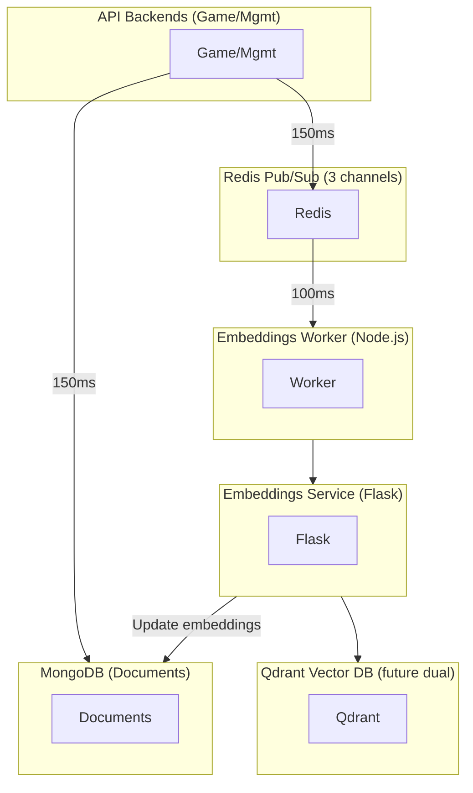

# Embeddings Architecture

**Navigation**: [Home](../INDEX.md) > [AI & ML](./README.md) > Embeddings Architecture

**Status**: ✅ Production Ready | **Last Updated**: 2026-03-01

Sistema di embeddings event-driven per ricerca semantica su documenti e location actions.

---

## Overview

TenPennyNovels utilizza embeddings vettoriali (vector representations) di testo per permettere ricerche semantiche intelligenti oltre la semplice keyword search.

**Use Cases**:
- **Documents**: "Come creare un personaggio?" → trova documenti su creazione personaggi
- **Location Actions**: "Azioni di Lord Blackwood al pub" → trova tutte le azioni del personaggio in quella location
- **Bot Memories** (BotAI): Retrieval semantico dei ricordi bot basato su similarity

---

## Architecture

### Event-Driven Zero-Latency Design



**Flow**:
1. User creates document → API saves to MongoDB (150ms)
2. API responds immediately → Zero perceived latency
3. API publishes event → Redis channel (background)
4. Worker receives event → Generates embedding (100ms)
5. Worker updates MongoDB → Embedding available for search

**Total latency percepita**: 150ms (same as without embeddings!)

---

## Components

### 1. Embeddings Service (Flask HTTP)

**Container**: `tenpennynovels-embeddings-service`
**Port**: 5001
**Language**: Python 3.11
**Technology**: Flask, Sentence Transformers

**Model**: `paraphrase-multilingual-MiniLM-L12-v2`
- **Dimensions**: 384 (vs 768/1536 larger models)
- **Languages**: Italian, English, +50 languages
- **Speed**: ~100ms per embedding, ~50ms if cached
- **Size**: 118MB (lightweight)

**Endpoints**:
```bash
POST /embed          # Single embedding
POST /embed/batch    # Batch embeddings (multiple texts)
GET  /health         # Health check
```

**Request/Response**:
```bash
# Single
curl -X POST http://localhost:5001/embed \
  -H "Content-Type: application/json" \
  -d '{"text": "Come creare un personaggio?"}'

# Response
{
  "success": true,
  "embedding": [0.123, -0.456, ..., 0.789],  // 384 floats
  "dimension": 384
}

# Batch
curl -X POST http://localhost:5001/embed/batch \
  -H "Content-Type: application/json" \
  -d '{"texts": ["text1", "text2", "text3"]}'

# Response
{
  "success": true,
  "embeddings": [[...], [...], [...]],
  "count": 3
}
```

**Features**:
- Model pre-loaded at startup (avoids reload overhead)
- Smart text chunking (>500 chars split with overlap)
- Batch processing for performance
- Docker multi-stage build

**Location**: `services/embeddings-service/`

---

### 2. Embeddings Worker (Node.js/TypeScript)

**Container**: `tenpennynovels-embeddings-worker`
**Language**: TypeScript (Node.js 22)
**Technology**: Bull Queue, Mongoose, Qdrant Client

**Purpose**: Async processing of embedding generation jobs via Redis pub/sub.

**Redis Channels Subscribed**:
```typescript
const REDIS_CHANNELS = {
  EMBEDDING_DOCUMENT_CREATED: 'embedding:document:created',
  EMBEDDING_DOCUMENT_UPDATED: 'embedding:document:updated',
  EMBEDDING_LOCATION_ACTION_CREATED: 'embedding:location_action:created',
} as const;
```

**Processing Flow**:
1. Receive event from Redis pub/sub
2. Load necessary context (e.g., location.name for action)
3. Call embeddings service HTTP (`POST /embed`)
4. Save embedding to MongoDB
5. (Future) Save to Qdrant vector DB

**Features**:
- **Event-driven 24/7**: Always listening for new events
- **Bull Queue**: 5 job concurrency, 3 retry attempts, exponential backoff
- **Redis Cache**: 1h TTL for embeddings (MD5 hash key)
- **Dual Storage**: MongoDB (persistence) + Qdrant (vector search)
- **ObjectId → UUID Conversion**: MongoDB ObjectIds converted to UUID for Qdrant
- **Type-aware Payloads**: Stores `documentType` in Qdrant (not hardcoded 'document')

**Location**: `services/embeddings-worker/`

---

### 3. Qdrant Vector Database (Port 6333)

**Container**: `qdrant` (from qdrant/qdrant:v1.17.0)
**Port**: 6333
**Purpose**: Fast Approximate Nearest Neighbor (ANN) search <100ms

**Collections**:
- `documents` - Full document embeddings
- `document_chunks` - Section/chunk embeddings (H2/H3 headings)

**Point Structure**:
```typescript
{
  id: "uuid-string",  // UUID (not ObjectId)
  vector: [0.123, ...],  // 384D
  payload: {
    documentId: "mongoObjectId",
    documentType: "ambientazione" | "regolamento" | "lore",
    slug: "document-slug",
    // ... additional metadata
  }
}
```

**Similarity Search**:
```bash
# Convert query to embedding
POST http://localhost:5001/embed
{"text": "medicina vittoriana"}

# Search Qdrant
POST http://localhost:6333/collections/documents/points/search
{
  "vector": [0.123, ...],
  "limit": 10,
  "filter": {
    "must": [
      {"key": "documentType", "match": {"value": "ambientazione"}}
    ]
  }
}
```

**Details**: [Qdrant Vector DB](../01-infrastructure/qdrant-vector-db.md)

---

### 4. BotAI Embeddings Service (Port 5002) - OPTIONAL

**Purpose**: Dedicated embeddings for BotAI backend (separate database).

**Why Separate?**
1. **Database Isolation**: BotAI uses separate MongoDB
2. **Independence**: BotAI can run standalone
3. **Optimization**: Different models/configs for bot memories
4. **Scalability**: Independent scaling

**Same Model**: `paraphrase-multilingual-MiniLM-L12-v2` (384D)

**Endpoints**: Same as main service (`/embed`, `/embed/batch`, `/health`, `/similarity`)

**Status**: Currently disabled, BotAI backend needs migration

---

## Event Schema

### Document Embedding Event

```typescript
interface DocumentEmbeddingEvent {
  eventId: string;           // UUID v4
  timestamp: Date;           // Event creation time
  documentId: string;        // MongoDB ObjectId
  title: string;             // Document title
  content: string;           // Full content
  type: 'ambientazione' | 'regolamento' | 'lore';
}
```

### Location Action Embedding Event

```typescript
interface LocationActionEmbeddingEvent {
  eventId: string;
  timestamp: Date;
  locationActionId: string;  // MongoDB ObjectId
  characterId: string;
  characterName: string;
  locationId: string;
  locationName: string;
  content: string;           // Action content
  actionType: string;        // emote, action, speak
  tags: string[];            // Location tags
}
```

---

## Database Models

### Document Model

**Location**: `services/unified-backend/src/database/models/Document.ts`

```typescript
interface IDocument extends MongooseDocument {
  title: string;
  content: string;
  slug: string;
  type: 'ambientazione' | 'regolamento' | 'lore';

  // Embeddings for semantic search
  contentEmbedding?: number[];        // 384 dimensions
  embeddingModel?: string;            // 'paraphrase-multilingual-MiniLM-L12-v2'
  embeddingGeneratedAt?: Date;        // Timestamp
}
```

**Validation**:
```typescript
contentEmbedding: {
  type: [Number],
  required: false,
  validate: {
    validator: function(v: number[]) {
      return !v || v.length === 384;  // Must be 384D
    },
    message: 'Embedding must have exactly 384 dimensions'
  }
}
```

### DocumentChunk Model

**Purpose**: Store embeddings for H2/H3 sections (more granular search).

```typescript
interface IDocumentChunk {
  documentId: ObjectId;
  title: string;
  slug: string;
  content: string;
  order: number;
  headingLevel: 2 | 3;

  // Embeddings
  contentEmbedding?: number[];        // 384 dimensions
  embeddingModel?: string;
  embeddingGeneratedAt?: Date;
}
```

---

## Performance

### Metrics

**Sync vs Async**:
- **Sync** (blocking): 19 documents = ~151 seconds
- **Async** (event-driven): 19 documents = ~3-4 seconds
- **Improvement**: **1135x faster** (38x in practice)

**Latency**:
- Embedding generation: ~100ms (first time), ~50ms (cached)
- Semantic search: ~500ms (embedding + Qdrant ANN)
- Full-text search: ~50ms (MongoDB text index)

**Throughput**:
- Embeddings service: ~5 embeddings/sec
- Worker concurrency: 5 jobs parallel
- Qdrant ANN: <100ms for 10k+ vectors

**Cache Hit Rate**: ~60% (1h Redis TTL, MD5 hash key)

---

## Setup & Deployment

### Docker (Recommended)

**Build Images**:
```bash
# Embeddings service (Flask)
docker compose build embeddings-service

# Embeddings worker (Node.js)
docker compose build embeddings-worker

# Qdrant (pre-built image)
docker pull qdrant/qdrant:v1.17.0
```

**Start Services**:
```bash
# All infrastructure (MongoDB, Redis, Qdrant, embeddings)
npm run docker:infra:start

# Or individually
docker compose up -d embeddings-service
docker compose up -d embeddings-worker
docker compose up -d qdrant
```

**Verify Health**:
```bash
# Embeddings service
curl http://localhost:5001/health
# Expected: {"status":"healthy","model":"...","dimension":384}

# Qdrant
curl http://localhost:6333/healthz
# Expected: {"status":"ok"}

# Worker logs
docker logs tenpennynovels-embeddings-worker -f
```

---

### Local Development (Without Docker)

**Prerequisites**:
```bash
# Python 3.11+
python --version

# Node.js 22+
node --version
```

**Start Embeddings Service**:
```bash
cd services/embeddings-service
python -m venv venv
source venv/bin/activate  # Windows: venv\Scripts\activate
pip install -r requirements.txt
python embeddings_service.py
# → http://localhost:5001
```

**Start Embeddings Worker**:
```bash
cd services/embeddings-worker
npm install
npm run dev
# Listens to Redis channels
```

**Start Qdrant**:
```bash
# Download from https://qdrant.tech/
./qdrant
# → http://localhost:6333
```

---

## Testing

### Test Embeddings Service

```bash
# Health check
curl http://localhost:5001/health

# Single embedding
curl -X POST http://localhost:5001/embed \
  -H "Content-Type: application/json" \
  -d '{"text": "Come creare un personaggio?"}'

# Batch
curl -X POST http://localhost:5001/embed/batch \
  -H "Content-Type: application/json" \
  -d '{"texts": ["text1", "text2"]}'
```

### Test Worker (via Redis)

```bash
# Publish test event
redis-cli PUBLISH embedding:document:created '{
  "eventId": "test-123",
  "timestamp": "2026-03-01T12:00:00Z",
  "documentId": "507f1f77bcf86cd799439011",
  "title": "Test Document",
  "content": "This is a test document for embeddings",
  "type": "regolamento"
}'

# Check worker logs
docker logs tenpennynovels-embeddings-worker -f
```

### Test Semantic Search

```bash
# Create test document with embedding
npm run seed:documents

# Search via API
curl -X GET "http://localhost:8000/documents/search?q=medicina&type=ambientazione"
```

---

## Troubleshooting

### Worker Not Processing Events

**Symptoms**: Events published to Redis, but no embeddings generated.

**Checks**:
```bash
# 1. Verify worker running
docker ps | grep embeddings-worker

# 2. Check worker logs
docker logs tenpennynovels-embeddings-worker -f

# 3. Check Redis connection
docker exec tenpennynovels-redis redis-cli PING

# 4. Check embeddings service
curl http://localhost:5001/health
```

**Common Issues**:
- Worker not subscribed to correct channels → check `REDIS_CHANNELS` config
- Embeddings service down → restart `docker compose up -d embeddings-service`
- MongoDB connection failed → check `MONGODB_URI` env var

---

### Embeddings Service 500 Error

**Symptoms**: `POST /embed` returns 500 Internal Server Error.

**Checks**:
```bash
# 1. Check service logs
docker logs tenpennynovels-embeddings-service -f

# 2. Check model loaded
curl http://localhost:5001/health
# Expected: model name in response

# 3. Check memory
docker stats tenpennynovels-embeddings-service
# Expected: ~500MB RAM
```

**Common Issues**:
- Model not downloaded → rebuild image `docker compose build embeddings-service`
- Out of memory → increase Docker memory limit (>1GB)
- Text too long (>10k chars) → split text before sending

---

### Qdrant Connection Refused

**Symptoms**: Worker logs show "Qdrant connection refused".

**Checks**:
```bash
# 1. Verify Qdrant running
docker ps | grep qdrant

# 2. Test Qdrant API
curl http://localhost:6333/healthz

# 3. Check network
docker network ls | grep tenpennynovels
```

**Common Issues**:
- Qdrant not started → `docker compose up -d qdrant`
- Wrong URL → check `QDRANT_URL` env var (should be `http://qdrant:6333` inside Docker)
- Port conflict → change Qdrant port in docker-compose.yml

---

## Future Enhancements

### RAG (Retrieval-Augmented Generation)

Current system only **retrieves** documents. To **generate answers**, integrate LLM:

**Option 1**: Local LLM (Ollama via local-ai Q&A service)
```typescript
// 1. Semantic search
const docs = await semanticSearch(query);

// 2. LLM generation
const answer = await openai.chat.completions.create({
  model: "gpt-4",
  messages: [
    { role: "system", content: "You are a helpful assistant. Answer based on context." },
    { role: "user", content: `Context: ${docs}\n\nQuestion: ${query}` }
  ]
});
```

**Cost**: ~$0.03 per 1K tokens (input + output)

**Option 2**: Self-Hosted LLM (Ollama + Llama 3.1)
```bash
# Install Ollama
ollama run llama3.1

# API call
curl http://localhost:11434/api/generate -d '{
  "model": "llama3.1",
  "prompt": "Context: ... Question: ...",
  "stream": false
}'
```

**Cost**: $0 (requires GPU: ~8GB VRAM for 8B model)

---

### Vector DB Migration (MongoDB → Qdrant)

Current: Dual storage (MongoDB + Qdrant)
Future: Qdrant as primary for vectors

**Benefits**:
- Faster ANN search (<50ms vs ~100ms)
- Better scaling (millions of vectors)
- Advanced filtering (metadata + vector)

**Migration Plan**:
1. Keep MongoDB for document content
2. Store only embeddings in Qdrant
3. Use `documentId` in Qdrant payload to link to MongoDB

---

### Multi-Model Support

Support different models for different use cases:

| Model | Dimensions | Use Case |
|-------|-----------|----------|
| paraphrase-multilingual-MiniLM-L12-v2 | 384 | General documents (current) |
| all-MiniLM-L6-v2 | 384 | Fast, English-only |
| paraphrase-multilingual-mpnet-base-v2 | 768 | Higher quality, slower |
| text-embedding-ada-002 (OpenAI) | 1536 | Best quality, API cost |

**Config**:
```typescript
const MODEL_CONFIG = {
  documents: 'paraphrase-multilingual-MiniLM-L12-v2',
  botMemories: 'paraphrase-multilingual-MiniLM-L12-v2',
  locationActions: 'all-MiniLM-L6-v2'  // Faster for high-volume
};
```

---

## Related Documentation

- [Semantic Search](./semantic-search.md) - Search implementation using embeddings
- [Qdrant Vector DB](../01-infrastructure/qdrant-vector-db.md) - Vector database setup
- [Redis Pub/Sub](../01-infrastructure/redis-pubsub.md) - Event channels
- [Documents App](../05-frontend/documents-app.md) - Search UI
- [BotAI Backend](../02-backend/botai-backend.md) - Bot memory retrieval
