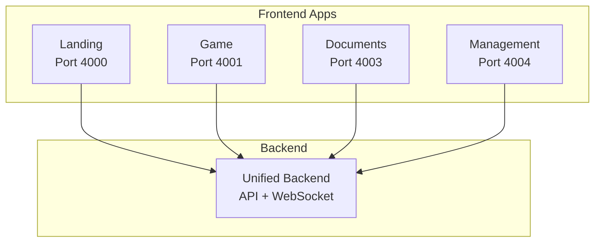
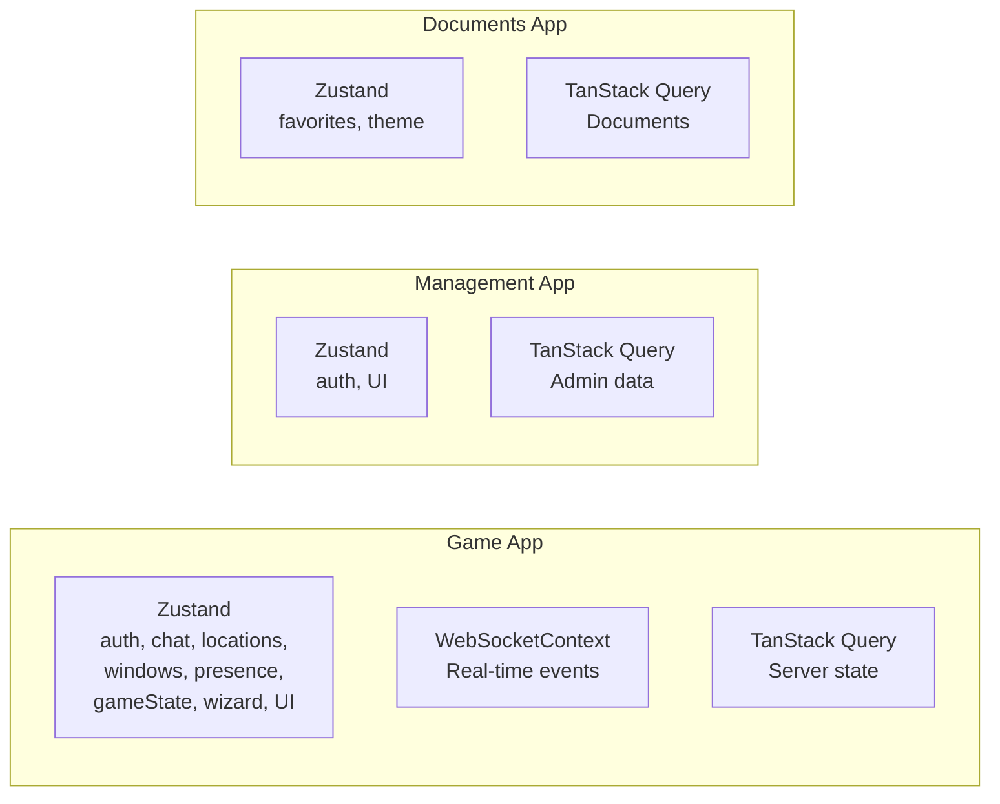
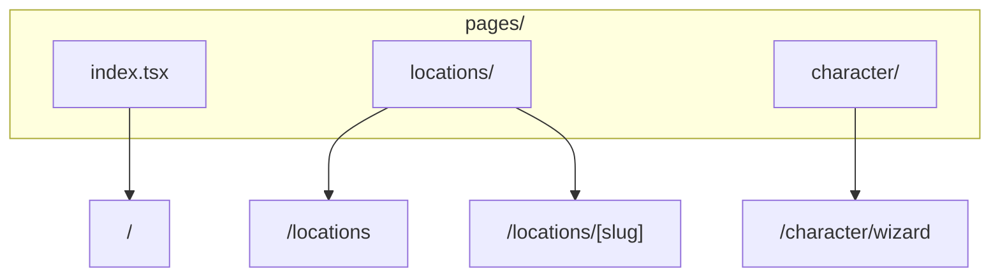
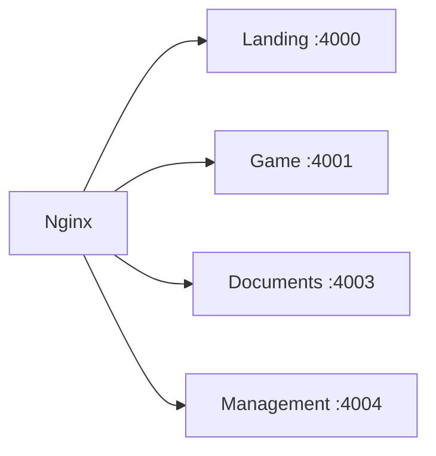

# Frontend Applications

**Navigation**: [Home](../INDEX.md) > Frontend

**Status**: ✅ Production Ready | **Last Updated**: 2026-03-08

Documentation for the 4 frontend Next.js applications of TenPennyNovels.

---

## Overview

TenPennyNovels uses 4 separate frontend applications built with Next.js 16, each with a specific scope and optimized for its use case.



---

## Applications

### 1. Landing App (Port 4000)

**Purpose**: Login, registration, character selection, onboarding.

**Technology**:
- Next.js 16.1.6
- React 19.2
- React Hook Form 7.71.2
- Zod 4.3.6
- SCSS Modules

**Key Features**:
- User registration with email verification
- Login (remember-me optional)
- Forgot password / reset password flow
- Character selection (user's character list)
- Character wizard redirect (for creation)
- Victorian-themed landing page

**Routes**:
- `/` - Landing page (login)
- `/register` - User registration
- `/forgot-password` - Password reset request
- `/reset-password/[token]` - Password reset
- `/delete-account/[token]` - Account deletion
- `/character-select` - Character selection
- `/character-creation` - Character creation wizard
- `/credits` - Credits page

**State Management**: Local component state + React Hook Form

**File**: [Landing App](./landing-app.md)

---

### 2. Game App (Port 4001)

**Purpose**: Main gameplay interface - locations, chat, sessions, character sheets.

**Technology**:
- Next.js 16.1.6
- React 18.3
- Socket.IO Client 4.8.3
- Zustand 5.0.3
- TanStack Query 5.62.11
- SCSS Modules

**Key Features**:
- **Location Exploration**: Join/leave locations, view occupants
- **Location Chat**: Real-time chat with turn-based system
- **Character Sheets**: View/edit character details
- **Sessions**: Participate in gaming sessions
- **OffGame Chat**: Private messages with other players
- **OnGame Mail**: Victorian postal system (IC)
- **Admin Panel Access**: Link to management app (if admin)

**State Management**:
- Zustand stores (auth, chat, locations, windows, presence, game state, wizard, UI)
- WebSocketContext (real-time events)
- TanStack Query (server state caching)

**WebSocket Integration**: [WebSocket Patterns](./websocket-patterns.md) (**CRITICAL**)

**Routes**:
- `/` - Game home (location list)
- `/locations` - Locations map
- `/locations/[slug]` - Location detail
- `/locations/[slug]/chat` - Location chat
- `/character/wizard` - Character creation wizard
- `/presenti-online` - Online presence list

**File**: [Game App](./game-app.md)

---

### 3. Documents App (Port 4003)

**Purpose**: Knowledge base (ambientazione e regolamento) with semantic search.

**Technology**:
- Next.js 16.1.6
- React 18.3
- Zustand 5.0.3
- TanStack Query 5.62.11
- Marked 17.0.3 (Markdown rendering)
- DOMPurify 3.0.6 (XSS protection)
- SCSS Modules

**Key Features**:
- **Document Browsing**: Hierarchical navigation (categories, documents)
- **Semantic Search**: Vector-based + full-text search
- **Favorites**: Save documents for quick access
- **Responsive**: Mobile-optimized

**Routes**:
- `/` - Redirects to /ambientazione
- `/ambientazione` - Setting documents index
- `/ambientazione/[...slug]` - Setting document detail
- `/regolamento` - Rules documents index
- `/regolamento/[...slug]` - Rule document detail
- `/preferiti` - Saved favorites
- `/preferiti/[...slug]` - Favorite document detail

**State Management**:
- Zustand store (favorites, theme)
- TanStack Query (document caching)

**File**: [Documents App](./documents-app.md)

---

### 4. Management App (Port 4004)

**Purpose**: Admin panel for game management.

**Technology**:
- Next.js 16.1.6
- React 18.3
- Zustand 5.0.3
- TanStack Query 5.62.11
- React Hook Form 7.71.2
- Zod 3.25.1
- TipTap editor (rich text)
- dnd-kit (drag and drop)
- SCSS Modules

**Key Features**:
- **Character Approval**: Review pending characters
- **User Management**: Ban/unban, permissions
- **Location Management**: Location CRUD
- **Document Management**: CRUD documents
- **System Configuration**: Game settings
- **Audit Logs**: Track admin actions
- **Broadcast Messages**: System announcements

**Routes** (basePath: `/gestione`):
- `/` - Admin dashboard
- `/users/user-list` - User management
- `/users/ban-list` - Ban list
- `/characters/character-list` - All characters
- `/characters/character-pending` - Pending approvals
- `/characters/permissions` - Character permissions
- `/locations/location-list` - Location management
- `/documents/document-list` - Document CRUD
- `/documents/subtypes` - Document subtypes
- `/system/configurations` - System config
- `/system/audit-logs` - Audit trail
- `/system/broadcast` - Broadcast messages
- `/system/maintenance` - Maintenance mode
- `/system/deleted-records` - Deleted records

**State Management**:
- Zustand store (auth, UI state)
- TanStack Query (admin data caching)

**Authentication**: Requires `canAccessAdminPanel: true` + specific userRoles

**File**: [Management App](./management-app.md)

---

## Shared UI System

### Shared UI Library

**Path**: `apps/shared-ui/` (or `packages/shared-ui`)

**Package**: `@tenpennynovels/shared-ui`

**Purpose**: Centralized Victorian-themed design system shared between game and management apps.

**Used by**: Game App, Management App (Landing and Documents have their own styles)

**File**: [Shared UI System](./shared-ui-system.md)

---

## WebSocket Integration

### CRITICAL PATTERN

**Rule**: NEVER call `socket.on()` or `socket.emit()` directly in components.

**Why**: Memory leaks, uncontrolled subscriptions, difficult cleanup.

**Pattern**: Use WebSocketContext subscription methods.

**Example**:

```typescript
// ❌ WRONG - Direct socket usage
import { io } from 'socket.io-client';

function MyComponent() {
  const socket = io('ws://localhost:8000');

  useEffect(() => {
    socket.on('player_joined', handlePlayerJoined); // Memory leak
    return () => socket.off('player_joined'); // Cleanup often forgotten
  }, []);
}

// ✅ CORRECT - WebSocketContext subscription
import { useWebSocket } from '@/contexts/WebSocketContext';

function MyComponent() {
  const { subscribeToLocation } = useWebSocket();

  useEffect(() => {
    const unsubscribe = subscribeToLocation(locationId, (event) => {
      if (event.type === 'player_joined') {
        handlePlayerJoined(event.data);
      }
    });

    return unsubscribe; // Automatic cleanup
  }, [locationId]);
}
```

**Details**: [WebSocket Patterns](./websocket-patterns.md) (**READ THIS FIRST**)

---

## State Management Strategies



### Game App

**Zustand Stores** (game state):
- `authStore` - User, character, permissions
- `chatStore` - Chat messages, typing state
- `locationStore` - Current location, favorites
- `windowManagerStore` - Open windows (character sheets, chat panels)
- `presenceStore` - Online players
- `gameStateStore` - Game session state
- `wizardStore` - Character creation wizard
- `uiStore` - Theme, sidebar state

**WebSocketContext** (real-time):
- Connection management
- Event subscriptions
- Automatic reconnection

**TanStack Query** (server state):
- API call caching
- Automatic refetch
- Optimistic updates

### Management App

**Zustand Store** (auth + UI):
- `authStore` - User, permissions
- `uiStore` - Sidebar, column visibility

**TanStack Query** (admin data):
- Character approvals
- User list
- Analytics data

### Documents App

**Zustand Store** (favorites + theme):
- Favorites list
- Theme preference

**TanStack Query** (document data):
- Document content
- Search results
- Route tree

---

## Routing & Navigation

### Next.js File-Based Routing

All apps use Next.js file-based routing:



### Cross-App Navigation

Apps link to each other via environment variables:

```typescript
// Landing → Game (after character select)
window.location.href = process.env.NEXT_PUBLIC_GAME_URL;

// Game → Management (admin link)
window.location.href = process.env.NEXT_PUBLIC_MANAGEMENT_URL;
```

**Note**: Full page reload required for cross-app navigation (different Next.js instances).

---

## Environment Variables

### Common Variables

```bash
# Backend API
NEXT_PUBLIC_API_URL=http://localhost:8000

# WebSocket (Game App and Management App)
NEXT_PUBLIC_WS_URL=ws://localhost:8000

# Cross-app URLs
NEXT_PUBLIC_LANDING_URL=http://localhost:4000
NEXT_PUBLIC_GAME_URL=http://localhost:4001
NEXT_PUBLIC_DOCUMENTS_URL=http://localhost:4003
NEXT_PUBLIC_MANAGEMENT_URL=http://localhost:4004
```

**Details**: [Environment Variables](../01-infrastructure/environment-variables.md)

---

## Building & Deployment

### Development

```bash
# Start individual app
cd apps/game
npm run dev

# Or from root (runs all)
npm run frontend:all
```

### Production Build

Production deployment uses **PM2 + Next.js SSR** (standalone output), not Docker.

```bash
# Build app
cd apps/game
npm run build

# Start production server (PM2 manages this)
npm run start
```

### Deployment Process

1. **Build**: `./deploy/primo-rilascio-manuale/build-all.sh` builds all services and apps
2. **PM2**: Apps run via PM2 (`next start -p 400X`)
3. **Nginx**: Reverse proxy routes traffic to each app port



---

## Files in This Section

- [README.md](./README.md) - This file
- [WebSocket Patterns](./websocket-patterns.md) - **CRITICAL** real-time patterns
- [Game App](./game-app.md) - Main gameplay interface
- [Landing App](./landing-app.md) - Login and character selection
- [Documents App](./documents-app.md) - Knowledge base
- [Management App](./management-app.md) - Admin panel
- [Shared UI System](./shared-ui-system.md) - Design system

---

## Related Documentation

- [Backend API](../02-backend/api-reference.md) - API endpoints
- [Game Systems](../03-game-systems/README.md) - Gameplay mechanics
- [Infrastructure](../01-infrastructure/README.md) - Backend services
- [Getting Started](../00-getting-started/README.md) - Setup guide
