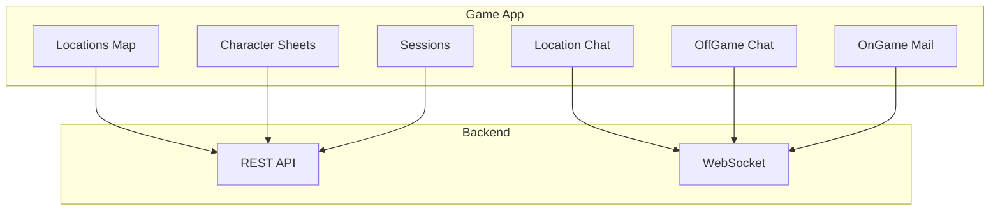
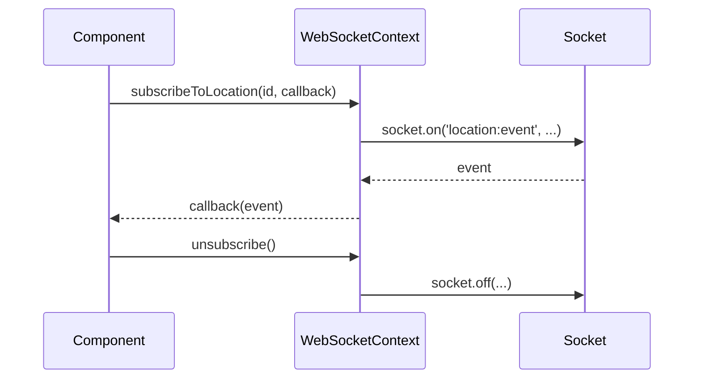
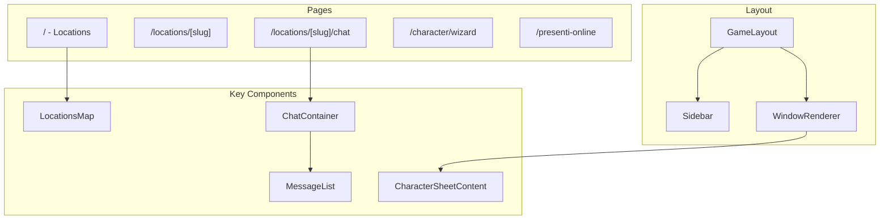

# Game App

**Navigation**: [Home](../INDEX.md) > [Frontend](./README.md) > Game App

**Status**: ✅ Production Ready | **Last Updated**: 2026-03-08

Main gameplay interface for TenPennyNovels - locations, chat, sessions, character sheets.

---

## Overview

The Game App is the primary interface for players to explore locations, participate in real-time chat, manage character sheets, and interact with the Victorian London setting.



---

## Technology Stack

| Technology | Version |
|------------|---------|
| Next.js | 16.1.6 |
| React | 18.3 |
| Socket.IO Client | 4.8.3 |
| Zustand | 5.0.3 |
| TanStack Query | 5.62.11 |
| TanStack Virtual | 3.13.19 |
| SCSS Modules | 1.97.3 |
| Shared UI | @tenpennynovels/shared-ui |

**Port**: 4001

---

## Key Features

- **Location Exploration**: Join/leave locations, view occupants, navigate the map
- **Location Chat**: Real-time chat with turn-based system
- **Character Sheets**: View/edit character details (skills, equipment, background, etc.)
- **Sessions**: Participate in gaming sessions
- **OffGame Chat**: Private messages with other players (OOC)
- **OnGame Mail**: Victorian postal system (IC)
- **Admin Panel Access**: Link to management app for users with admin permissions

---

## State Management (Zustand Stores)

| Store | Purpose |
|-------|---------|
| `authStore` | User, selected character, permissions, login/logout |
| `chatStore` | Chat messages, typing state, location chat state |
| `locationStore` | Current location, favorite locations |
| `windowManagerStore` | Open windows (character sheets, chat panels, mail) |
| `presenceStore` | Online players in current location |
| `gameStateStore` | Game session state |
| `wizardStore` | Character creation wizard state |
| `uiStore` | Theme, sidebar collapsed state |

---

## WebSocket Integration

**WebSocketContext** provides real-time event handling. **Never** call `socket.on()` or `socket.emit()` directly in components.



**Environment Variable**: `NEXT_PUBLIC_WS_URL` (e.g. `ws://localhost:8000`)

**Details**: [WebSocket Patterns](./websocket-patterns.md)

---

## Routes

| Route | Description |
|-------|-------------|
| `/` | Game home - location list |
| `/locations` | Locations map |
| `/locations/[slug]` | Location detail |
| `/locations/[slug]/chat` | Location chat |
| `/character/wizard` | Character creation wizard |
| `/presenti-online` | Online presence list |

---

## Main Components

| Component | Purpose |
|-----------|---------|
| **ChatContainer** | Main chat layout, integrates with useLocationChat |
| **MessageList** | Scrollable message list with virtualization |
| **LocationsMap** | Interactive map of game locations |
| **CharacterSheet panels** | CharacterSheetLeftPanel, CharacterSheetRightPanel, tabs |
| **Sidebar** | Left sidebar with character info, presence, weather/time |
| **WindowRenderer** | Renders open windows (character sheets, chat panels, mail) |

---

## Architecture



---

## File Structure

```
apps/game/
├── src/
│   ├── components/
│   │   ├── chat/           # ChatContainer, MessageList
│   │   ├── character/      # Character sheet panels, tabs
│   │   ├── layout/         # GameLayout, Sidebar
│   │   ├── locations/      # LocationsMap
│   │   ├── windows/        # WindowRenderer, Window, contents
│   │   └── ...
│   ├── contexts/
│   │   └── WebSocketContext.tsx
│   ├── hooks/
│   │   ├── useLocationChat.ts
│   │   ├── useOffGameChat.ts
│   │   ├── useOnGameMail.ts
│   │   └── ...
│   ├── store/
│   │   ├── authStore.ts
│   │   ├── chatStore.ts
│   │   ├── locationStore.ts
│   │   ├── windowManagerStore.ts
│   │   ├── presenceStore.ts
│   │   ├── gameStateStore.ts
│   │   ├── wizardStore.ts
│   │   └── uiStore.ts
│   └── pages/
│       ├── index.tsx
│       ├── locations/
│       ├── character/
│       └── presenti-online.tsx
└── package.json
```

---

## Related Documentation

- [WebSocket Patterns](./websocket-patterns.md) - Real-time patterns
- [Frontend README](./README.md) - Overview
- [Shared UI System](./shared-ui-system.md) - Design system
