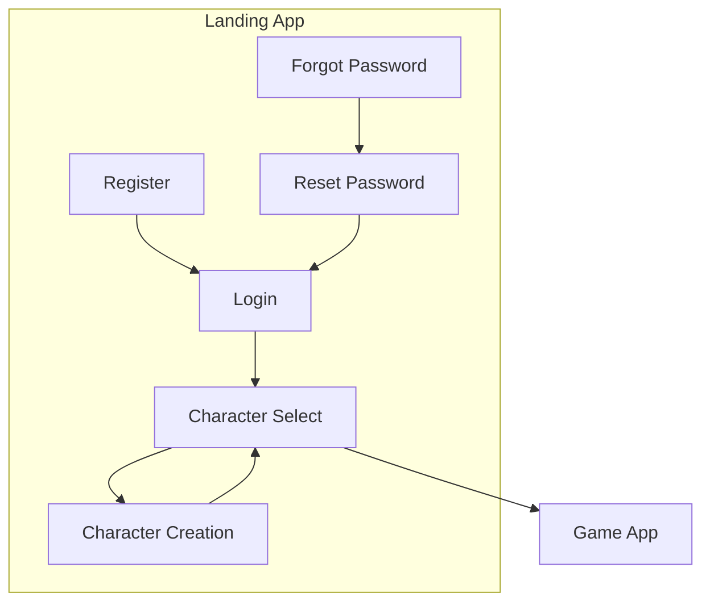

# Landing App

**Navigation**: [Home](../INDEX.md) > [Frontend](./README.md) > Landing App

**Status**: ✅ Production Ready | **Last Updated**: 2026-03-08

Login, registration, character selection, and onboarding for TenPennyNovels.

---

## Overview

The Landing App is the entry point for users. It handles authentication, registration, password recovery, and character selection before redirecting to the Game App.



---

## Technology Stack

| Technology | Version |
|------------|---------|
| Next.js | 16.1.6 |
| React | 19.2 |
| React Hook Form | 7.71.2 |
| Zod | 4.3.6 |
| SCSS Modules | 1.97.3 |

**Port**: 4000

---

## Key Features

- **Login**: Username/password with optional remember-me
- **Register**: User registration with email verification
- **Forgot/Reset Password**: Password recovery flow
- **Character Select**: List of user's characters, redirect to game or creation
- **Character Creation**: Wizard for new character (redirects to game app)
- **Victorian Theme**: Consistent Victorian aesthetic across all pages

---

## Routes

| Route | Description |
|-------|-------------|
| `/` | Landing page (login) |
| `/register` | User registration |
| `/forgot-password` | Password reset request |
| `/reset-password/[token]` | Password reset with token |
| `/delete-account/[token]` | Account deletion with token |
| `/character-select` | Character selection |
| `/character-creation` | Character creation wizard |
| `/credits` | Credits page |

**Email Verification**: Link in email points to `/?token=xxx` (handled on index page)

---

## Layout

**VictorianLayout** is the main layout wrapper with desktop and mobile variants:

- **Desktop** (≥1024px): Left sidebar (logo + nav) + right content (background image + page content)
- **Mobile** (<1024px): Hamburger menu, overlay nav, content with background image

**Layout Components**:
- `VictorianLayout` - Chooses desktop/mobile based on viewport
- `VictorianLayoutDesktop` - Desktop layout
- `VictorianLayoutMobile` - Mobile layout
- `PageLayout` - Combines SEO + VictorianLayout
- `FormPageLayout` - Form pages (login, register)
- `TokenPageLayout` - Token-based pages (reset password, delete account)

---

## Services

| Service | Purpose |
|---------|---------|
| **AuthService** | Login, register, logout, profile, password reset, email verification, account deletion |
| **CharacterService** | List characters, create character, character operations |
| **SettingsService** | User preferences, UI settings |

All services use the shared API client (`@/lib/api/client`).

---

## State Management

- **Local component state** for form state
- **React Hook Form** for form handling and validation
- **Zod** for schema validation (via @hookform/resolvers)

No global state store - authentication state is managed via cookies and redirects.

---

## File Structure

```
apps/landing/
├── src/
│   ├── components/
│   │   ├── VictorianLayout.tsx
│   │   ├── VictorianLayoutDesktop.tsx
│   │   ├── VictorianLayoutMobile.tsx
│   │   ├── layouts/
│   │   │   ├── PageLayout.tsx
│   │   │   ├── FormPageLayout.tsx
│   │   │   └── TokenPageLayout.tsx
│   │   └── forms/
│   ├── services/
│   │   ├── AuthService.ts
│   │   ├── CharacterService.ts
│   │   └── SettingsService.ts
│   ├── lib/
│   │   ├── api/
│   │   └── validation/
│   └── pages/
│       ├── index.tsx
│       ├── register.tsx
│       ├── forgot-password.tsx
│       ├── reset-password/[token].tsx
│       ├── delete-account/[token].tsx
│       ├── character-select.tsx
│       ├── character-creation.tsx
│       └── credits.tsx
└── package.json
```

---

## Related Documentation

- [Frontend README](./README.md) - Overview
- [Backend API - Auth](../02-backend/api-reference.md) - Auth endpoints
