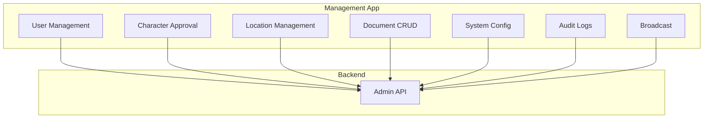
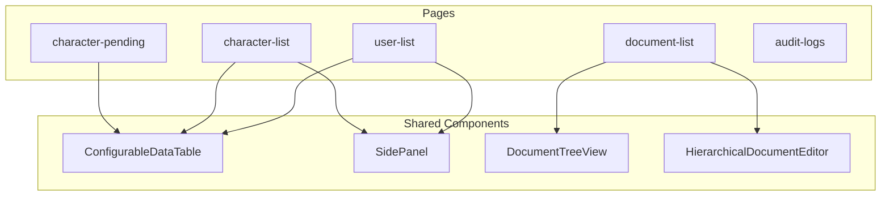

# Management App

**Navigation**: [Home](../INDEX.md) > [Frontend](./README.md) > Management App

**Status**: ✅ Production Ready | **Last Updated**: 2026-03-08

Admin panel for game management - characters, users, locations, documents, system config.

---

## Overview

The Management App is the administrative interface for TenPennyNovels. It requires `canAccessAdminPanel: true` and specific user roles. Authentication is handled by the Landing App; users must be logged in with admin permissions.



---

## Technology Stack

| Technology | Version |
|------------|---------|
| Next.js | 16.1.6 |
| React | 18.3 |
| Zustand | 5.0.3 |
| TanStack Query | 5.62.11 |
| React Hook Form | 7.71.2 |
| Zod | 3.25.1 |
| TipTap | 2.27.2 (rich text editor) |
| dnd-kit | 6.3.1 (drag and drop) |
| Socket.IO Client | 4.8.3 |
| SCSS Modules | 1.97.3 |
| Shared UI | @tenpennynovels/shared-ui |

**Port**: 4004

**Base Path**: `/gestione` (production: https://tenpennynovels.com/gestione)

---

## Key Features

- **Character Approval**: Review and approve/reject pending characters
- **User Management**: User list, edit, ban/unban
- **Location Management**: CRUD for game locations
- **Document Management**: Hierarchical document CRUD with TipTap editor
- **System Configuration**: Game settings
- **Audit Logs**: Track admin actions
- **Broadcast Messages**: System announcements
- **Maintenance Mode**: Enable/disable maintenance
- **Deleted Records**: View and restore soft-deleted records

---

## Routes

All routes are prefixed with `/gestione` in production.

| Route | Description |
|-------|-------------|
| `/` | Admin dashboard |
| `/users/user-list` | User management |
| `/users/ban-list` | Ban list |
| `/characters/character-list` | All characters |
| `/characters/character-pending` | Pending approvals |
| `/characters/permissions` | Character permissions |
| `/locations/location-list` | Location management |
| `/documents/document-list` | Document CRUD |
| `/documents/subtypes` | Document subtypes |
| `/system/configurations` | System config |
| `/system/audit-logs` | Audit trail |
| `/system/broadcast` | Broadcast messages |
| `/system/maintenance` | Maintenance mode |
| `/system/deleted-records` | Deleted records |

---

## Key Components

| Component | Purpose |
|-----------|---------|
| **ConfigurableDataTable** | JSON-driven data table with filters, sorting, pagination |
| **SidePanel** | Slide-out panel for edit/detail views, form-based |
| **DocumentTreeView** | Tree view for document hierarchy |
| **HierarchicalDocumentEditor** | TipTap-based editor for documents with drag-and-drop |

---

## Authentication

- **No login page**: Authentication is handled by Landing App
- **Requires**: `canAccessAdminPanel: true` + specific `userRoles`
- **Redirect**: Unauthorized users are redirected to Landing App

---

## State Management

| Store/Query | Purpose |
|-------------|---------|
| **Zustand** | authStore (user, permissions), uiStore (sidebar, column visibility) |
| **TanStack Query** | Character list, user list, documents, audit logs, etc. |

---

## Architecture



---

## File Structure

```
apps/management/
├── src/
│   ├── components/
│   │   ├── shared/
│   │   │   ├── ConfigurableDataTable.tsx
│   │   │   ├── SidePanel.tsx
│   │   │   └── TableFilters.tsx
│   │   └── documents/
│   │       ├── DocumentTreeView.tsx
│   │       ├── HierarchicalDocumentEditor.tsx
│   │       └── SortableDocumentNode.tsx
│   ├── pages/
│   │   ├── users/
│   │   ├── characters/
│   │   ├── locations/
│   │   ├── documents/
│   │   └── system/
│   ├── lib/
│   │   └── config/        # JSON table configs
│   └── store/
└── package.json
```

---

## Related Documentation

- [Frontend README](./README.md) - Overview
- [Shared UI System](./shared-ui-system.md) - Design system
- [Backend - Admin API](../02-backend/api-reference.md) - Admin endpoints
