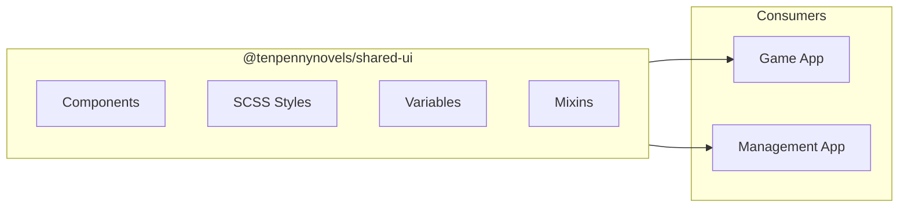
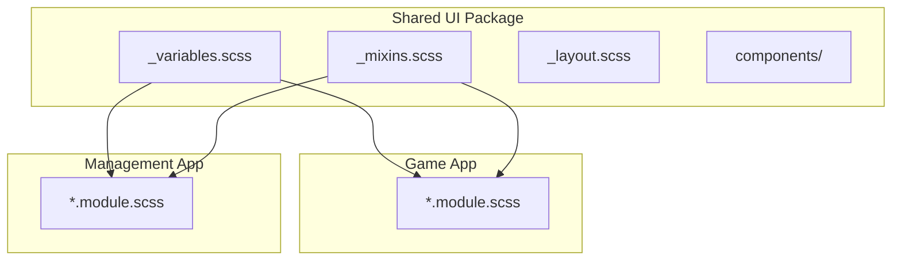

# Shared UI System

**Navigation**: [Home](../INDEX.md) > [Frontend](./README.md) > Shared UI System

**Status**: ✅ Production Ready | **Last Updated**: 2026-03-08

Victorian-themed design system shared across Game and Management apps.

---

## Overview

The Shared UI package provides a centralized Victorian-themed design system. It is a workspace package consumed by the Game and Management apps. The Landing and Documents apps have their own styles and do not use Shared UI.



---

## Package

| Property | Value |
|----------|-------|
| **Package Name** | `@tenpennynovels/shared-ui` |
| **Path** | `apps/shared-ui/` or `packages/shared-ui` |
| **Used By** | Game App, Management App |

**Dependency** (in package.json):
```json
"@tenpennynovels/shared-ui": "file:../shared-ui"
```

---

## Design Principles

- **Victorian Theme**: Sepia tones, dark brown, gold accents
- **SCSS-based**: NO Tailwind - pure SCSS/SCSS Modules
- **Typography**: Victorian fonts (Barrio, IMFeENsc28P, Thrifted Attire)
- **Components**: Buttons, forms, modals, cards with Victorian aesthetic

---

## SCSS Structure

```
shared-ui/
└── src/
    └── styles/
        ├── _variables.scss    # Color palette, fonts, spacing
        ├── _mixins.scss      # Reusable style mixins
        ├── _layout.scss      # Layout utilities
        └── components/      # Component styles
```

---

## Usage in Apps

Apps include Shared UI styles via `sassOptions.includePaths` in `next.config.js`:

```javascript
sassOptions: {
  includePaths: ['./src/styles', '../shared-ui/src/styles'],
  // ...
}
```

**Import in components**:
```scss
@import 'shared-ui/styles/variables';
@import 'shared-ui/styles/mixins';

.myComponent {
  @include victorian-button;
  color: $primary-color;
}
```

---

## Components & Styles

| Category | Contents |
|----------|----------|
| **Typography** | Victorian fonts, headings, body text |
| **Colors** | Sepia palette, dark brown, gold accents |
| **Buttons** | Styled buttons with Victorian aesthetic |
| **Forms** | Input fields, selects, checkboxes |
| **Modals** | Modal dialogs |
| **Cards** | Content containers |

---

## Architecture



---

## Related Documentation

- [Frontend README](./README.md) - Overview
- [Game App](./game-app.md) - Uses Shared UI
- [Management App](./management-app.md) - Uses Shared UI
