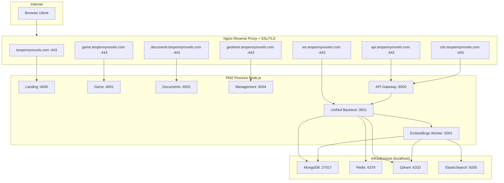
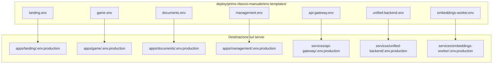
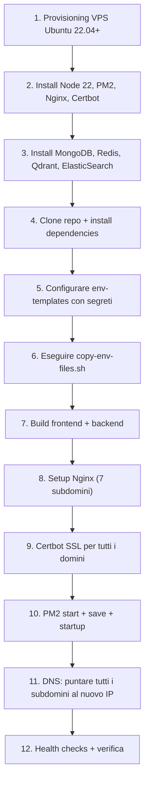

# Deployment Guide

**Navigation**: [Home](../INDEX.md) > [Operations](./README.md) > Deployment Guide

**Status**: ✅ Production Ready | **Last Updated**: 2026-03-08

Guida completa al deployment di TenPennyNovels su VPS Ubuntu con PM2 e GitHub Actions.

---

## Architettura Produzione



### Subdomini e Porte

| Subdomain | Servizio | Porta | PM2 Process | Mode |
|-----------|----------|-------|-------------|------|
| `tenpennynovels.com` | Landing App | 4000 | `tenpennynovels-landing` | fork |
| `game.tenpennynovels.com` | Game App | 4001 | `tenpennynovels-game` | fork |
| `documenti.tenpennynovels.com` | Documents App | 4003 | `tenpennynovels-documenti` | fork |
| `gestione.tenpennynovels.com` | Management App | 4004 | `tenpennynovels-gestione` | fork |
| `api.tenpennynovels.com` | API Gateway | 8000 | `tenpennynovels-api-gateway` | cluster x2 |
| `ws.tenpennynovels.com` | Unified Backend (WebSocket) | 3001 | `tenpennynovels-unified-backend` | fork |
| `cdn.tenpennynovels.com` | Static CDN | - | Nginx direct | - |

**Nota**: unified-backend DEVE usare fork mode (NON cluster) -- cluster mode causa crash con il Redis adapter di Socket.IO.

---

## Prerequisiti Server

### Requisiti Minimi

- **OS**: Ubuntu 22.04 LTS
- **CPU**: 4 vCPU
- **RAM**: 8 GB
- **SSD**: 100 GB
- **Node.js**: v22.13.1 (via nvm)
- **Python**: 3.8+

### Software Necessario

```bash
# Node.js via nvm
nvm install 22.13.1 && nvm alias default 22.13.1

# PM2
npm install -g pm2

# Nginx + Certbot
sudo apt install -y nginx certbot python3-certbot-nginx

# MongoDB, Redis installati come servizi systemd
# Qdrant, ElasticSearch installati separatamente
```

---

## CI/CD Pipeline

Il deploy avviene automaticamente tramite GitHub Actions su push al branch `master`.

```mermaid
flowchart LR
    Push["Push to master"] --> BuildCheck["Build Check (CI)"]
    BuildCheck --> Rsync["rsync to VPS"]
    Rsync --> InstallDeps["Install Dependencies"]
    InstallDeps --> BuildFE["Build Frontend"]
    BuildFE --> BuildBE["Build Backend"]
    BuildBE --> SetupPy["Setup Python venv"]
    SetupPy --> PM2Restart["PM2 Restart"]
    PM2Restart --> HealthCheck["Health Checks"]
```



**File**: [`.github/workflows/deploy.yml`](../../.github/workflows/deploy.yml)

**Nota importante**: Il workflow usa `pm2 startOrRestart ecosystem.config.js` -- il file [`ecosystem.config.js`](../../ecosystem.config.js) DEVE essere presente nella root del progetto.

### GitHub Secrets Necessari

| Secret | Descrizione |
|--------|-------------|
| `SSH_HOST` | IP o hostname del VPS |
| `SSH_PORT` | Porta SSH |
| `SSH_USERNAME` | Utente SSH |
| `SSH_PRIVATE_KEY` | Chiave privata SSH |
| `HF_TOKEN` | HuggingFace token (opzionale) |

---

## Variabili d'Ambiente

### Come Funzionano

I template sono in `deploy/primo-rilascio-manuale/env-templates/`. Lo script `copy-env-files.sh` li copia come `.env.production` in ogni servizio/app.



**CRITICO**: I file `.env.production` NON vengono trasferiti via rsync (esclusi in `.github/rsync-exclude.txt`). Devono essere gia presenti sul server o copiati manualmente.

**CRITICO per Next.js**: Le variabili `NEXT_PUBLIC_*` sono compilate durante il build. Modificare `.env.production` richiede un rebuild (`npm run build`), non basta riavviare PM2.

### Variabili per Servizio

#### Frontend Apps (tutte)

```bash
NODE_ENV=production
NEXT_PUBLIC_API_URL=https://api.tenpennynovels.com
NEXT_PUBLIC_LANDING_URL=https://tenpennynovels.com
NEXT_PUBLIC_GAME_URL=https://game.tenpennynovels.com
NEXT_PUBLIC_DOCUMENTS_URL=https://documenti.tenpennynovels.com
NEXT_PUBLIC_MANAGEMENT_URL=https://gestione.tenpennynovels.com
```

Solo game e management aggiungono:
```bash
# Socket.IO usa https:// (NON wss://), auto-upgrade a WSS
NEXT_PUBLIC_WS_URL=https://ws.tenpennynovels.com
```

#### Unified Backend (servizio principale)

```bash
NODE_ENV=production
PORT=3001
MONGODB_URI=mongodb://127.0.0.1:27017/tenpennynovels
REDIS_HOST=127.0.0.1
REDIS_PORT=6379
REDIS_URL=redis://127.0.0.1:6379
QDRANT_URL=http://127.0.0.1:6333
EMBEDDINGS_SERVICE_URL=http://127.0.0.1:5001

# CORS - tutti i frontend
FRONTEND_URL=https://game.tenpennynovels.com
LANDING_URL=https://tenpennynovels.com
GAME_URL=https://game.tenpennynovels.com
DOCUMENTS_URL=https://documenti.tenpennynovels.com
MANAGEMENT_URL=https://gestione.tenpennynovels.com
ALLOWED_ORIGINS=https://tenpennynovels.com,https://game.tenpennynovels.com,https://documenti.tenpennynovels.com,https://gestione.tenpennynovels.com

# Segreti (generare con openssl rand -hex 64)
JWT_SECRET=<generare>
JWT_REFRESH_SECRET=<generare>

# AI Gateway (local-ai via ngrok)
AI_GATEWAY_URL=<url-ngrok>
AI_GATEWAY_CLIENT_ID=tpn-prod
AI_GATEWAY_API_KEY=<generare con openssl rand -hex 32>
AI_GATEWAY_HMAC_SECRET=<generare con openssl rand -hex 32>

# Email SMTP
SMTP_HOST=mail.tenpennynovels.com
SMTP_PORT=465
SMTP_SECURE=true
SMTP_USER=info@tenpennynovels.com
SMTP_PASS=<password>

# CDN
CDN_STORAGE_PATH=/var/www/cdn-cache
CDN_BASE_URL=https://cdn.tenpennynovels.com
```

#### API Gateway

```bash
NODE_ENV=production
PORT=8000
UNIFIED_BACKEND_URL=http://127.0.0.1:3001
TRUST_PROXY=true
CDN_STORAGE_PATH=/var/www/cdn-cache
# Frontend URLs per CORS
LANDING_URL=https://tenpennynovels.com
GAME_URL=https://game.tenpennynovels.com
DOCUMENTS_URL=https://documenti.tenpennynovels.com
MANAGEMENT_URL=https://gestione.tenpennynovels.com
```

#### Embeddings Worker

```bash
NODE_ENV=production
HTTP_PORT=5001
PYTHON_PATH=python3
MONGODB_URI=mongodb://127.0.0.1:27017/tenpennynovels
REDIS_URL=redis://127.0.0.1:6379
QDRANT_URL=http://127.0.0.1:6333
ELASTICSEARCH_URL=http://127.0.0.1:9200
ELASTICSEARCH_INDEX_PREFIX=tenpennynovels
```

---

## Setup Nuovo Server (Checklist)



### Step 1: Software di Base

```bash
# Node.js via nvm
curl -o- https://raw.githubusercontent.com/nvm-sh/nvm/v0.39.0/install.sh | bash
source ~/.bashrc
nvm install 22.13.1
nvm alias default 22.13.1

# PM2
npm install -g pm2

# Nginx + Certbot
sudo apt install -y nginx certbot python3-certbot-nginx
```

### Step 2: Database e Servizi

```bash
# MongoDB
sudo systemctl enable mongod && sudo systemctl start mongod

# Redis
sudo systemctl enable redis && sudo systemctl start redis

# Qdrant (porta 6333) - installare secondo documentazione ufficiale
# ElasticSearch (porta 9200) - installare secondo documentazione ufficiale
```

### Step 3: Deploy Applicazione

```bash
cd ~ && git clone <repo-url> tenpennynovels && cd tenpennynovels

# Installare dipendenze
./deploy/scripts/install-all.sh

# Configurare variabili d'ambiente
# 1. Editare i template in deploy/primo-rilascio-manuale/env-templates/
# 2. Generare segreti: openssl rand -hex 64 (per JWT), openssl rand -hex 32 (per AI)
# 3. Copiare i template
./deploy/primo-rilascio-manuale/copy-env-files.sh

# Build
npm run build:frontend:all
npm run build:backend:all

# Setup Python per embeddings
cd services/embeddings-worker/python
python3 -m venv venv && source venv/bin/activate
pip install -r requirements.txt
deactivate && cd ../../..
```

### Step 4: Nginx + SSL

```bash
# Copiare le config Nginx
sudo cp deploy/primo-rilascio-manuale/nginx-configs/* /etc/nginx/sites-enabled/
sudo nginx -t && sudo systemctl reload nginx

# SSL per tutti i domini
sudo certbot --nginx \
  -d tenpennynovels.com -d game.tenpennynovels.com \
  -d documenti.tenpennynovels.com -d gestione.tenpennynovels.com \
  -d api.tenpennynovels.com -d ws.tenpennynovels.com \
  -d cdn.tenpennynovels.com
```

### Step 5: Avvio PM2

```bash
pm2 startOrRestart ecosystem.config.js --env production
pm2 save
pm2 startup  # seguire le istruzioni per auto-avvio al boot
```

### Step 6: Verifica

```bash
pm2 status
curl https://api.tenpennynovels.com/health
curl https://ws.tenpennynovels.com/health
```

---

## Generazione Segreti

```bash
# JWT secrets (128 char hex)
openssl rand -hex 64

# AI Gateway secrets (64 char hex)
openssl rand -hex 32

# I segreti AI devono matchare tra:
# - services/unified-backend/.env.production (AI_GATEWAY_*)
# - local-ai/.env (client config)
```

---

## Comandi Utili

```bash
# PM2
pm2 status                              # Stato processi
pm2 logs [nome]                         # Visualizza log
pm2 restart [nome]                      # Riavvia servizio
pm2 restart all                         # Riavvia tutto
pm2 monit                               # Monitoraggio real-time

# Nginx
sudo nginx -t                           # Test configurazione
sudo systemctl reload nginx             # Applica modifiche
sudo tail -f /var/log/nginx/error.log   # Log errori

# Database
mongosh mongodb://127.0.0.1:27017/tenpennynovels  # Shell MongoDB
redis-cli PING                                      # Test Redis
curl http://127.0.0.1:6333/healthz                  # Test Qdrant
curl http://127.0.0.1:9200/_cluster/health           # Test ElasticSearch

# SSL
sudo certbot certificates               # Stato certificati
sudo certbot renew --dry-run             # Test rinnovo
```

---

## Rollback

```bash
# Git rollback (sul server)
cd ~/tenpennynovels
git log --oneline -5                    # Trova commit precedente
git checkout <commit-hash>
npm run build:frontend:all && npm run build:backend:all
pm2 restart all
```

---

## Troubleshooting

### PM2 mostra servizio "errored"

```bash
pm2 logs <nome-servizio> --lines 50    # Controlla i log
# Cause comuni: .env.production mancante, porta occupata, dipendenza mancante
```

### Nginx 502 Bad Gateway

```bash
pm2 status                              # Verifica che il servizio sia online
sudo netstat -tulpn | grep :<porta>     # Verifica che la porta sia in ascolto
sudo tail -f /var/log/nginx/error.log   # Log Nginx
```

### WebSocket non si connette

1. Verificare CSP in `apps/game/next.config.js` includa `https://ws.tenpennynovels.com`
2. Verificare Nginx config per ws.tenpennynovels.com abbia `proxy_read_timeout 7200s`
3. Socket.IO usa `https://` (NON `wss://`)
4. Rebuild necessario dopo modifica: `cd apps/game && npm run build && pm2 restart tenpennynovels-game`

### NEXT_PUBLIC_* non aggiornata

Le variabili `NEXT_PUBLIC_*` sono compilate nel build. Dopo modifica di `.env.production`:
```bash
cd apps/<app-name>
npm run build
pm2 restart tenpennynovels-<nome>
```

---

## Security Checklist

- [ ] JWT secrets generati con `openssl rand -hex 64` (non valori di default)
- [ ] SMTP password reale (non placeholder)
- [ ] unified-backend bind su 127.0.0.1 (non esposto su internet)
- [ ] Firewall: solo porte 80, 443, 22 aperte
- [ ] MongoDB senza auth pubblica (solo localhost)
- [ ] SSL certificati validi e auto-rinnovo configurato
- [ ] CORS `ALLOWED_ORIGINS` contiene solo i domini reali
- [ ] File `.env.production` con permessi `chmod 600`

---

## Database Produzione

**Nome DB**: `tenpennynovels` (NON `tenpennynovels-prod`)

Quando si eseguono i seeder in produzione, specificare sempre:
```bash
MONGODB_URI=mongodb://127.0.0.1:27017/tenpennynovels \
DB_NAME=tenpennynovels \
npm run seed:users -- --force
```

---

## Related Documentation

- [Docker Compose (Dev)](../01-infrastructure/docker-compose.md) - Ambiente locale di sviluppo
- [Docker Troubleshooting](./docker-troubleshooting.md) - Problemi Docker in dev
- [Monitoring](./monitoring.md) - Monitoraggio produzione
- [Backup & Restore](./backup-restore.md) - Backup database
- [VPS Troubleshooting](../../.claude/vps-deployment-guide.md) - Fix specifici produzione
