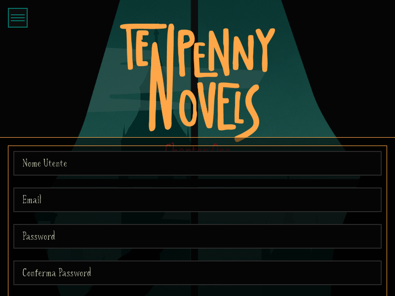
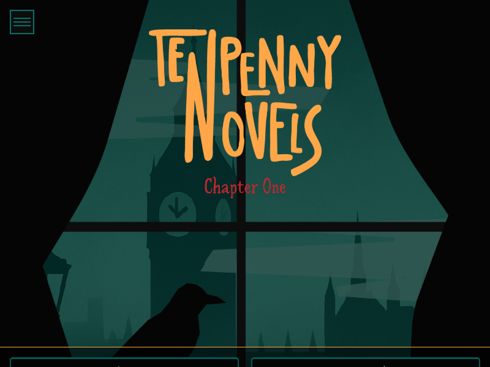

# Guida all'Iscrizione - TenPennyNovels

> **Ultima modifica**: Marzo 2026 | **Versione guida**: 1.0

## Introduzione

Benvenuto su **TenPennyNovels**! Questa guida ti accompagnerà passo-passo nel processo di registrazione alla piattaforma. L'iscrizione è **completamente gratuita** e richiede circa **5 minuti**.

Al termine della registrazione potrai:
- Creare il tuo primo personaggio ambientato nell'epoca vittoriana
- Esplorare le location del gioco
- Interagire con altri giocatori tramite chat in-character
- Consultare documenti e materiale di gioco

**Requisiti**:
- Un indirizzo email valido
- Un browser moderno (Chrome, Firefox, Safari, Edge)
- Connessione internet stabile

---

## Passo 1: Accedere alla Pagina di Registrazione

1. Vai all'indirizzo **[https://tenpennynovels.com](https://tenpennynovels.com)**
2. Clicca sul pulsante **"Registrati"** nella homepage
3. Verrai reindirizzato alla pagina di registrazione: `https://tenpennynovels.com/register`

> **💡 Nota**: Se hai già un account, puoi cliccare su "Accedi" invece di "Registrati".

---

## Passo 2: Compilare il Form di Registrazione

Il form di registrazione è composto da **5 campi obbligatori**. Compila tutti i campi seguendo le indicazioni qui sotto.

### 2.1 Nome Utente

Il nome utente è il tuo identificativo univoco sulla piattaforma. Sarà visibile agli altri giocatori.

**Requisiti tecnici**:
- **Lunghezza**: minimo 3 caratteri, massimo 20 caratteri
- **Caratteri consentiti**: lettere (a-z, A-Z), numeri (0-9), underscore (_), trattini (-)
- **Restrizioni**: non può iniziare o terminare con underscore o trattino
- **Unicità**: deve essere disponibile (non già usato da altri utenti)

**Esempi validi**:
- `john_doe`
- `detective1888`
- `mary-watson`
- `Inspector42`

**Esempi NON validi**:
- `_user` ❌ (inizia con underscore)
- `ab` ❌ (troppo corto, minimo 3 caratteri)
- `user@name` ❌ (carattere @ non consentito)
- `username-` ❌ (termina con trattino)

> **💡 Controllo automatico**: Mentre digiti, il sistema verifica automaticamente se il nome utente è disponibile. Un segno di spunta verde ✓ indica che il nome è disponibile.

---

### 2.2 Email

L'indirizzo email sarà utilizzato per:
- Confermare la registrazione
- Recuperare la password in caso di smarrimento
- Ricevere notifiche importanti (opzionale)

**Requisiti tecnici**:
- **Formato**: deve essere un indirizzo email valido (es. `nome@dominio.com`)
- **Lunghezza**: massimo 100 caratteri
- **Unicità**: ogni email può essere registrata una sola volta
- **Privacy**: l'email NON sarà visibile agli altri giocatori

**Esempi validi**:
- `john.doe@example.com`
- `detective1888@gmail.com`
- `mary_watson@protonmail.com`

> **⚠️ Attenzione**: Se l'email è già stata utilizzata per un altro account, riceverai un messaggio di errore. In questo caso, utilizza un'altra email o recupera l'accesso al tuo account esistente.

---

### 2.3 Password

La password protegge il tuo account. Scegli una password sicura e facile da ricordare.

**Requisiti di sicurezza**:
- **Lunghezza minima**: 8 caratteri
- **Composizione obbligatoria**:
  - Almeno **1 lettera** (maiuscola o minuscola)
  - Almeno **1 numero**
- **Caratteri speciali**: opzionali ma consigliati (es. `!`, `@`, `#`, `$`, `%`)

**Esempi validi**:
- `MyPassword123`
- `detective2024!`
- `VictorianEra88`
- `Tenp3nny!Novels`

**Esempi NON validi**:
- `password` ❌ (manca un numero)
- `12345678` ❌ (manca una lettera)
- `Pass1` ❌ (troppo corta, minimo 8 caratteri)

> **🔒 Consigli per una password sicura**:
> - Non usare informazioni personali facilmente individuabili (nome, data di nascita)
> - Evita password comuni o sequenze semplici (es. `password123`, `qwerty123`)
> - Usa una combinazione di lettere maiuscole, minuscole, numeri e simboli
> - Considera l'uso di un password manager per memorizzare password complesse

---

### 2.4 Conferma Password

Questo campo serve a verificare che tu abbia digitato correttamente la password scelta.

**Requisiti**:
- Deve **coincidere esattamente** con il campo "Password"
- Fai attenzione a maiuscole/minuscole e caratteri speciali

> **⚠️ Errore comune**: Se le due password non coincidono, vedrai il messaggio "Le password non coincidono". Verifica di aver digitato la stessa password in entrambi i campi.

---

### 2.5 Accettazione Termini e Condizioni

Prima di completare la registrazione, devi accettare i **Termini e Condizioni** e la **Privacy Policy** della piattaforma.

**Come procedere**:
1. Leggi i [Termini e Condizioni](https://tenpennynovels.com/terms) cliccando sul link
2. Leggi la [Privacy Policy](https://tenpennynovels.com/privacy) cliccando sul link
3. **Spunta la checkbox** per confermare l'accettazione

> **⚠️ Campo obbligatorio**: Non potrai completare la registrazione senza accettare i termini. Se provi a inviare il form senza spuntare la checkbox, riceverai il messaggio di errore "Devi accettare i termini e condizioni".

---

## Passo 3: Inviare la Registrazione

Dopo aver compilato tutti i campi correttamente, sei pronto per completare la registrazione.

1. **Verifica i dati inseriti**: controlla che tutte le informazioni siano corrette
2. Clicca sul pulsante **"Registrati"** in fondo al form
3. Il sistema elaborerà la richiesta (potrebbero servire alcuni secondi)

**Se la registrazione ha successo**:
- Vedrai un **banner verde** con il messaggio "Registrazione completata con successo!"
- Verrai **reindirizzato automaticamente** alla pagina di login entro 5 secondi
- Se il redirect non funziona, clicca sul link manuale "Vai al login"

> **💡 Email di conferma**: Controlla la tua casella email. Potresti ricevere un'email di benvenuto con informazioni utili per iniziare a giocare.

---

## Passo 4: Primo Accesso

Dopo la registrazione, verrai portato alla schermata di login.

**Credenziali di accesso**:
- **Username**: il nome utente che hai scelto durante la registrazione
- **Password**: la password che hai impostato

**Procedura**:
1. Inserisci il tuo **username**
2. Inserisci la tua **password**
3. (Opzionale) Spunta "Ricordami" per rimanere connesso più a lungo
4. Clicca su **"Accedi"**

### Creazione del Primo Personaggio

Al primo accesso, ti verrà chiesto di **creare il tuo primo personaggio**.

> **📖 Continua con la guida**: Per istruzioni dettagliate sulla creazione del personaggio, consulta la **[Guida alla Creazione del Personaggio](./personaggi.md)** *(coming soon)*.

---

## Risoluzione Problemi Comuni

### 1. "Nome utente non disponibile"

**Problema**: Il nome utente che hai scelto è già utilizzato da un altro giocatore.

**Soluzioni**:
- Prova una variante del nome (es. `john_doe` → `john_doe88`)
- Aggiungi numeri o trattini (es. `detective` → `detective-1888`)
- Scegli un nome completamente diverso

---

### 2. "Email già registrata"

**Problema**: L'indirizzo email è già associato a un account esistente.

**Soluzioni**:
- **Se hai già un account**: Vai alla pagina di login e accedi con le tue credenziali
- **Se hai dimenticato la password**: Usa la funzione "Password dimenticata" nella pagina di login
- **Se non ricordi di avere un account**: Contatta il supporto per assistenza
- **Altrimenti**: Usa un indirizzo email diverso

---

### 3. "Password troppo debole"

**Problema**: La password non soddisfa i requisiti di sicurezza.

**Verifica che la password**:
- ✓ Sia lunga almeno **8 caratteri**
- ✓ Contenga almeno **1 lettera** (maiuscola o minuscola)
- ✓ Contenga almeno **1 numero**

**Esempio di correzione**:
- ❌ `mypassword` → ✓ `mypassword123`
- ❌ `12345678` → ✓ `password123`
- ❌ `Pass1` → ✓ `Password1`

---

### 4. "Devi accettare i termini e condizioni"

**Problema**: Hai dimenticato di spuntare la checkbox dei termini.

**Soluzione**:
1. Scorri fino alla sezione "Termini e Condizioni"
2. **Spunta la checkbox** accanto a "Accetto i Termini e Condizioni e la Privacy Policy"
3. Riprova a inviare il form

---

### 5. Il form si resetta dopo aver cliccato "Registrati"

**Possibili cause**:
- Errore di connessione
- Timeout del server
- Problema di validazione non visualizzato

**Soluzioni**:
1. **Controlla la connessione internet**
2. **Ricarica la pagina** (F5 o Ctrl+R)
3. **Ricompila il form** prestando attenzione ai messaggi di errore sotto ogni campo
4. Se il problema persiste, prova a **svuotare la cache del browser** o usa la **navigazione in incognito**

---

### 6. Il redirect al login non funziona

**Problema**: Dopo la registrazione, rimani sulla pagina di registrazione invece di essere reindirizzato al login.

**Soluzioni**:
- Clicca sul **link manuale** "Vai al login" nel messaggio di successo
- Oppure vai direttamente a `https://tenpennynovels.com/` e clicca su "Accedi"
- Se non vedi il messaggio di successo, verifica se la registrazione è andata a buon fine tentando il login

---

### 7. "Errore di connessione" o "Impossibile contattare il server"

**Problema**: Problemi di rete o server temporaneamente non disponibile.

**Soluzioni**:
1. **Verifica la connessione internet**
2. **Riprova dopo alcuni minuti** (il server potrebbe essere in manutenzione)
3. **Prova da un altro browser** o dispositivo
4. Se il problema persiste per più di 30 minuti, contatta il supporto

---

## Domande Frequenti (FAQ)

### Serve una conferma via email?

Attualmente **non è richiesta** la conferma dell'indirizzo email per completare la registrazione. Puoi accedere immediatamente dopo esserti registrato. Tuttavia, è importante fornire un'email valida per poter recuperare l'account in caso di password dimenticata.

---

### Posso cambiare il mio username dopo la registrazione?

**No**, al momento non è possibile modificare il nome utente dopo la registrazione. Scegli con attenzione il tuo username, poiché sarà **permanente** e visibile agli altri giocatori.

> **💡 Consiglio**: Se hai registrato un account con un username che non ti piace, considera di creare un nuovo account con una email diversa (ma nota che perderai eventuali progressi fatti con il vecchio personaggio).

---

### Posso registrare più account con la stessa email?

**No**, ogni indirizzo email può essere associato a **un solo account**. Se hai bisogno di creare più personaggi, puoi farlo all'interno dello stesso account senza necessità di registrarti più volte.

> **ℹ️ Multi-personaggio**: TenPennyNovels supporta la creazione di **più personaggi per account**. Non serve registrare account multipli.

---

### La piattaforma è mobile-friendly?

**Sì**, il sito è completamente **responsive** e ottimizzato per dispositivi mobili (smartphone e tablet). Puoi registrarti e giocare sia da desktop che da mobile.

---

### L'iscrizione è a pagamento?

**No**, la registrazione e l'uso della piattaforma sono **completamente gratuiti**. Non ci sono costi nascosti né abbonamenti richiesti.

---

### Qual è l'età minima per registrarsi?

L'età minima consigliata è **13 anni**. I minori di 18 anni dovrebbero chiedere il permesso ai genitori o ai tutori prima di registrarsi.

> **⚠️ Attenzione**: I contenuti del gioco sono ambientati nell'epoca vittoriana e possono contenere temi maturi. La supervisione di un adulto è consigliata per i giocatori più giovani.

---

### Posso eliminare il mio account?

Sì, puoi richiedere la cancellazione del tuo account contattando il supporto. La cancellazione è permanente e comporta la perdita di tutti i dati associati (personaggi, progressi, messaggi).

---

### Cosa succede se dimentico la password?

Nella pagina di login troverai il link **"Password dimenticata"**. Segui la procedura di recupero password: riceverai un'email con le istruzioni per reimpostare la tua password.

> **📧 Email di recupero**: Assicurati che l'indirizzo email fornito durante la registrazione sia valido e accessibile.

---

## Link Utili

- **[Termini e Condizioni](https://tenpennynovels.com/terms)** - Regolamento della piattaforma
- **[Privacy Policy](https://tenpennynovels.com/privacy)** - Come trattiamo i tuoi dati
- **[Guida Creazione Personaggio](./personaggi.md)** *(coming soon)* - Tutorial per creare il tuo primo personaggio
- **[Documentazione Funzionale](../funzionale/autenticazione.md)** - Dettagli tecnici sul sistema di autenticazione
- **[Supporto](https://tenpennynovels.com/support)** - Contatta il team per assistenza

---

## Conclusione

Congratulazioni! Ora sai come registrarti su TenPennyNovels. Se hai seguito questa guida, dovresti avere un account attivo e essere pronto a creare il tuo primo personaggio vittoriano.

**Prossimi passi**:
1. Crea il tuo primo personaggio → [Guida Creazione Personaggio](./personaggi.md) *(coming soon)*
2. Esplora le location disponibili
3. Inizia a interagire con altri giocatori

**Buon divertimento su TenPennyNovels!** 🎩✨

---

_Ultimo aggiornamento: Marzo 2026 | Versione: 1.0 | Autore: Team TenPennyNovels_
