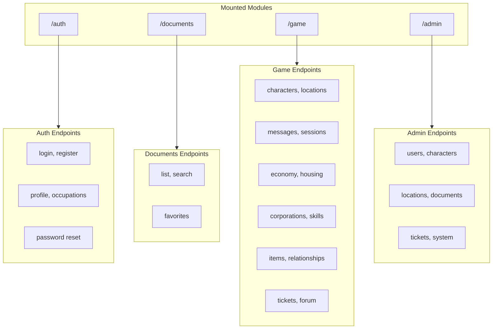

# API Reference

**Navigation**: [Home](../../INDEX.md) > [Backend](./README.md) > API Reference

**Status**: ✅ Production Ready | **Last Updated**: 2026-03-08

Complete reference of all API endpoints exposed by the Unified Backend. Only routes that are **mounted** in `app.ts` are documented.

**Note**: Ticketing system is **fully active** with user-facing endpoints (`/game/tickets`) and admin endpoints (`/admin/tickets`). Forum functionality is integrated within game endpoints.

---

## Overview

**Base URL**: `http://localhost:3001` (internal) or via API Gateway (port 8000)

---

## Auth Module (`/auth`)

Authentication, registration, profile management, and security.

| Method | Path | Description |
|--------|------|-------------|
| POST | `/auth/register` | User registration |
| POST | `/auth/register/check-availability` | Check username/email availability |
| GET | `/auth/check-username` | Check username availability |
| GET | `/auth/check-email` | Check email availability |
| GET | `/auth/verify-email/:token` | Verify email address |
| POST | `/auth/resend-verification` | Resend verification email |
| POST | `/auth/login` | User login |
| POST | `/auth/select-character` | Select active character |
| POST | `/auth/create-character` | Create new character |
| POST | `/auth/refresh` | Refresh JWT tokens |
| GET | `/auth/session` | Get current session |
| GET | `/auth/effective-permissions` | Get effective permissions |
| POST | `/auth/logout` | Logout (single session) |
| POST | `/auth/logout-all` | Logout all sessions |
| POST | `/auth/forgot-password` | Request password reset |
| GET | `/auth/reset-password/:token` | Verify reset token |
| POST | `/auth/reset-password/:token` | Reset password with token |
| POST | `/auth/change-password` | Change password (authenticated) |
| GET | `/auth/profile` | Get user profile |
| PUT | `/auth/profile` | Update profile |
| GET | `/auth/profile/export` | Export user data (GDPR) |
| POST | `/auth/profile/request-deletion` | Request account deletion |
| POST | `/auth/delete-account/:token` | Confirm account deletion |
| GET | `/auth/security/sessions` | List active sessions |
| DELETE | `/auth/security/sessions/:sessionId` | Terminate session |
| GET | `/auth/security/login-history` | Login history |
| GET | `/auth/security/alerts` | Security alerts |
| POST | `/auth/security/report-suspicious` | Report suspicious activity |
| POST | `/auth/security/acknowledge-alert/:alertId` | Acknowledge alert |
| GET | `/auth/occupations` | List all occupations |
| GET | `/auth/occupations/filtered` | List filtered occupations |

---

## Game Module (`/game`)

Core gameplay: characters, locations, housing, sessions, messaging, economy, and more.

### Characters

| Method | Path | Description |
|--------|------|-------------|
| GET | `/game/characters/my` | List user's characters |
| GET | `/game/characters/public-list` | List public characters |
| POST | `/game/characters/create` | Create character |
| GET | `/game/characters/:characterId` | Get character details |
| GET | `/game/characters/:characterId?view=sheet` | Get character sheet |
| GET | `/game/characters/:characterId/wizard` | Get character for wizard |
| GET | `/game/characters/:characterId/skills` | Get character skills |
| GET | `/game/characters/public/:characterId` | Get public character |
| PUT | `/game/characters/:characterId` | Update character |
| POST | `/game/characters/:characterId/submit` | Submit for approval |
| POST | `/game/characters/:characterId/select` | Select character |
| DELETE | `/game/characters/:characterId` | Delete character |
| POST | `/game/characters/set-location` | Set character location |
| GET | `/game/characters/:characterId/corporations` | Character corporations |
| GET | `/game/characters/:characterId/skill-points` | Get skill points |
| POST | `/game/characters/:characterId/apply-occupation-bonuses` | Apply occupation bonuses |
| GET | `/game/occupations/:occupationId/check-prerequisites` | Check occupation prerequisites |
| POST | `/game/characters/bot` | Create bot character (AI webhook) |
| POST | `/game/characters/bot/complete` | Complete bot creation (AI webhook) |

### Locations

| Method | Path | Description |
|--------|------|-------------|
| GET | `/game/locations` | Get accessible locations |
| GET | `/game/locations/:locationId` | Get location details |
| POST | `/game/locations/:locationId/enter` | Enter location |
| POST | `/game/locations/leave` | Leave location |
| GET | `/game/locations/:locationId/access` | Check access |
| POST | `/game/locations/:locationId/grant-access` | Grant access |
| GET | `/game/locations/:locationId/occupants` | List occupants |
| PATCH | `/game/locations/:locationId/occupant-tag` | Update occupant tag |
| GET | `/game/location-tags` | Get location tags (admin) |

### Messages

| Method | Path | Description |
|--------|------|-------------|
| POST | `/game/messages/send` | Send direct message |
| GET | `/game/messages/inbox` | Get inbox |
| GET | `/game/messages/sent` | Get sent messages |
| GET | `/game/messages/:messageId` | Read message |
| DELETE | `/game/messages/:messageId` | Delete message |
| GET | `/game/messages/unread-count` | Unread count |
| POST | `/game/ongame-messages` | Send on-game (postal) message |
| GET | `/game/ongame-messages/inbox` | On-game inbox |

### Sessions

| Method | Path | Description |
|--------|------|-------------|
| GET | `/game/sessions/current` | Get current session |
| GET | `/game/sessions/active` | Get active sessions |
| GET | `/game/sessions/history` | Session history |
| DELETE | `/game/sessions/:sessionId` | Invalidate session |
| DELETE | `/game/sessions/others/all` | Invalidate other sessions |

### Economy

| Method | Path | Description |
|--------|------|-------------|
| GET | `/game/economy/wallet` | Get wallet |
| POST | `/game/economy/transfer` | Transfer money |
| GET | `/game/economy/general-store` | Get general store |
| GET | `/game/economy/shops/:locationSlug` | Get shop items |
| POST | `/game/economy/purchase` | Purchase item |
| POST | `/game/economy/shops/:shopId/restock` | Restock shop |
| GET | `/game/economy/transactions` | Transaction history |
| POST | `/game/economy/admin/grant` | Admin money grant |
| POST | `/game/economy/admin/reset-credit` | Admin reset credit |
| GET | `/game/economy/admin/status` | System status |

### Housing

| Method | Path | Description |
|--------|------|-------------|
| GET | `/game/housing/districts` | List districts |
| GET | `/game/housing/available/:district` | Available properties |
| GET | `/game/housing/my-properties` | My properties |
| GET | `/game/housing/:propertyId` | Property details |
| POST | `/game/housing/rent` | Rent property |
| POST | `/game/housing/purchase` | Purchase property |
| POST | `/game/housing/:propertyId/pay-rent` | Pay rent |
| PUT | `/game/housing/:propertyId/guests` | Manage guests |

### Corporations

| Method | Path | Description |
|--------|------|-------------|
| GET | `/game/corporations` | List corporations |
| GET | `/game/corporations/:corporationId` | Get corporation |
| POST | `/game/corporations/:corporationId/join` | Join corporation |
| POST | `/game/corporations/:corporationId/leave` | Leave corporation |
| GET | `/game/corporations/:corporationId/invitations` | Get invitations |
| PUT | `/game/corporations/:corporationId/invitations/:invitationId` | Handle invitation |

### Skills

| Method | Path | Description |
|--------|------|-------------|
| GET | `/game/skills` | Get character skills |
| GET | `/game/skills/categories` | Get skill categories |
| GET | `/game/skills/placeholders` | Get placeholder skills |
| GET | `/game/skills/:skillId` | Get skill details |

### Items

| Method | Path | Description |
|--------|------|-------------|
| GET | `/game/items` | Get available items |
| GET | `/game/items/categories` | Get item categories |
| GET | `/game/items/search` | Search items |

### Relationships

| Method | Path | Description |
|--------|------|-------------|
| GET | `/game/relationships` | Get relationships |
| GET | `/game/relationships/types` | Get relationship types |
| POST | `/game/relationships` | Propose relationship |
| PUT | `/game/relationships/:relationshipId/respond` | Respond to proposal |
| DELETE | `/game/relationships/:relationshipId` | End relationship |

### Location Chats

| Method | Path | Description |
|--------|------|-------------|
| POST | `/game/chats` | Create chat message |
| GET | `/game/chats/:locationId` | Get chat messages |
| PATCH | `/game/chats/:messageId` | Update message |
| DELETE | `/game/chats/:messageId` | Delete message |
| POST | `/game/chats/social-conflict` | Create social conflict |
| DELETE | `/game/chats/:locationId/clear` | Clear chat (moderation) |
| POST | `/game/chats/bot` | Create bot message |

### Character Creation

| Method | Path | Description |
|--------|------|-------------|
| GET | `/game/character-creation-config` | Get creation config |
| GET | `/game/character-creation-config/occupations` | Get occupations |
| GET | `/game/character-creation-config/skills` | Get skills |

### AI Webhooks

| Method | Path | Description |
|--------|------|-------------|
| POST | `/game/webhooks/bot-response` | Bot response callback (Local AI) |

### Other Game Routes

| Method | Path | Description |
|--------|------|-------------|
| GET | `/game/health` | Health check |
| GET | `/game/occupations` | List occupations |
| GET | `/game/api-docs` | API documentation |

---

## Documents Module (`/documents`)

Document management, semantic search, and favorites.

| Method | Path | Description |
|--------|------|-------------|
| GET | `/documents/routes/list` | List documents |
| GET | `/documents/routes/list-hierarchical` | Hierarchical document list |
| GET | `/documents/semantic-search` | Semantic search (Qdrant) |
| GET | `/documents/ask` | AI-powered Q&A |
| GET | `/documents/:type/:category/:slug` | Get document by path |
| GET | `/documents/:type/:path` | Get document by path |
| GET | `/documents/favorites` | Get user favorites |
| POST | `/documents/:type/:category/:slug/favorite` | Toggle favorite |
| POST | `/documents/:type/:path/favorite` | Toggle favorite |

---

## Admin Module (`/admin`)

Administrative operations: user management, character approval, locations, documents, tickets, system config, audit logs.

### Authentication

| Method | Path | Description |
|--------|------|-------------|
| GET | `/admin/me` | Get admin user info |
| GET | `/admin/my-characters` | Get user's characters |

### User Management

| Method | Path | Description |
|--------|------|-------------|
| GET | `/admin/users` | List users |
| GET | `/admin/users/:id` | Get user |
| PATCH | `/admin/users/:id` | Update user |
| POST | `/admin/users/:id/ban` | Ban user |
| DELETE | `/admin/users/:id/ban` | Unban user |
| POST | `/admin/users/:id/roles` | Assign roles |
| PATCH | `/admin/users/:id/permissions` | Update permissions |
| POST | `/admin/users/:id/impersonate` | Impersonate user |
| POST | `/admin/users/:id/restore` | Restore deleted user |

### Character Management

| Method | Path | Description |
|--------|------|-------------|
| GET | `/admin/characters` | List characters |
| GET | `/admin/characters/pending` | Pending approvals |
| GET | `/admin/characters/:id` | Get character |
| POST | `/admin/characters/:id/approve` | Approve character |
| POST | `/admin/characters/:id/reject` | Reject character |
| PATCH | `/admin/characters/:id` | Update character |
| DELETE | `/admin/characters/:id` | Delete character |
| POST | `/admin/characters/:id/revert-draft` | Revert to draft |
| GET | `/admin/characters/:id/audit` | Character audit log |

### Location Management

| Method | Path | Description |
|--------|------|-------------|
| GET | `/admin/locations` | List locations |
| GET | `/admin/locations/:id` | Get location |
| POST | `/admin/locations` | Create location |
| PUT | `/admin/locations/:id` | Update location |
| PATCH | `/admin/locations/:id` | Partial update |
| DELETE | `/admin/locations/:id` | Delete location |

### Document Management

| Method | Path | Description |
|--------|------|-------------|
| GET | `/admin/documents` | List documents |
| POST | `/admin/documents` | Create document |
| GET | `/admin/documents/:id` | Get document |
| GET | `/admin/documents/:id/with-children` | Get with children |
| PUT | `/admin/documents/reorder` | Reorder documents |
| PATCH | `/admin/documents/:id` | Update document |
| DELETE | `/admin/documents/:id` | Delete document |
| PATCH | `/admin/documents/:id/toggle-visibility` | Toggle visibility |
| PATCH | `/admin/documents/:id/toggle-draft` | Toggle draft |
| POST | `/admin/documents/:id/regenerate-chunks` | Regenerate chunks |

### CDN Management

| Method | Path | Description |
|--------|------|-------------|
| POST | `/admin/cdn/upload` | Upload asset |
| DELETE | `/admin/cdn/:id` | Delete asset |
| GET | `/admin/cdn` | List assets |

### Ticket Management

| Method | Path | Description |
|--------|------|-------------|
| GET | `/admin/tickets/dashboard` | Ticket dashboard |
| GET | `/admin/tickets` | List all tickets |
| GET | `/admin/tickets/my` | My assigned tickets |
| GET | `/admin/tickets/department` | Department tickets |
| GET | `/admin/tickets/department/:dept` | Specific department |
| GET | `/admin/tickets/stats` | Ticket statistics |
| GET | `/admin/tickets/staff` | Staff list |
| GET | `/admin/tickets/:id` | Get ticket |
| PUT | `/admin/tickets/:id/assign` | Assign ticket |
| PUT | `/admin/tickets/:id/reassign` | Reassign ticket |
| PUT | `/admin/tickets/:id/transfer` | Transfer ticket |
| PUT | `/admin/tickets/:id/close` | Close ticket |
| POST | `/admin/tickets/:id/messages` | Add staff message |
| PUT | `/admin/tickets/:id/priority` | Update priority |
| PUT | `/admin/tickets/:id/internal-note` | Update internal note |
| POST | `/admin/tickets/:id/take` | Self-assign ticket |
| POST | `/admin/tickets/:id/release` | Release ticket |
| POST | `/admin/tickets/bulk-assign` | Bulk assign |

### System Configuration

| Method | Path | Description |
|--------|------|-------------|
| GET | `/admin/system/config` | Get config |
| PATCH | `/admin/system/config` | Update config |
| POST | `/admin/system/broadcast` | Send broadcast |

### Audit Logs & Deleted Records

| Method | Path | Description |
|--------|------|-------------|
| GET | `/admin/deleted-records` | List deleted records |
| POST | `/admin/deleted-records/restore` | Restore record |
| DELETE | `/admin/deleted-records/:id` | Permanently delete |
| POST | `/admin/deleted-records/bulk-restore` | Bulk restore |

### Other Admin Routes

| Method | Path | Description |
|--------|------|-------------|
| GET | `/admin/analytics/dashboard` | Analytics dashboard |
| GET | `/admin/analytics/health` | Health check |
| GET | `/admin/corporations` | Corporation management |
| GET | `/admin/housing/properties` | Housing management |
| GET | `/admin/occupations` | Occupation management |
| GET | `/admin/chat/overview` | Chat monitoring |
| GET | `/admin/forum` | Forum management |
| GET | `/admin/experience/overview` | Experience management |
| GET | `/admin/sessions/overview` | Session management |
| GET | `/admin/character-sessions` | Character sessions |
| GET | `/admin/location-actions` | Location actions |

---

## Health Check

| Method | Path | Description |
|--------|------|-------------|
| GET | `/health` | Unified backend health check |

---

## Related Documentation

- [Unified Backend Architecture](./unified-backend.md) - Module structure
- [API Gateway](./api-gateway.md) - Proxy configuration
- [Authentication System](./authentication-system.md) - JWT and permissions
- [API Testing Scripts](../07-testing/api-testing-scripts.md) - Testing scripts
