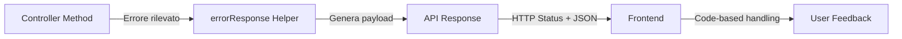

# Error Codes

**Registry completo codici errore API** - Tutti i codici, HTTP status, payload e frontend handling

---

## Introduzione

Ten PennyNovels utilizza un **sistema di error codes standardizzato** per garantire consistenza nelle risposte API e facilitare error handling frontend.

### Architettura Error Response



### Error Response Format

**Standard Payload** (da [API_RESPONSE_STANDARDS.md](../../../services/unified-backend/src/modules/admin/docs/API_RESPONSE_STANDARDS.md)):

```typescript
{
  result: false,
  success: false,
  error: string;           // Messaggio leggibile (italiano)
  code?: string;           // Error code (es: "USER_NOT_FOUND")
  details?: {              // Dettagli aggiuntivi opzionali
    [key: string]: any;
  };
  timestamp: string;       // ISO 8601
  requestId?: string;      // Request tracing ID
}
```

**TypeScript Type**: `ApiErrorResponse`

**File**: [services/unified-backend/src/shared/utils/errorCodes.ts](../../../services/unified-backend/src/shared/utils/errorCodes.ts)

---

## Authentication Errors

### USER_NOT_FOUND (404)

**Message**: "Utente non trovato"

**Trigger**: Login con username inesistente

**Payload**:
```json
{
  "result": false,
  "success": false,
  "error": "Utente non trovato",
  "code": "USER_NOT_FOUND",
  "timestamp": "2026-03-15T10:30:00.000Z"
}
```

**Frontend Handling**:
```typescript
if (error.code === 'USER_NOT_FOUND') {
  showError('Username non trovato. Verifica di aver inserito correttamente i dati.');
}
```

**Fix**: Verifica username, case-sensitive

---

### INVALID_PASSWORD (401)

**Message**: "Password non corretta"

**Trigger**: Login con password errata

**Payload**:
```json
{
  "result": false,
  "success": false,
  "error": "Password non corretta",
  "code": "INVALID_PASSWORD",
  "timestamp": "2026-03-15T10:30:00.000Z"
}
```

**Frontend Handling**:
```typescript
if (error.code === 'INVALID_PASSWORD') {
  showError('Password errata. Riprova o usa "Password dimenticata".');
}
```

**Fix**: Verifica password, usa password reset se dimenticata

---

### EMAIL_NOT_VERIFIED (403)

**Message**: "Email non verificata. Controlla la tua casella di posta."

**Trigger**: Login prima della verifica email

**Payload**:
```json
{
  "result": false,
  "success": false,
  "error": "Email non verificata. Controlla la tua casella di posta.",
  "code": "EMAIL_NOT_VERIFIED",
  "details": {
    "email": "user@example.com"
  },
  "timestamp": "2026-03-15T10:30:00.000Z"
}
```

**Frontend Handling**:
```typescript
if (error.code === 'EMAIL_NOT_VERIFIED') {
  showWarning('Verifica la tua email prima di accedere.');
  navigateTo('/auth/verify-email-prompt');
}
```

**Fix**: Controlla inbox/spam, richiedi nuovo link di verifica

---

### ACCOUNT_BANNED (403)

**Message**: "Account bannato permanentemente"

**Trigger**: Login con account bannato da admin

**Payload**:
```json
{
  "result": false,
  "success": false,
  "error": "Account bannato permanentemente",
  "code": "ACCOUNT_BANNED",
  "details": {
    "reason": "Violazione regole comunitarie",
    "bannedAt": "2026-03-10T14:00:00.000Z"
  },
  "timestamp": "2026-03-15T10:30:00.000Z"
}
```

**Frontend Handling**:
```typescript
if (error.code === 'ACCOUNT_BANNED') {
  showError(`Account bannato: ${error.details?.reason || 'Violazione regole'}`);
  navigateTo('/banned');
}
```

**Fix**: Contatta amministratori via email supporto

---

### ACCOUNT_SUSPENDED (403)

**Message**: "Account sospeso"

**Trigger**: Login con account temporaneamente sospeso

**Payload**:
```json
{
  "result": false,
  "success": false,
  "error": "Account sospeso",
  "code": "ACCOUNT_SUSPENDED",
  "details": {
    "suspendedUntil": "2026-03-20T00:00:00.000Z",
    "reason": "Comportamento inappropriato"
  },
  "timestamp": "2026-03-15T10:30:00.000Z"
}
```

**Frontend Handling**:
```typescript
if (error.code === 'ACCOUNT_SUSPENDED') {
  const until = new Date(error.details.suspendedUntil).toLocaleDateString();
  showWarning(`Account sospeso fino al ${until}`);
}
```

**Fix**: Attendi scadenza sospensione, contatta moderatori

---

### TOKEN_EXPIRED (401)

**Message**: "Token scaduto"

**Trigger**: JWT auth_token scaduto (> 1h da emissione)

**Payload**:
```json
{
  "result": false,
  "success": false,
  "error": "Token scaduto",
  "code": "TOKEN_EXPIRED",
  "timestamp": "2026-03-15T10:30:00.000Z"
}
```

**Frontend Handling**:
```typescript
if (error.code === 'TOKEN_EXPIRED') {
  // Automatic refresh token flow
  await refreshAuthToken();
  // Retry original request
  retryRequest();
}
```

**Fix**: Frontend dovrebbe auto-refresh con refresh_token

---

### TOKEN_INVALID (401)

**Message**: "Token non valido"

**Trigger**: JWT auth_token corrotto, signature mismatch, payload alterato

**Payload**:
```json
{
  "result": false,
  "success": false,
  "error": "Token non valido",
  "code": "TOKEN_INVALID",
  "timestamp": "2026-03-15T10:30:00.000Z"
}
```

**Frontend Handling**:
```typescript
if (error.code === 'TOKEN_INVALID') {
  clearAuthTokens();
  navigateTo('/auth/login');
  showError('Sessione non valida. Effettua nuovamente il login.');
}
```

**Fix**: Logout forzato, richiedi nuovo login

---

### UNAUTHORIZED (401)

**Message**: "Accesso non autorizzato"

**Trigger**: Richiesta endpoint protetto senza auth_token cookie

**Payload**:
```json
{
  "result": false,
  "success": false,
  "error": "Accesso non autorizzato",
  "code": "UNAUTHORIZED",
  "timestamp": "2026-03-15T10:30:00.000Z"
}
```

**Frontend Handling**:
```typescript
if (error.code === 'UNAUTHORIZED' || error.code === 'NO_AUTH_TOKEN') {
  navigateTo('/auth/login');
}
```

**Fix**: Login required

---

### SESSION_EXPIRED (401)

**Message**: "Sessione scaduta. Effettua nuovamente il login."

**Trigger**: Refresh token scaduto (> 7 giorni)

**Payload**:
```json
{
  "result": false,
  "success": false,
  "error": "Sessione scaduta. Effettua nuovamente il login.",
  "code": "SESSION_EXPIRED",
  "timestamp": "2026-03-15T10:30:00.000Z"
}
```

**Frontend Handling**:
```typescript
if (error.code === 'SESSION_EXPIRED') {
  clearAuthTokens();
  navigateTo('/auth/login');
  showInfo('Sessione scaduta. Effettua nuovamente il login.');
}
```

**Fix**: Login completo richiesto

---

### INVALID_CREDENTIALS (401)

**Message**: "Credenziali non valide"

**Trigger**: Generic login failure

**Payload**:
```json
{
  "result": false,
  "success": false,
  "error": "Credenziali non valide",
  "code": "INVALID_CREDENTIALS",
  "timestamp": "2026-03-15T10:30:00.000Z"
}
```

**Frontend Handling**:
```typescript
if (error.code === 'INVALID_CREDENTIALS') {
  showError('Username o password errati.');
}
```

**Fix**: Verifica username e password

---

## Registration Errors

### USERNAME_TAKEN (409)

**Message**: "Nome utente già in uso"

**Trigger**: Registrazione con username già esistente

**Payload**:
```json
{
  "result": false,
  "success": false,
  "error": "Nome utente già in uso",
  "code": "USERNAME_TAKEN",
  "details": {
    "field": "username",
    "value": "johndoe"
  },
  "timestamp": "2026-03-15T10:30:00.000Z"
}
```

**Frontend Handling**:
```typescript
if (error.code === 'USERNAME_TAKEN') {
  setFieldError('username', 'Questo username è già in uso. Scegline un altro.');
}
```

**Fix**: Scegli username diverso

---

### EMAIL_TAKEN (409)

**Message**: "Email già registrata"

**Trigger**: Registrazione con email già in uso

**Payload**:
```json
{
  "result": false,
  "success": false,
  "error": "Email già registrata",
  "code": "EMAIL_TAKEN",
  "details": {
    "field": "email",
    "value": "user@example.com"
  },
  "timestamp": "2026-03-15T10:30:00.000Z"
}
```

**Frontend Handling**:
```typescript
if (error.code === 'EMAIL_TAKEN') {
  setFieldError('email', 'Email già registrata. Usa "Password dimenticata" per recuperare l\'account.');
}
```

**Fix**: Usa email diversa o recupera account esistente

---

### WEAK_PASSWORD (400)

**Message**: "Password troppo debole"

**Trigger**: Password non rispetta requisiti (min 8 chars, 1 uppercase, 1 lowercase, 1 digit)

**Payload**:
```json
{
  "result": false,
  "success": false,
  "error": "Password troppo debole",
  "code": "WEAK_PASSWORD",
  "details": {
    "requirements": {
      "minLength": 8,
      "uppercase": true,
      "lowercase": true,
      "digit": true
    }
  },
  "timestamp": "2026-03-15T10:30:00.000Z"
}
```

**Frontend Handling**:
```typescript
if (error.code === 'WEAK_PASSWORD') {
  setFieldError('password', 'Password troppo debole. Usa almeno 8 caratteri, 1 maiuscola, 1 minuscola, 1 numero.');
}
```

**Fix**: Usa password più forte secondo requisiti

---

### INVALID_EMAIL (400)

**Message**: "Formato email non valido"

**Trigger**: Email non valida (formato RFC 5322)

**Payload**:
```json
{
  "result": false,
  "success": false,
  "error": "Formato email non valido",
  "code": "INVALID_EMAIL",
  "details": {
    "field": "email",
    "value": "notanemail"
  },
  "timestamp": "2026-03-15T10:30:00.000Z"
}
```

**Frontend Handling**:
```typescript
if (error.code === 'INVALID_EMAIL') {
  setFieldError('email', 'Formato email non valido. Usa un indirizzo email valido (es: user@example.com).');
}
```

**Fix**: Inserisci email valida

---

### INVALID_USERNAME (400)

**Message**: "Nome utente non valido"

**Trigger**: Username non rispetta formato (3-20 chars, alphanumeric + underscore)

**Payload**:
```json
{
  "result": false,
  "success": false,
  "error": "Nome utente non valido",
  "code": "INVALID_USERNAME",
  "details": {
    "field": "username",
    "pattern": "^[a-zA-Z0-9_]{3,20}$"
  },
  "timestamp": "2026-03-15T10:30:00.000Z"
}
```

**Frontend Handling**:
```typescript
if (error.code === 'INVALID_USERNAME') {
  setFieldError('username', 'Username non valido. Usa 3-20 caratteri alfanumerici e underscore.');
}
```

**Fix**: Usa username secondo pattern

---

## Character Errors

### CHARACTER_NOT_FOUND (404)

**Message**: "Personaggio non trovato"

**Trigger**: Richiesta personaggio con ID inesistente o non accessibile

**Payload**:
```json
{
  "result": false,
  "success": false,
  "error": "Personaggio non trovato",
  "code": "CHARACTER_NOT_FOUND",
  "details": {
    "characterId": "507f1f77bcf86cd799439011"
  },
  "timestamp": "2026-03-15T10:30:00.000Z"
}
```

**Frontend Handling**:
```typescript
if (error.code === 'CHARACTER_NOT_FOUND') {
  showError('Personaggio non trovato o non accessibile.');
  navigateTo('/characters');
}
```

**Fix**: Verifica ID personaggio, controlla permessi

---

### CHARACTER_NOT_APPROVED (403)

**Message**: "Personaggio non ancora approvato"

**Trigger**: Tentativo di giocare con personaggio in stato "pending" o "draft"

**Payload**:
```json
{
  "result": false,
  "success": false,
  "error": "Personaggio non ancora approvato",
  "code": "CHARACTER_NOT_APPROVED",
  "details": {
    "characterId": "507f1f77bcf86cd799439011",
    "characterName": "Lord Blackwood",
    "status": "pending"
  },
  "timestamp": "2026-03-15T10:30:00.000Z"
}
```

**Frontend Handling**:
```typescript
if (error.code === 'CHARACTER_NOT_APPROVED') {
  showWarning('Personaggio non ancora approvato. Attendi la revisione dello staff.');
  navigateTo('/characters/pending');
}
```

**Fix**: Attendi approvazione staff

---

### CHARACTER_DELETED (410)

**Message**: "Personaggio eliminato"

**Trigger**: Accesso a personaggio soft-deleted

**Payload**:
```json
{
  "result": false,
  "success": false,
  "error": "Personaggio eliminato",
  "code": "CHARACTER_DELETED",
  "timestamp": "2026-03-15T10:30:00.000Z"
}
```

**Frontend Handling**:
```typescript
if (error.code === 'CHARACTER_DELETED') {
  showError('Questo personaggio è stato eliminato.');
  navigateTo('/characters');
}
```

**Fix**: Non recuperabile (contatta admin se errore)

---

### NO_CHARACTER_CONTEXT (403)

**Message**: "Selezione del personaggio richiesta"

**Trigger**: Endpoint game chiamato senza character_context token

**Payload**:
```json
{
  "result": false,
  "success": false,
  "error": "Selezione del personaggio richiesta",
  "code": "NO_CHARACTER_CONTEXT",
  "timestamp": "2026-03-15T10:30:00.000Z"
}
```

**Frontend Handling**:
```typescript
if (error.code === 'NO_CHARACTER_CONTEXT') {
  navigateTo('/characters/select');
  showInfo('Seleziona un personaggio per continuare.');
}
```

**Fix**: Seleziona personaggio via `POST /auth/select-character`

---

### INVALID_CHARACTER_CONTEXT (403)

**Message**: "Contesto personaggio non valido"

**Trigger**: character_context token corrotto o scaduto

**Payload**:
```json
{
  "result": false,
  "success": false,
  "error": "Contesto personaggio non valido",
  "code": "INVALID_CHARACTER_CONTEXT",
  "timestamp": "2026-03-15T10:30:00.000Z"
}
```

**Frontend Handling**:
```typescript
if (error.code === 'INVALID_CHARACTER_CONTEXT') {
  clearCharacterContext();
  navigateTo('/characters/select');
}
```

**Fix**: Riseleziona personaggio

---

### MULTIPLE_CHARACTERS_NOT_ALLOWED (403)

**Message**: "Non puoi creare più di un personaggio"

**Trigger**: Tentativo creazione secondo personaggio (configurazione server limit=1)

**Payload**:
```json
{
  "result": false,
  "success": false,
  "error": "Non puoi creare più di un personaggio",
  "code": "MULTIPLE_CHARACTERS_NOT_ALLOWED",
  "timestamp": "2026-03-15T10:30:00.000Z"
}
```

**Frontend Handling**:
```typescript
if (error.code === 'MULTIPLE_CHARACTERS_NOT_ALLOWED') {
  showError('Hai già un personaggio. Non è possibile crearne altri.');
  navigateTo('/characters');
}
```

**Fix**: Elimina personaggio esistente o contatta admin per eccezione

---

## Location Errors

### LOCATION_NOT_FOUND (404)

**Message**: "Location non trovata"

**Trigger**: Richiesta location con ID inesistente

**Payload**:
```json
{
  "result": false,
  "success": false,
  "error": "Location non trovata",
  "code": "LOCATION_NOT_FOUND",
  "details": {
    "locationId": "507f1f77bcf86cd799439011"
  },
  "timestamp": "2026-03-15T10:30:00.000Z"
}
```

**Frontend Handling**:
```typescript
if (error.code === 'LOCATION_NOT_FOUND') {
  showError('Location non trovata.');
  navigateTo('/locations');
}
```

**Fix**: Verifica ID location

---

### LOCATION_ACCESS_DENIED (403)

**Message**: "Accesso alla location negato"

**Trigger**: Tentativo accesso location privata senza permessi

**Payload**:
```json
{
  "result": false,
  "success": false,
  "error": "Accesso alla location negato",
  "code": "LOCATION_ACCESS_DENIED",
  "details": {
    "locationId": "507f1f77bcf86cd799439011",
    "locationName": "Master's Sanctum",
    "reason": "private_location"
  },
  "timestamp": "2026-03-15T10:30:00.000Z"
}
```

**Frontend Handling**:
```typescript
if (error.code === 'LOCATION_ACCESS_DENIED') {
  showError('Non hai i permessi per accedere a questa location.');
}
```

**Fix**: Richiedi permessi a master/admin

---

### ALREADY_IN_LOCATION (409)

**Message**: "Sei già in questa location"

**Trigger**: Tentativo join location già corrente

**Payload**:
```json
{
  "result": false,
  "success": false,
  "error": "Sei già in questa location",
  "code": "ALREADY_IN_LOCATION",
  "timestamp": "2026-03-15T10:30:00.000Z"
}
```

**Frontend Handling**:
```typescript
if (error.code === 'ALREADY_IN_LOCATION') {
  // Silent ignore - già nella location corretta
  console.log('Already in location, skipping join');
}
```

**Fix**: No action needed (già nella location)

---

### INVALID_LOCATION_ID (400)

**Message**: "ID location non valido"

**Trigger**: locationId non è MongoDB ObjectId valido (24 hex chars)

**Payload**:
```json
{
  "success": false,
  "code": "INVALID_LOCATION_ID",
  "message": "ID location non valido"
}
```

**Frontend Handling**:
```typescript
if (error.code === 'INVALID_LOCATION_ID') {
  showError('ID location non valido. Ricarica la pagina.');
  navigateTo('/locations');
}
```

**Fix**: Usa ID location valido (MongoDB ObjectId)

---

## Validation Errors

### VALIDATION_ERROR (400)

**Message**: "Errore di validazione"

**Trigger**: Dati input non rispettano schema validazione (Joi)

**Payload**:
```json
{
  "result": false,
  "success": false,
  "error": "Errore di validazione",
  "code": "VALIDATION_ERROR",
  "details": {
    "fields": [
      {
        "field": "email",
        "message": "Email must be a valid email address"
      },
      {
        "field": "age",
        "message": "Age must be at least 18"
      }
    ]
  },
  "timestamp": "2026-03-15T10:30:00.000Z"
}
```

**Frontend Handling**:
```typescript
if (error.code === 'VALIDATION_ERROR' && error.details?.fields) {
  error.details.fields.forEach(({ field, message }) => {
    setFieldError(field, message);
  });
}
```

**Fix**: Correggi campi secondo validazione

---

### MISSING_FIELD (400)

**Message**: "Campo obbligatorio mancante"

**Trigger**: Campo required non presente in payload

**Payload**:
```json
{
  "result": false,
  "success": false,
  "error": "Campo obbligatorio mancante",
  "code": "MISSING_FIELD",
  "details": {
    "field": "username"
  },
  "timestamp": "2026-03-15T10:30:00.000Z"
}
```

**Frontend Handling**:
```typescript
if (error.code === 'MISSING_FIELD') {
  setFieldError(error.details.field, 'Campo obbligatorio');
}
```

**Fix**: Compila campo mancante

---

### INVALID_FORMAT (400)

**Message**: "Formato non valido"

**Trigger**: Campo con formato errato (es: data, URL)

**Payload**:
```json
{
  "result": false,
  "success": false,
  "error": "Formato non valido",
  "code": "INVALID_FORMAT",
  "details": {
    "field": "birthDate",
    "expected": "ISO 8601 (YYYY-MM-DD)",
    "received": "15/03/2026"
  },
  "timestamp": "2026-03-15T10:30:00.000Z"
}
```

**Frontend Handling**:
```typescript
if (error.code === 'INVALID_FORMAT') {
  setFieldError(error.details.field, `Formato non valido. Usa: ${error.details.expected}`);
}
```

**Fix**: Usa formato corretto

---

### INVALID_OBJECT_ID (400)

**Message**: "ID non valido per il parametro '{paramName}'"

**Trigger**: Parametro non è MongoDB ObjectId valido

**Payload**:
```json
{
  "result": false,
  "success": false,
  "error": "ID non valido per il parametro 'userId'",
  "code": "INVALID_OBJECT_ID",
  "timestamp": "2026-03-15T10:30:00.000Z"
}
```

**Frontend Handling**:
```typescript
if (error.code === 'INVALID_OBJECT_ID') {
  showError('ID non valido. Riprova.');
}
```

**Fix**: Usa MongoDB ObjectId valido (24 hex chars)

---

## Permission Errors

### ACCESS_DENIED (403)

**Message**: "Accesso negato"

**Trigger**: Tentativo accesso risorsa senza permessi sufficienti

**Payload**:
```json
{
  "result": false,
  "success": false,
  "error": "Accesso negato",
  "code": "ACCESS_DENIED",
  "timestamp": "2026-03-15T10:30:00.000Z"
}
```

**Frontend Handling**:
```typescript
if (error.code === 'ACCESS_DENIED') {
  showError('Non hai i permessi per accedere a questa risorsa.');
}
```

**Fix**: Richiedi permessi o usa account con privilegi appropriati

---

### PERMISSION_DENIED (403)

**Message**: "Permesso negato"

**Trigger**: Operazione richiede permesso specifico non posseduto

**Payload**:
```json
{
  "result": false,
  "success": false,
  "error": "Permesso negato",
  "code": "PERMISSION_DENIED",
  "details": {
    "requiredPermission": "CHARACTERS_DELETE",
    "operation": "delete character"
  },
  "timestamp": "2026-03-15T10:30:00.000Z"
}
```

**Frontend Handling**:
```typescript
if (error.code === 'PERMISSION_DENIED') {
  showError(`Permesso negato: ${error.details.requiredPermission}`);
}
```

**Fix**: Richiedi permesso a admin

---

### INSUFFICIENT_PERMISSIONS (403)

**Message**: "Permessi insufficienti per questa operazione"

**Trigger**: Ruolo utente non sufficiente per operazione

**Payload**:
```json
{
  "result": false,
  "success": false,
  "error": "Permessi insufficienti per questa operazione",
  "code": "INSUFFICIENT_PERMISSIONS",
  "details": {
    "requiredRole": "master",
    "currentRole": "personaggio"
  },
  "timestamp": "2026-03-15T10:30:00.000Z"
}
```

**Frontend Handling**:
```typescript
if (error.code === 'INSUFFICIENT_PERMISSIONS') {
  showError('Permessi insufficienti. Richiedi accesso a un master.');
}
```

**Fix**: Richiedi ruolo con permessi appropriati

---

## System Errors

### RATE_LIMIT_EXCEEDED (429)

**Message**: "Troppe richieste. Riprova più tardi."

**Trigger**: Rate limit superato (configurabile per endpoint)

**Payload**:
```json
{
  "result": false,
  "success": false,
  "error": "Troppe richieste. Riprova più tardi.",
  "code": "RATE_LIMIT_EXCEEDED",
  "details": {
    "retryAfter": 3600,
    "limit": 5,
    "window": "1 hour"
  },
  "timestamp": "2026-03-15T10:30:00.000Z"
}
```

**Frontend Handling**:
```typescript
if (error.code === 'RATE_LIMIT_EXCEEDED') {
  const minutes = Math.ceil(error.details.retryAfter / 60);
  showWarning(`Troppe richieste. Riprova tra ${minutes} minuti.`);
}
```

**Fix**: Attendi tempo specificato in `retryAfter`

---

### DATABASE_ERROR (500)

**Message**: "Errore del database"

**Trigger**: MongoDB query failure, connection loss

**Payload**:
```json
{
  "result": false,
  "success": false,
  "error": "Errore del database",
  "code": "DATABASE_ERROR",
  "timestamp": "2026-03-15T10:30:00.000Z"
}
```

**Frontend Handling**:
```typescript
if (error.code === 'DATABASE_ERROR') {
  showError('Errore del server. Riprova più tardi.');
  // Automatic retry with exponential backoff
  retryWithBackoff();
}
```

**Fix**: Backend issue - riprova, contatta admin se persiste

---

### INTERNAL_SERVER_ERROR (500)

**Message**: "Errore interno del server"

**Trigger**: Eccezione non gestita backend

**Payload**:
```json
{
  "result": false,
  "success": false,
  "error": "Errore interno del server",
  "code": "INTERNAL_SERVER_ERROR",
  "requestId": "req_abc123",
  "timestamp": "2026-03-15T10:30:00.000Z"
}
```

**Frontend Handling**:
```typescript
if (error.code === 'INTERNAL_SERVER_ERROR') {
  showError(`Errore server (ID: ${error.requestId}). Contatta il supporto se il problema persiste.`);
}
```

**Fix**: Backend issue - segnala con requestId a admin

---

### SERVICE_UNAVAILABLE (503)

**Message**: "Servizio temporaneamente non disponibile"

**Trigger**: Backend in manutenzione o overload

**Payload**:
```json
{
  "result": false,
  "success": false,
  "error": "Servizio temporaneamente non disponibile",
  "code": "SERVICE_UNAVAILABLE",
  "details": {
    "retryAfter": 300
  },
  "timestamp": "2026-03-15T10:30:00.000Z"
}
```

**Frontend Handling**:
```typescript
if (error.code === 'SERVICE_UNAVAILABLE') {
  showWarning('Servizio in manutenzione. Riprova tra qualche minuto.');
  setTimeout(() => window.location.reload(), error.details.retryAfter * 1000);
}
```

**Fix**: Attendi fine manutenzione

---

## Document Errors

### INVALID_TYPE (400)

**Message**: "Tipo non valido"

**Trigger**: Document type non in ['ambientazione', 'regolamento']

**Payload**:
```json
{
  "result": false,
  "error": "Tipo non valido",
  "code": "INVALID_TYPE"
}
```

**Frontend Handling**:
```typescript
if (error.code === 'INVALID_TYPE') {
  showError('Tipo documento non valido. Usa "ambientazione" o "regolamento".');
}
```

**Fix**: Usa tipo documento valido

---

### NOT_FOUND (404)

**Message**: "Risorsa non trovata"

**Trigger**: Documento con ID inesistente

**Payload**:
```json
{
  "result": false,
  "error": "Risorsa non trovata",
  "code": "NOT_FOUND"
}
```

**Frontend Handling**:
```typescript
if (error.code === 'NOT_FOUND' || error.code === 'DOCUMENT_NOT_FOUND') {
  showError('Documento non trovato.');
  navigateTo('/documenti');
}
```

**Fix**: Verifica ID documento

---

### MISSING_QUERY (400)

**Message**: "Query richiesta"

**Trigger**: Semantic search senza parametro `query`

**Payload**:
```json
{
  "result": false,
  "error": "Query richiesta",
  "code": "MISSING_QUERY"
}
```

**Frontend Handling**:
```typescript
if (error.code === 'MISSING_QUERY') {
  setFieldError('query', 'Inserisci una query di ricerca');
}
```

**Fix**: Fornisci query di ricerca (min 3 chars)

---

## Economy Errors

### INSUFFICIENT_FUNDS (402)

**Message**: "Fondi insufficienti"

**Trigger**: Tentativo acquisto senza credito sufficiente

**Payload**:
```json
{
  "result": false,
  "success": false,
  "error": "Fondi insufficienti",
  "code": "INSUFFICIENT_FUNDS",
  "details": {
    "required": 500,
    "available": 120,
    "currency": "sterling"
  },
  "timestamp": "2026-03-15T10:30:00.000Z"
}
```

**Frontend Handling**:
```typescript
if (error.code === 'INSUFFICIENT_FUNDS') {
  showError(`Fondi insufficienti. Richiesti: £${error.details.required}, Disponibili: £${error.details.available}`);
}
```

**Fix**: Guadagna credito o riduci spesa

---

### INVALID_TRANSACTION (400)

**Message**: "Transazione non valida"

**Trigger**: Parametri transazione non validi

**Payload**:
```json
{
  "result": false,
  "success": false,
  "error": "Transazione non valida",
  "code": "INVALID_TRANSACTION",
  "details": {
    "reason": "negative_amount"
  },
  "timestamp": "2026-03-15T10:30:00.000Z"
}
```

**Frontend Handling**:
```typescript
if (error.code === 'INVALID_TRANSACTION') {
  showError('Transazione non valida. Verifica i parametri.');
}
```

**Fix**: Correggi parametri transazione

---

## Error Code Summary Table

| Code | HTTP Status | Category | User Action |
|------|-------------|----------|-------------|
| `USER_NOT_FOUND` | 404 | Authentication | Verifica username |
| `INVALID_PASSWORD` | 401 | Authentication | Verifica password |
| `EMAIL_NOT_VERIFIED` | 403 | Authentication | Verifica email |
| `ACCOUNT_BANNED` | 403 | Authentication | Contatta admin |
| `ACCOUNT_SUSPENDED` | 403 | Authentication | Attendi scadenza |
| `TOKEN_EXPIRED` | 401 | Authentication | Auto-refresh |
| `TOKEN_INVALID` | 401 | Authentication | Re-login |
| `UNAUTHORIZED` | 401 | Authentication | Login required |
| `SESSION_EXPIRED` | 401 | Authentication | Re-login |
| `USERNAME_TAKEN` | 409 | Registration | Cambia username |
| `EMAIL_TAKEN` | 409 | Registration | Cambia email |
| `WEAK_PASSWORD` | 400 | Registration | Usa password forte |
| `CHARACTER_NOT_FOUND` | 404 | Character | Verifica ID |
| `CHARACTER_NOT_APPROVED` | 403 | Character | Attendi approvazione |
| `NO_CHARACTER_CONTEXT` | 403 | Character | Seleziona personaggio |
| `LOCATION_NOT_FOUND` | 404 | Location | Verifica ID |
| `LOCATION_ACCESS_DENIED` | 403 | Location | Richiedi permessi |
| `VALIDATION_ERROR` | 400 | Validation | Correggi campi |
| `MISSING_FIELD` | 400 | Validation | Compila campo |
| `ACCESS_DENIED` | 403 | Permission | Richiedi permessi |
| `PERMISSION_DENIED` | 403 | Permission | Richiedi ruolo |
| `RATE_LIMIT_EXCEEDED` | 429 | System | Attendi retry |
| `DATABASE_ERROR` | 500 | System | Riprova |
| `INTERNAL_SERVER_ERROR` | 500 | System | Segnala admin |
| `SERVICE_UNAVAILABLE` | 503 | System | Attendi manutenzione |
| `INSUFFICIENT_FUNDS` | 402 | Economy | Guadagna credito |

---

## Frontend Error Handling Pattern

### Centralized Error Handler

```typescript
// lib/api/errorHandler.ts
import { useUIStore } from '@/store/uiStore';
import { useRouter } from 'next/navigation';

export function handleAPIError(error: APIError) {
  const router = useRouter();
  const { addToast } = useUIStore.getState();

  switch (error.code) {
    // Authentication - Redirect to login
    case 'UNAUTHORIZED':
    case 'TOKEN_EXPIRED':
    case 'TOKEN_INVALID':
    case 'SESSION_EXPIRED':
    case 'NO_AUTH_TOKEN':
      router.push('/auth/login');
      addToast({ type: 'error', message: 'Sessione scaduta. Effettua il login.' });
      break;

    // Character - Redirect to select
    case 'NO_CHARACTER_CONTEXT':
    case 'INVALID_CHARACTER_CONTEXT':
      router.push('/characters/select');
      addToast({ type: 'info', message: 'Seleziona un personaggio per continuare.' });
      break;

    // Character not approved
    case 'CHARACTER_NOT_APPROVED':
      router.push('/characters/pending');
      addToast({ type: 'warning', message: 'Personaggio in attesa di approvazione.' });
      break;

    // Rate limit
    case 'RATE_LIMIT_EXCEEDED':
      const minutes = Math.ceil((error.details?.retryAfter || 3600) / 60);
      addToast({ type: 'warning', message: `Troppe richieste. Riprova tra ${minutes} minuti.` });
      break;

    // Generic error
    default:
      addToast({ type: 'error', message: error.error || 'Si è verificato un errore.' });
  }
}
```

### React Query Integration

```typescript
// hooks/useAPI.ts
import { useQuery } from '@tanstack/react-query';
import { handleAPIError } from '@/lib/api/errorHandler';

export function useAPI<T>(key: string[], fetcher: () => Promise<T>) {
  return useQuery({
    queryKey: key,
    queryFn: fetcher,
    onError: (error: APIError) => {
      handleAPIError(error);
    },
    retry: (failureCount, error: APIError) => {
      // Don't retry on client errors
      if (error.code && ['UNAUTHORIZED', 'VALIDATION_ERROR', 'NOT_FOUND'].includes(error.code)) {
        return false;
      }
      // Retry on server errors (max 3 times)
      return failureCount < 3;
    },
    retryDelay: (attemptIndex) => Math.min(1000 * 2 ** attemptIndex, 30000), // Exponential backoff
  });
}
```

---

## Backend Error Response Helpers

### errorResponse Helper

**Location**: `services/unified-backend/src/shared/utils/apiResponse.ts`

**Usage**:
```typescript
import { errorResponse, getRequestId } from '../utils/apiResponse';
import { ErrorCode } from '../utils/errorCodes';

// Simple error
return res.status(404).json(errorResponse(
  'Utente non trovato',
  ErrorCode.USER_NOT_FOUND,
  undefined,
  404,
  getRequestId(req)
));

// Error with details
return res.status(400).json(errorResponse(
  'Errore di validazione',
  ErrorCode.VALIDATION_ERROR,
  { fields: validationErrors },
  400,
  getRequestId(req)
));
```

### createError Helper

**Location**: `services/unified-backend/src/shared/utils/errorCodes.ts`

**Usage**:
```typescript
import { createError, ErrorCode } from '../utils/errorCodes';

const error = createError(ErrorCode.CHARACTER_NOT_FOUND, {
  characterId: '507f1f77bcf86cd799439011'
});

// Returns: { message: "Personaggio non trovato", code: "CHARACTER_NOT_FOUND", details: { characterId: "..." } }
```

---

## Troubleshooting

### Error Code Not Documented

**Symptom**: Ricevi error code non in questa lista

**Fix**: Controlla codice sorgente:
```bash
grep -r "code: 'MISSING_CODE'" services/unified-backend/src
```

Segnala mancanza a team backend per aggiunta.

---

### Error Message in English (not Italian)

**Symptom**: Messaggio errore in inglese invece che italiano

**Root Cause**: Error code non registrato in `ERROR_MESSAGES` map

**Fix**: Aggiungi traduzione in [errorCodes.ts](../../../services/unified-backend/src/shared/utils/errorCodes.ts)

---

### Frontend Non Gestisce Error Code

**Symptom**: Error code non gestito in frontend, toast generico mostrato

**Fix**: Aggiungi case specifico in `handleAPIError` (vedi [Frontend Error Handling Pattern](#frontend-error-handling-pattern))

---

## Related Documentation

- [API Endpoints](./api-endpoints.md) - Endpoint che possono ritornare questi error codes
- [Authentication System](./authentication.md) - Dettagli auth errors e token lifecycle
- [WebSocket Events](./websocket-events.md) - Error events via WebSocket
- [API Response Standards](../../../services/unified-backend/src/modules/admin/docs/API_RESPONSE_STANDARDS.md) - Standard response format

---

**Maintained by**: TenPennyNovels Team
**Last Updated**: 2026-03-15
