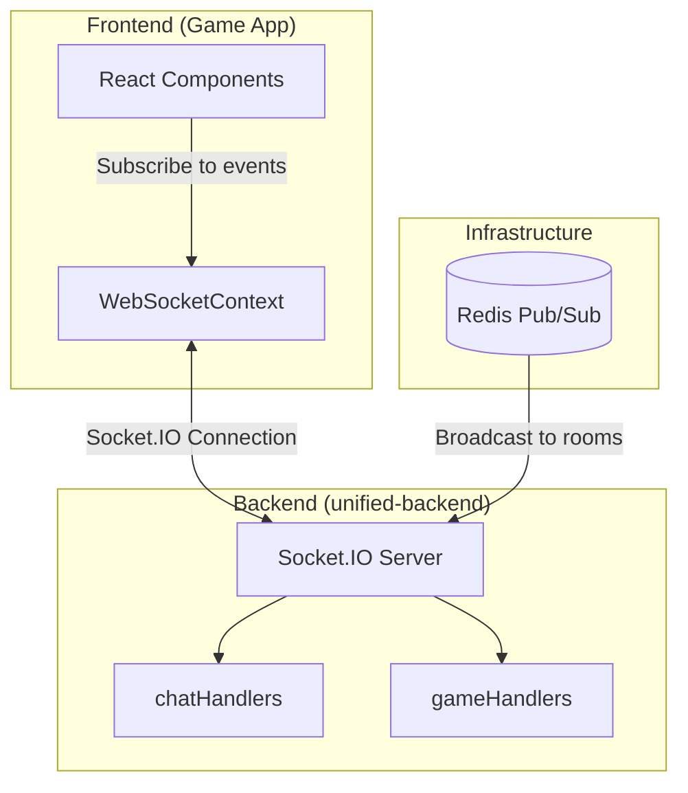
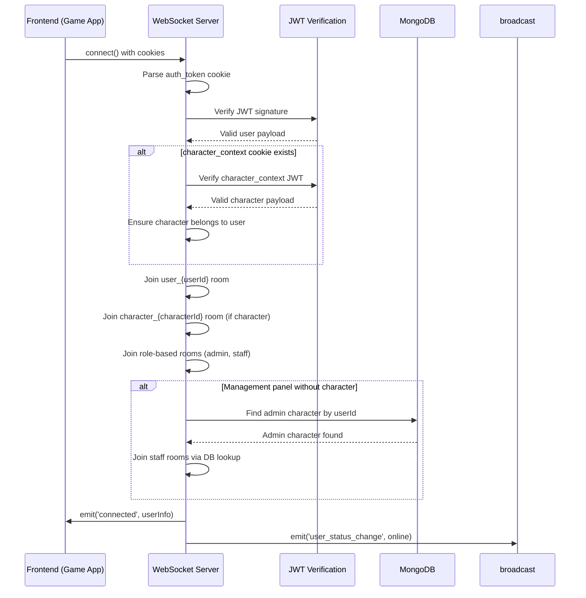
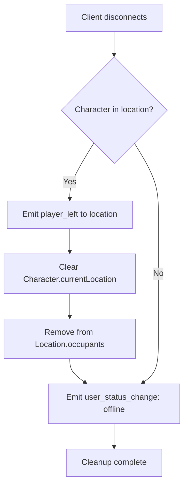

# WebSocket Events

**Catalogo completo degli eventi Socket.IO** - Payload schemas e pattern di utilizzo

---

## Introduzione

TenPennyNovels utilizza **Socket.IO** per comunicazione real-time bidirezionale tra frontend (apps/game) e backend (unified-backend).

### Architettura WebSocket



### Concetti Chiave

**Room-Based Broadcasting**:
- `user_{userId}` - User-specific room (notifications)
- `character_{characterId}` - Character-specific room (messages, status)
- `location_{locationId}` - Location room (chat, presence)
- `admin`, `staff`, `staff_leadership` - Role-based rooms

**Event Categories**:
- **Connection Events**: Autenticazione, handshake
- **Location Events**: Join/leave, player presence
- **Message Events**: Chat in-game, postal, off-game
- **Presence Events**: Online/offline status
- **Notification Events**: System alerts, toasts

---

## Connection Events

### Server → Client: `connected`

**Trigger**: Successful WebSocket connection after authentication

**Payload**:
```typescript
{
  message: string;
  user: {
    userId: string;
    username: string;
    userRoles: string[];
    characterRoles: string[];
    canAccessAdminPanel: boolean;
  };
  character: {
    characterId: string;
    characterName: string;
    isApproved: boolean;
  } | null;
  timestamp: string; // ISO 8601
}
```

**Example**:
```typescript
{
  message: "Connected to TenPennyNovels Game Backend",
  user: {
    userId: "507f1f77bcf86cd799439011",
    username: "johndoe",
    userRoles: ["user"],
    characterRoles: [],
    canAccessAdminPanel: false
  },
  character: {
    characterId: "507f191e810c19729de860ea",
    characterName: "Lord Blackwood",
    isApproved: true
  },
  timestamp: "2026-03-15T10:30:00.000Z"
}
```

**Frontend Handling**:
```typescript
socket.on('connected', (data) => {
  console.log('WebSocket connected:', data.user.username);
  setUser(data.user);
  if (data.character) {
    setCharacter(data.character);
  }
});
```

**File**: [services/unified-backend/src/modules/game/websocket/index.ts:242-257](../../../services/unified-backend/src/modules/game/websocket/index.ts#L242-L257)

---

### Server → Client: `user_status_change`

**Trigger**: User connects or disconnects from WebSocket

**Room**: `broadcast` (all connected users)

**Payload**:
```typescript
{
  userId: string;
  username: string;
  status: 'online' | 'offline';
  timestamp: string; // ISO 8601
}
```

**Example**:
```typescript
{
  userId: "507f1f77bcf86cd799439011",
  username: "johndoe",
  status: "online",
  timestamp: "2026-03-15T10:30:00.000Z"
}
```

**Frontend Handling**:
```typescript
socket.on('user_status_change', (data) => {
  updatePresence(data.userId, data.status);
});
```

**File**: [services/unified-backend/src/modules/game/websocket/index.ts:234-239](../../../services/unified-backend/src/modules/game/websocket/index.ts#L234-L239)

---

## Location Events

### Client → Server: `join_location`

**Purpose**: Join a location room for chat and presence

**Payload**:
```typescript
locationId: string; // MongoDB ObjectId (24 hex chars)
```

**Example**:
```typescript
socket.emit('join_location', '507f1f77bcf86cd799439011');
```

**Server Response**: [`location_joined`](#server--client-location_joined)

**File**: [services/unified-backend/src/modules/game/websocket/chatHandlers.ts:60-140](../../../services/unified-backend/src/modules/game/websocket/chatHandlers.ts#L60-L140)

---

### Server → Client: `location_joined`

**Trigger**: Character successfully joined a location

**Room**: `character_{characterId}` (only sender)

**Payload**:
```typescript
{
  locationId: string;
  locationName: string;
  timestamp: string; // ISO 8601
  presentCharacters: Array<{
    characterId: string;
    characterName: string;
    locationId: string;
  }>;
}
```

**Example**:
```typescript
{
  locationId: "507f1f77bcf86cd799439011",
  locationName: "The Miskatonic Library",
  timestamp: "2026-03-15T10:30:00.000Z",
  presentCharacters: [
    {
      characterId: "507f191e810c19729de860ea",
      characterName: "Professor Armitage",
      locationId: "507f1f77bcf86cd799439011"
    },
    {
      characterId: "507f191e810c19729de860eb",
      characterName: "Dr. Warren",
      locationId: "507f1f77bcf86cd799439011"
    }
  ]
}
```

**Frontend Handling**:
```typescript
socket.on('location_joined', (data) => {
  setCurrentLocation(data.locationId);
  setLocationName(data.locationName);
  setPresentCharacters(data.presentCharacters);
});
```

**File**: [services/unified-backend/src/modules/game/websocket/chatHandlers.ts:125-130](../../../services/unified-backend/src/modules/game/websocket/chatHandlers.ts#L125-L130)

---

### Server → Client: `player_entered`

**Trigger**: Another character enters current location

**Room**: `location_{locationId}` (broadcast to all occupants except sender)

**Payload**:
```typescript
{
  characterId: string;
  characterName: string;
  locationId: string;
  timestamp: string; // ISO 8601
}
```

**Example**:
```typescript
{
  characterId: "507f191e810c19729de860ea",
  characterName: "Lord Blackwood",
  locationId: "507f1f77bcf86cd799439011",
  timestamp: "2026-03-15T10:30:00.000Z"
}
```

**Frontend Handling**:
```typescript
socket.on('player_entered', (data) => {
  addCharacterToLocation(data.locationId, {
    characterId: data.characterId,
    characterName: data.characterName
  });
  showNotification(`${data.characterName} è entrato`);
});
```

**File**: [services/unified-backend/src/modules/game/websocket/chatHandlers.ts:94-102](../../../services/unified-backend/src/modules/game/websocket/chatHandlers.ts#L94-L102)

---

### Server → Client: `player_left`

**Trigger**: Character leaves location (explicit leave or disconnect)

**Room**: `location_{locationId}` (broadcast to remaining occupants)

**Payload**:
```typescript
{
  characterId: string;
  characterName: string;
  locationId: string;
  timestamp: string; // ISO 8601
}
```

**Example**:
```typescript
{
  characterId: "507f191e810c19729de860ea",
  characterName: "Lord Blackwood",
  locationId: "507f1f77bcf86cd799439011",
  timestamp: "2026-03-15T10:35:00.000Z"
}
```

**Frontend Handling**:
```typescript
socket.on('player_left', (data) => {
  removeCharacterFromLocation(data.locationId, data.characterId);
  showNotification(`${data.characterName} è uscito`);
});
```

**File**: [services/unified-backend/src/modules/game/websocket/chatHandlers.ts:164-171](../../../services/unified-backend/src/modules/game/websocket/chatHandlers.ts#L164-L171)

---

### Client → Server: `leave_location`

**Purpose**: Leave current location room

**Payload**:
```typescript
locationId: string; // MongoDB ObjectId
```

**Example**:
```typescript
socket.emit('leave_location', '507f1f77bcf86cd799439011');
```

**Server Response**: [`location_left`](#server--client-location_left)

**File**: [services/unified-backend/src/modules/game/websocket/chatHandlers.ts:145-187](../../../services/unified-backend/src/modules/game/websocket/chatHandlers.ts#L145-L187)

---

### Server → Client: `location_left`

**Trigger**: Character successfully left location

**Room**: `character_{characterId}` (only sender)

**Payload**:
```typescript
{
  locationId: string;
  timestamp: string; // ISO 8601
}
```

**Example**:
```typescript
{
  locationId: "507f1f77bcf86cd799439011",
  timestamp: "2026-03-15T10:35:00.000Z"
}
```

**Frontend Handling**:
```typescript
socket.on('location_left', (data) => {
  clearCurrentLocation();
});
```

**File**: [services/unified-backend/src/modules/game/websocket/chatHandlers.ts:174-177](../../../services/unified-backend/src/modules/game/websocket/chatHandlers.ts#L174-L177)

---

### Server → Client: `location_message_notification`

**Trigger**: New message posted in a location (including cross-location notifications)

**Room**: `location_{locationId}` (broadcast to all occupants)

**Payload**:
```typescript
{
  locationId: string;
  locationName?: string;
  locationSlug?: string;
  message: {
    characterId: string;
    characterName: string;
    content: string;
    visibility: 'public' | 'whisper' | 'master_only';
    targetCharacters?: string[]; // For whispers
  };
}
```

**Example**:
```typescript
{
  locationId: "507f1f77bcf86cd799439011",
  locationName: "The Miskatonic Library",
  locationSlug: "miskatonic-library",
  message: {
    characterId: "507f191e810c19729de860ea",
    characterName: "Lord Blackwood",
    content: "I've found something disturbing in these old texts...",
    visibility: "public"
  }
}
```

**Frontend Handling** (Cross-location notification):
```typescript
socket.on('location_message_notification', (data) => {
  // Cross-location toast notification
  if (data.locationId !== currentLocationId) {
    if (shouldNotifyBasedOnVisibility(data.message)) {
      playNotificationSound();
      showToast({
        message: `${data.message.characterName} ha scritto in ${data.locationName}`,
        onClick: () => navigateTo(`/locations/${data.locationSlug}/chat`)
      });
    }
  }

  // In-chat handling (append message if in same location)
  if (data.locationId === currentLocationId) {
    appendMessage(data.message);
  }
});
```

**File**: [apps/game/src/contexts/WebSocketContext.tsx:301-362](../../../apps/game/src/contexts/WebSocketContext.tsx#L301-L362)

---

## Typing Indicators

### Client → Server: `typing_start`

**Purpose**: Notify others that character is typing in location

**Payload**:
```typescript
locationId: string; // MongoDB ObjectId
```

**Example**:
```typescript
socket.emit('typing_start', '507f1f77bcf86cd799439011');
```

**File**: [services/unified-backend/src/modules/game/websocket/gameHandlers.ts:85-103](../../../services/unified-backend/src/modules/game/websocket/gameHandlers.ts#L85-L103)

---

### Client → Server: `typing_stop`

**Purpose**: Notify others that character stopped typing

**Payload**:
```typescript
locationId: string; // MongoDB ObjectId
```

**Example**:
```typescript
socket.emit('typing_stop', '507f1f77bcf86cd799439011');
```

**File**: [services/unified-backend/src/modules/game/websocket/gameHandlers.ts:105-123](../../../services/unified-backend/src/modules/game/websocket/gameHandlers.ts#L105-L123)

---

### Server → Client: `user_typing`

**Trigger**: Character starts or stops typing in location

**Room**: `location_{locationId}` (broadcast to all occupants except sender)

**Payload**:
```typescript
{
  characterId: string;
  characterName: string;
  locationId: string;
  typing: boolean;
  timestamp: string; // ISO 8601
}
```

**Example**:
```typescript
{
  characterId: "507f191e810c19729de860ea",
  characterName: "Lord Blackwood",
  locationId: "507f1f77bcf86cd799439011",
  typing: true,
  timestamp: "2026-03-15T10:30:00.000Z"
}
```

**Frontend Handling**:
```typescript
socket.on('user_typing', (data) => {
  if (data.typing) {
    addTypingIndicator(data.characterId, data.characterName);
  } else {
    removeTypingIndicator(data.characterId);
  }
});
```

**File**: [services/unified-backend/src/modules/game/websocket/gameHandlers.ts:96-102](../../../services/unified-backend/src/modules/game/websocket/gameHandlers.ts#L96-L102)

---

## Presence Events

### Server → Client: `global_presence_update`

**Trigger**: Periodic presence sync broadcast

**Room**: `broadcast` (all connected users)

**Payload**:
```typescript
{
  onlineUsers: Array<{
    userId: string;
    username: string;
    characterId?: string;
    characterName?: string;
    currentLocation?: string;
  }>;
  timestamp: string; // ISO 8601
}
```

**Example**:
```typescript
{
  onlineUsers: [
    {
      userId: "507f1f77bcf86cd799439011",
      username: "johndoe",
      characterId: "507f191e810c19729de860ea",
      characterName: "Lord Blackwood",
      currentLocation: "507f1f77bcf86cd799439012"
    }
  ],
  timestamp: "2026-03-15T10:30:00.000Z"
}
```

**Frontend Handling**:
```typescript
socket.on('global_presence_update', (data) => {
  updateOnlineUsersList(data.onlineUsers);
});
```

**File**: [apps/game/src/contexts/WebSocketContext.tsx:392-396](../../../apps/game/src/contexts/WebSocketContext.tsx#L392-L396)

---

### Server → Client: `character_active`

**Trigger**: Character becomes active (logged in with character selected)

**Room**: `broadcast` (all connected users)

**Payload**:
```typescript
{
  characterId: string;
  characterName: string;
  userId: string;
  timestamp: string; // ISO 8601
}
```

**Example**:
```typescript
{
  characterId: "507f191e810c19729de860ea",
  characterName: "Lord Blackwood",
  userId: "507f1f77bcf86cd799439011",
  timestamp: "2026-03-15T10:30:00.000Z"
}
```

**Frontend Handling**:
```typescript
socket.on('character_active', (data) => {
  markCharacterOnline(data.characterId, data.characterName);
});
```

**File**: [apps/game/src/contexts/WebSocketContext.tsx:404-408](../../../apps/game/src/contexts/WebSocketContext.tsx#L404-L408)

---

### Server → Client: `character_inactive`

**Trigger**: Character becomes inactive (logged out or switched character)

**Room**: `broadcast` (all connected users)

**Payload**:
```typescript
{
  characterId: string;
  characterName: string;
  userId: string;
  timestamp: string; // ISO 8601
}
```

**Example**:
```typescript
{
  characterId: "507f191e810c19729de860ea",
  characterName: "Lord Blackwood",
  userId: "507f1f77bcf86cd799439011",
  timestamp: "2026-03-15T10:35:00.000Z"
}
```

**Frontend Handling**:
```typescript
socket.on('character_inactive', (data) => {
  markCharacterOffline(data.characterId);
});
```

**File**: [apps/game/src/contexts/WebSocketContext.tsx:410-414](../../../apps/game/src/contexts/WebSocketContext.tsx#L410-L414)

---

## Message Events (Off-Game Chat)

### Server → Client: `offgame_message_received`

**Trigger**: New off-game message received by character

**Room**: `character_{characterId}` (receiver only)

**Payload**:
```typescript
{
  chatId: string;
  messageId: string;
  senderId: string;
  senderName: string;
  content: string;
  timestamp: string; // ISO 8601
}
```

**Example**:
```typescript
{
  chatId: "507f1f77bcf86cd799439011",
  messageId: "507f191e810c19729de860ea",
  senderId: "507f191e810c19729de860eb",
  senderName: "Professor Armitage",
  content: "We need to meet urgently. I've discovered something about the artifact.",
  timestamp: "2026-03-15T10:30:00.000Z"
}
```

**Frontend Handling**:
```typescript
socket.on('offgame_message_received', (data) => {
  appendOffGameMessage(data.chatId, data);
  showToast(`Nuovo messaggio da ${data.senderName}`);
  invalidateOffGameChatQuery(data.chatId);
});
```

**File**: [apps/game/src/contexts/WebSocketContext.tsx:420-432](../../../apps/game/src/contexts/WebSocketContext.tsx#L420-L432)

---

### Server → Client: `offgame_typing_indicator`

**Trigger**: Character is typing in off-game chat

**Room**: `character_{targetCharacterId}` (other participants)

**Payload**:
```typescript
{
  chatId: string;
  characterId: string;
  characterName: string;
  typing: boolean;
}
```

**Example**:
```typescript
{
  chatId: "507f1f77bcf86cd799439011",
  characterId: "507f191e810c19729de860ea",
  characterName: "Lord Blackwood",
  typing: true
}
```

**Frontend Handling**:
```typescript
socket.on('offgame_typing_indicator', (data) => {
  if (data.typing) {
    addTypingIndicator(data.chatId, data.characterName);
  } else {
    removeTypingIndicator(data.chatId, data.characterId);
  }
});
```

**File**: [apps/game/src/contexts/WebSocketContext.tsx:434-438](../../../apps/game/src/contexts/WebSocketContext.tsx#L434-L438)

---

### Server → Client: `offgame_message_read`

**Trigger**: Message read by recipient

**Room**: `character_{senderCharacterId}` (sender only)

**Payload**:
```typescript
{
  chatId: string;
  messageId: string;
  readerId: string;
  readerName: string;
  timestamp: string; // ISO 8601
}
```

**Example**:
```typescript
{
  chatId: "507f1f77bcf86cd799439011",
  messageId: "507f191e810c19729de860ea",
  readerId: "507f191e810c19729de860eb",
  readerName: "Professor Armitage",
  timestamp: "2026-03-15T10:32:00.000Z"
}
```

**Frontend Handling**:
```typescript
socket.on('offgame_message_read', (data) => {
  markMessageAsRead(data.chatId, data.messageId);
});
```

**File**: [apps/game/src/contexts/WebSocketContext.tsx:440-444](../../../apps/game/src/contexts/WebSocketContext.tsx#L440-L444)

---

### Server → Client: `offgame_chat_updated`

**Trigger**: Chat metadata updated (new participant, name change, etc.)

**Room**: `character_{participantCharacterId}` (all participants)

**Payload**:
```typescript
{
  chatId: string;
  action: 'participant_added' | 'participant_removed' | 'name_changed';
  data: any; // Varies by action
  timestamp: string; // ISO 8601
}
```

**Example**:
```typescript
{
  chatId: "507f1f77bcf86cd799439011",
  action: "participant_added",
  data: {
    characterId: "507f191e810c19729de860ec",
    characterName: "Dr. Warren"
  },
  timestamp: "2026-03-15T10:30:00.000Z"
}
```

**Frontend Handling**:
```typescript
socket.on('offgame_chat_updated', (data) => {
  invalidateOffGameChatQuery(data.chatId);
  refetchChatMetadata(data.chatId);
});
```

**File**: [apps/game/src/contexts/WebSocketContext.tsx:446-450](../../../apps/game/src/contexts/WebSocketContext.tsx#L446-L450)

---

## Message Events (Postal System)

### Server → Client: `ongame:message_delivered`

**Trigger**: New postal message delivered to character

**Room**: `character_{toCharacterId}` (receiver only)

**Payload**:
```typescript
{
  messageId: string;
  fromCharacterId: string;
  fromCharacterName: string;
  subject?: string;
  timestamp: string; // ISO 8601
}
```

**Example**:
```typescript
{
  messageId: "507f191e810c19729de860ea",
  fromCharacterId: "507f191e810c19729de860eb",
  fromCharacterName: "Inspector Legrasse",
  subject: "Regarding the cult investigation",
  timestamp: "2026-03-15T10:30:00.000Z"
}
```

**Frontend Handling**:
```typescript
socket.on('ongame:message_delivered', (data) => {
  showToast(`Nuova posta da ${data.fromCharacterName}${data.subject ? `: ${data.subject}` : ''}`);
  invalidatePostalInboxQuery();
});
```

**File**: [apps/game/src/contexts/WebSocketContext.tsx:452-464](../../../apps/game/src/contexts/WebSocketContext.tsx#L452-L464)

---

### Server → Client: `ongame:message_sent`

**Trigger**: Postal message successfully sent (confirmation to sender)

**Room**: `character_{fromCharacterId}` (sender only)

**Payload**:
```typescript
{
  messageId: string;
  toCharacterId: string;
  toCharacterName: string;
  subject?: string;
  timestamp: string; // ISO 8601
}
```

**Example**:
```typescript
{
  messageId: "507f191e810c19729de860ea",
  toCharacterId: "507f191e810c19729de860eb",
  toCharacterName: "Professor Armitage",
  subject: "Urgent meeting required",
  timestamp: "2026-03-15T10:30:00.000Z"
}
```

**Frontend Handling**:
```typescript
socket.on('ongame:message_sent', (data) => {
  invalidatePostalSentQuery();
});
```

**File**: [apps/game/src/contexts/WebSocketContext.tsx:466-470](../../../apps/game/src/contexts/WebSocketContext.tsx#L466-L470)

---

### Server → Client: `ongame:message_read`

**Trigger**: Postal message read by recipient (notification to sender)

**Room**: `character_{fromCharacterId}` (sender only)

**Payload**:
```typescript
{
  messageId: string;
  readerId: string;
  readerName: string;
  timestamp: string; // ISO 8601
}
```

**Example**:
```typescript
{
  messageId: "507f191e810c19729de860ea",
  readerId: "507f191e810c19729de860eb",
  readerName: "Professor Armitage",
  timestamp: "2026-03-15T10:32:00.000Z"
}
```

**Frontend Handling**:
```typescript
socket.on('ongame:message_read', (data) => {
  updateMessageReadStatus(data.messageId);
});
```

**File**: [apps/game/src/contexts/WebSocketContext.tsx:472-476](../../../apps/game/src/contexts/WebSocketContext.tsx#L472-L476)

---

## Character Status Events

### Server → Client: `character_status_changed`

**Trigger**: Character status changed (approved, rejected, banned)

**Room**: `character_{characterId}` (affected character)

**Payload**:
```typescript
{
  characterId: string;
  characterName: string;
  action: 'approve' | 'reject' | 'ban' | 'unban';
  message: string;
  timestamp: string; // ISO 8601
}
```

**Example**:
```typescript
{
  characterId: "507f191e810c19729de860ea",
  characterName: "Lord Blackwood",
  action: "approve",
  message: "Il tuo personaggio Lord Blackwood è stato approvato! Benvenuto a TenPennyNovels.",
  timestamp: "2026-03-15T10:30:00.000Z"
}
```

**Frontend Handling**:
```typescript
socket.on('character_status_changed', (data) => {
  const toastType = data.action === 'approve' ? 'success' : 'warning';
  showToast({
    type: toastType,
    message: data.message
  });
  invalidateCharacterQuery();
});
```

**File**: [apps/game/src/contexts/WebSocketContext.tsx:478-491](../../../apps/game/src/contexts/WebSocketContext.tsx#L478-L491)

---

## Notification Events

### Server → Client: `notification:ticket`

**Trigger**: Ticket-related notification (support, admin)

**Room**: `character_{characterId}` or `admin` room

**Payload**:
```typescript
{
  ticketId?: string;
  title?: string;
  message?: string;
  timestamp: string; // ISO 8601
}
```

**Example**:
```typescript
{
  ticketId: "507f191e810c19729de860ea",
  title: "Nuovo ticket aperto",
  message: "Il tuo ticket #1234 è stato preso in carico",
  timestamp: "2026-03-15T10:30:00.000Z"
}
```

**Frontend Handling**:
```typescript
socket.on('notification:ticket', (data) => {
  showToast({
    message: data.title || data.message || 'Nuova notifica ticket'
  });
});
```

**File**: [apps/game/src/contexts/WebSocketContext.tsx:500-506](../../../apps/game/src/contexts/WebSocketContext.tsx#L500-L506)

---

### Server → Client: `system_notification`

**Trigger**: System-wide announcement or notification

**Room**: `broadcast` (all connected users)

**Payload**:
```typescript
string | { message: string; type?: 'info' | 'warning' | 'success'; }
```

**Example**:
```typescript
"Il server verrà riavviato tra 10 minuti per manutenzione programmata"
```

**Frontend Handling**:
```typescript
socket.on('system_notification', (message) => {
  showToast({
    message: typeof message === 'string' ? message : 'Notifica di sistema'
  });
});
```

**File**: [apps/game/src/contexts/WebSocketContext.tsx:508-514](../../../apps/game/src/contexts/WebSocketContext.tsx#L508-L514)

---

### Server → Client: `error`

**Trigger**: WebSocket error (authentication failed, invalid action, etc.)

**Room**: `character_{characterId}` (sender only)

**Payload**:
```typescript
string | { code?: string; message: string; }
```

**Example**:
```typescript
{
  code: "AUTH_REQUIRED",
  message: "Token di autenticazione richiesto"
}
```

**Frontend Handling**:
```typescript
socket.on('error', (errorMsg) => {
  showToast({
    type: 'error',
    message: typeof errorMsg === 'string' ? errorMsg : 'Si è verificato un errore'
  });
});
```

**File**: [apps/game/src/contexts/WebSocketContext.tsx:516-522](../../../apps/game/src/contexts/WebSocketContext.tsx#L516-L522)

---

## Health Check Events

### Client → Server: `ping`

**Purpose**: Keepalive heartbeat + update character presence

**Payload**: None

**Example**:
```typescript
socket.emit('ping');
```

**Server Response**: [`pong`](#server--client-pong)

**Side Effects**:
1. Updates `Character.lastActive` timestamp
2. Updates `Location.occupants[].lastSeen` if in location
3. Prevents WebSocket timeout disconnect

**File**: [services/unified-backend/src/modules/game/websocket/gameHandlers.ts:14-55](../../../services/unified-backend/src/modules/game/websocket/gameHandlers.ts#L14-L55)

---

### Server → Client: `pong`

**Trigger**: Response to `ping` event

**Payload**:
```typescript
{
  timestamp: string; // ISO 8601
}
```

**Example**:
```typescript
{
  timestamp: "2026-03-15T10:30:00.000Z"
}
```

**Frontend Handling**:
```typescript
// Usually no explicit handling needed - Socket.IO uses this for keepalive
socket.on('pong', (data) => {
  console.log('Pong received at:', data.timestamp);
});
```

**File**: [services/unified-backend/src/modules/game/websocket/gameHandlers.ts:52-54](../../../services/unified-backend/src/modules/game/websocket/gameHandlers.ts#L52-L54)

---

### Client → Server: `get_status`

**Purpose**: Request current connection status

**Payload**: None

**Example**:
```typescript
socket.emit('get_status');
```

**Server Response**: [`status`](#server--client-status)

**File**: [services/unified-backend/src/modules/game/websocket/gameHandlers.ts:60-80](../../../services/unified-backend/src/modules/game/websocket/gameHandlers.ts#L60-L80)

---

### Server → Client: `status`

**Trigger**: Response to `get_status` event

**Payload**:
```typescript
{
  user: {
    userId: string;
    username: string;
    userRoles: string[];
  };
  character: {
    characterId: string;
    characterName: string;
    isApproved: boolean;
    gameplayRoles: string[];
  } | null;
  currentLocationId: string | null;
  connected: boolean;
  timestamp: string; // ISO 8601
}
```

**Example**:
```typescript
{
  user: {
    userId: "507f1f77bcf86cd799439011",
    username: "johndoe",
    userRoles: ["user"]
  },
  character: {
    characterId: "507f191e810c19729de860ea",
    characterName: "Lord Blackwood",
    isApproved: true,
    gameplayRoles: ["personaggio"]
  },
  currentLocationId: "507f1f77bcf86cd799439012",
  connected: true,
  timestamp: "2026-03-15T10:30:00.000Z"
}
```

**Frontend Handling**:
```typescript
socket.on('status', (data) => {
  console.log('Current status:', data);
  updateLocalState(data);
});
```

**File**: [services/unified-backend/src/modules/game/websocket/gameHandlers.ts:64-79](../../../services/unified-backend/src/modules/game/websocket/gameHandlers.ts#L64-L79)

---

## WebSocket Authentication

### Connection Handshake



### Authentication Middleware

**Location**: [services/unified-backend/src/modules/game/websocket/index.ts:37-106](../../../services/unified-backend/src/modules/game/websocket/index.ts#L37-L106)

**Required Cookies**:
- `auth_token` (JWT) - **Required** - User authentication
- `character_context` (JWT) - Optional - Character selection

**Error Codes**:
- `Token di autenticazione richiesto` - Missing `auth_token`
- `JWT_SECRET non configurato` - Server misconfiguration
- `Il personaggio non appartiene all'utente autenticato` - Character mismatch
- `Autenticazione fallita` - General auth failure

**Room Assignment**:
1. `user_{userId}` - Always joined (user-specific notifications)
2. `character_{characterId}` - If character selected
3. `admin`, `staff`, `staff_{userId}` - If admin/master/moderatore
4. `staff_leadership` - If gestore or amministratore

---

## WebSocket Disconnection Cleanup

### Disconnect Flow



**Location**: [services/unified-backend/src/modules/game/websocket/index.ts:182-231](../../../services/unified-backend/src/modules/game/websocket/index.ts#L182-L231)

**Critical Pattern**: Database cleanup on disconnect ensures consistency even if user crashes/closes tab without explicit `leave_location` call.

**Cleanup Steps**:
1. Emit `player_left` to `location_{locationId}` room
2. Set `Character.currentLocation = null`
3. Remove character from `Location.occupants` array
4. Emit `user_status_change: offline` to broadcast

---

## Frontend WebSocket Integration

### WebSocketContext Pattern

**Location**: [apps/game/src/contexts/WebSocketContext.tsx](../../../apps/game/src/contexts/WebSocketContext.tsx)

**Key Features**:
- **Single connection** - One Socket.IO instance per app
- **Event subscription** - Components subscribe via callbacks, not direct socket.on
- **Auto-reconnect** - Exponential backoff up to max attempts
- **Keepalive ping** - Every 30s to prevent timeout

**Usage Pattern**:
```typescript
import { useWebSocket } from '@/contexts/WebSocketContext';

function LocationChat() {
  const { onLocationEvent, isConnected } = useWebSocket();

  useEffect(() => {
    const unsubscribe = onLocationEvent((event) => {
      switch (event.type) {
        case 'location_message_notification':
          handleNewMessage(event.data);
          break;
        case 'player_entered':
          handlePlayerEntered(event.data);
          break;
        case 'player_left':
          handlePlayerLeft(event.data);
          break;
        case 'user_typing':
          handleTypingIndicator(event.data);
          break;
      }
    });

    return unsubscribe; // Cleanup on unmount
  }, [onLocationEvent]);

  return <div>Connected: {isConnected ? 'Yes' : 'No'}</div>;
}
```

---

## Event Categories Summary

### By Direction

| Direction | Category | Event Count | Purpose |
|-----------|----------|-------------|---------|
| **Client → Server** | Connection | 6 | Join/leave locations, typing indicators |
| **Server → Client** | Location | 6 | Player presence, messages |
| **Server → Client** | Presence | 4 | Online/offline status |
| **Server → Client** | Messages | 7 | Off-game, postal, chat |
| **Server → Client** | Notifications | 3 | System alerts, toasts |
| **Server → Client** | Status | 3 | Connection, character status |

### By Room Type

| Room Pattern | Purpose | Broadcast Scope |
|--------------|---------|-----------------|
| `user_{userId}` | User-specific notifications | Single user |
| `character_{characterId}` | Character-specific messages | Single character |
| `location_{locationId}` | Location chat and presence | All occupants |
| `admin`, `staff` | Admin/staff notifications | Role holders |
| `broadcast` | System-wide announcements | All connected users |

---

## Troubleshooting

### WebSocket Not Connecting

**Symptoms**: `status: 'error'`, `isConnected: false`

**Checklist**:
1. Check `auth_token` cookie exists (login required)
2. Verify `WS_CONFIG.URL` points to correct backend (default: `wss://ws.tenpennynovels.com`)
3. Check Nginx WebSocket upgrade config (see [nginx-configuration.md](../../../deploy/docs/04-nginx-configuration.md))
4. Verify backend is running: `pm2 status tenpennynovels-unified-backend`
5. Check backend logs: `pm2 logs tenpennynovels-unified-backend`

---

### Events Not Received

**Symptoms**: Socket connected but events not firing

**Checklist**:
1. Verify you're subscribed to correct room (`join_location` called?)
2. Check event type matches exactly (case-sensitive)
3. Verify character is approved (`character.isApproved: true`)
4. Check visibility filter (whispers only visible to sender/targets, master_only only to masters)
5. Use `socket.emit('get_status')` to debug current state

---

### Stale Presence Data

**Symptoms**: Characters shown as online but disconnected

**Root Cause**: Client crashed without clean disconnect, ping heartbeat stopped

**Fix**: Backend automatically cleans up on disconnect + ping timeout (see [Disconnect Flow](#disconnect-flow))

**Manual Cleanup**:
```typescript
// Force presence sync
socket.emit('request_presence_sync');
```

---

### Cross-Location Notifications Not Working

**Symptoms**: No toast when messages posted in other locations

**Checklist**:
1. Verify `currentLocationId` is set correctly in `WebSocketContext`
2. Check visibility filter logic in `location_message_notification` handler
3. Verify audio permission granted (`playNotificationSound()`)
4. Check toast is not dismissed too quickly (`duration: 6000`)

---

## Performance Considerations

### Room Broadcasting Efficiency

**Problem**: Broadcasting to 1000+ users is expensive

**Solution**: Room-based targeting

**Example**:
```typescript
// ❌ BAD: Broadcast to all users
io.emit('player_joined', data); // Sends to EVERYONE

// ✅ GOOD: Broadcast to location occupants only
io.to(`location_${locationId}`).emit('player_entered', data); // Sends to location only
```

**Impact**: 100x reduction in network traffic for location events

---

### Ping Interval Optimization

**Current**: 30s interval

**Trade-offs**:
- **Lower interval** (10s): More accurate presence, higher DB load
- **Higher interval** (60s): Lower DB load, stale presence data

**Recommendation**: Keep 30s (balanced)

---

### Event Payload Size

**Guideline**: Keep payloads < 1KB when possible

**Anti-Pattern**:
```typescript
// ❌ BAD: Send entire message history
socket.emit('location_history', { messages: allMessages }); // 100KB+
```

**Pattern**:
```typescript
// ✅ GOOD: Send only new message
socket.emit('location_message_notification', { message: newMessage }); // 1KB
```

---

## Related Documentation

- [API Endpoints](./api-endpoints.md) - HTTP endpoints that trigger WebSocket events
- [Authentication System](./authentication.md) - JWT token structure and validation
- [unified-backend Architecture](./unified-backend.md) - WebSocket server implementation
- [Game App Architecture](../frontend/game-app.md) - Frontend WebSocket integration

---

**Maintained by**: TenPennyNovels Team
**Last Updated**: 2026-03-15
