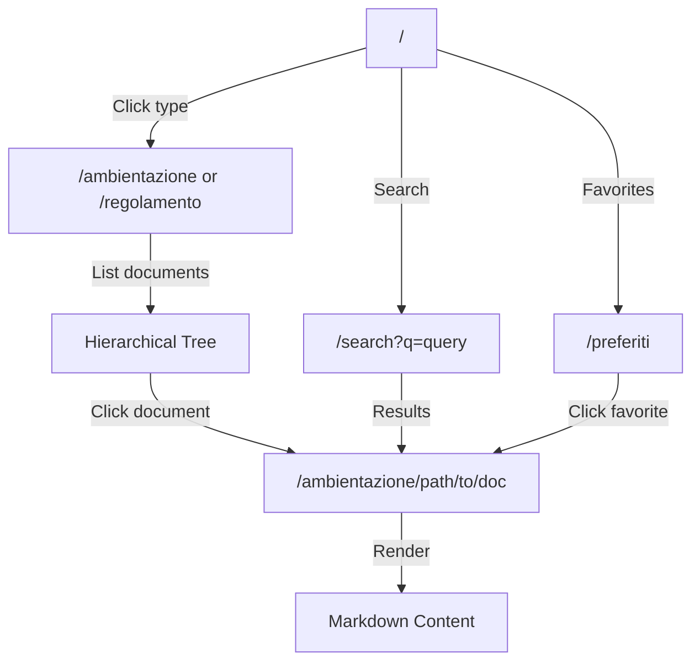
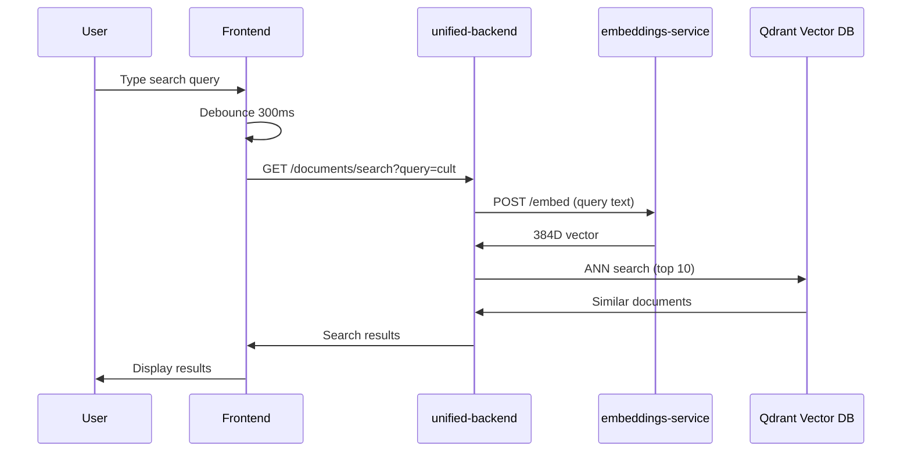

# Documents App - Documentazione Tecnica

**Knowledge base e sistema di documentazione** - Semantic search, routing gerarchico, markdown rendering

---

## Overview

**Documents App** è l'applicazione frontend dedicata alla consultazione della knowledge base di TenPennyNovels: ambientazione, regolamento, lore. Implementa semantic search con embeddings, routing gerarchico basato su slug, e sistema di favoriti.

**Statistiche**:
- **Port**: 4003
- **Pages**: 6 route dinamiche
- **Components**: 47
- **Bundle Size**: ~180 KB (gzipped)
- **Document Types**: 2 (ambientazione, regolamento)

**URL Production**: https://documenti.tenpennynovels.com

```mermaid
flowchart TB
    subgraph DocumentsApp["Documents App"]
        Home[Home Page]
        Ambientazione[/ambientazione/[...slug]]
        Regolamento[/regolamento/[...slug]]
        Search[Semantic Search]
        Favorites[Preferiti]
    end

    subgraph Backend["unified-backend"]
        API[REST API :8000]
        Embeddings[Embeddings Service]
        Qdrant[Qdrant Vector DB]
    end

    Home --> API
    Ambientazione --> API
    Regolamento --> API
    Search --> Embeddings
    Embeddings --> Qdrant
    Favorites --> API
```

---

## Technology Stack

| Technology | Version | Purpose |
|------------|---------|---------|
| Next.js | 16.1.6 | React framework (Pages Router) |
| React | 18.3 | UI library |
| React Markdown | 9.0.1 | Markdown rendering |
| Remark GFM | 4.0.0 | GitHub Flavored Markdown |
| TanStack Query | 5.62.11 | Server state management |
| Zustand | 5.0.3 | Client state (favorites) |
| SCSS Modules | 1.97.3 | Component-scoped styles |

---

## Routing Architecture

### Catch-All Routes

**Pattern**: `/[type]/[[...slug]]`

**Document Types**:
- `ambientazione` - Lore, setting, storia
- `regolamento` - Regole di gioco, meccaniche

**Examples**:
```
/ambientazione
/ambientazione/introduzione
/ambientazione/introduzione/presentazione
/regolamento
/regolamento/creazione-personaggio
/regolamento/creazione-personaggio/statistiche
```

**Implementation**:
```typescript
// pages/ambientazione/[...slug].tsx
export const getServerSideProps: GetServerSideProps = async ({ params, req }) => {
  const slugArray = params?.slug as string[] | undefined;

  if (!slugArray || slugArray.length === 0) {
    return { notFound: true };
  }

  const path = slugArray.join('/');

  try {
    const cookies = req.headers.cookie || '';
    const data = await documentsApi.get('ambientazione', path, cookies);

    return { props: { data } };
  } catch (error) {
    if (error?.statusCode === 404) {
      return { notFound: true };
    }

    return {
      props: {
        data: null,
        error: 'Errore nel caricamento del documento.'
      }
    };
  }
};
```

**Files**:
- [ambientazione/[...slug].tsx](../../../apps/documents/src/pages/ambientazione/[...slug].tsx)
- [regolamento/[...slug].tsx](../../../apps/documents/src/pages/regolamento/[...slug].tsx)
- [preferiti/[...slug].tsx](../../../apps/documents/src/pages/preferiti/[...slug].tsx)

---

### Route Hierarchy Flow



---

## Document Structure

### Document API Response

**Endpoint**: `GET /documents/:type/:path`

**Response**:
```typescript
{
  result: true;
  success: true;
  document: {
    _id: string;
    title: string;
    slug: string;
    path: string;
    type: 'ambientazione' | 'regolamento';
    content: string; // Markdown
    routeId: string;
    level: number; // Depth in hierarchy (0 = root)
    isPrivate: boolean;
    createdAt: string;
    updatedAt: string;
  };
  route: {
    _id: string;
    name: string;
    slug: string;
    path: string;
    parentId: string | null;
    documentId: string;
    order: number;
  };
  breadcrumbs: Array<{
    name: string;
    path: string;
    slug: string;
  }>;
  children: Array<{
    _id: string;
    name: string;
    slug: string;
    path: string;
    hasChildren: boolean;
    documentId: string;
  }>;
  timestamp: string;
}
```

---

### Hierarchical Tree API

**Endpoint**: `GET /documents/routes/hierarchical?type=ambientazione`

**Response**:
```typescript
{
  result: true;
  success: true;
  routes: Array<{
    _id: string;
    name: string;
    slug: string;
    path: string;
    parentId: string | null;
    documentId: string;
    order: number;
    children: Route[]; // Recursive structure
  }>;
  timestamp: string;
}
```

**Usage**: Sidebar navigation tree

---

## Semantic Search

### Search Flow



### Search Implementation

**Component**: [SearchBar.tsx](../../../apps/documents/src/components/search/SearchBar.tsx)

**API Call**:
```typescript
import { useQuery } from '@tanstack/react-query';
import { documentsApi } from '@/lib/api/documents';

function SearchResults({ query }: { query: string }) {
  const { data, isLoading } = useQuery({
    queryKey: ['search', query],
    queryFn: () => documentsApi.search(query, { limit: 10 }),
    enabled: query.length >= 3 // Min 3 chars
  });

  return (
    <div>
      {data?.results.map(result => (
        <SearchResultCard key={result._id} result={result} />
      ))}
    </div>
  );
}
```

**Search Result Format**:
```typescript
{
  result: true;
  success: true;
  results: Array<{
    _id: string;
    title: string;
    slug: string;
    path: string;
    type: 'ambientazione' | 'regolamento';
    score: number; // Similarity score (0-1)
    snippet?: string; // Text excerpt
  }>;
  count: number;
  timestamp: string;
}
```

**Performance**:
- Search latency: ~500ms (embedding generation + ANN search)
- Cached embeddings: ~50ms (Redis cache hit)
- Results limit: 10 (configurable)

---

## Favorites System

### Favorites Store (Zustand)

**File**: [favoritesStore.ts](../../../apps/documents/src/store/favoritesStore.ts)

**State**:
```typescript
{
  favoriteIds: string[]; // Array of document IDs
}
```

**Actions**:
```typescript
{
  addFavorite: (documentId: string) => void;
  removeFavorite: (documentId: string) => void;
  isFavorite: (documentId: string) => boolean;
  clearFavorites: () => void;
}
```

**Persistence**: localStorage (`favorites_v1`)

**API Integration**:
```typescript
import { useFavoritesStore } from '@/store/favoritesStore';
import { documentsApi } from '@/lib/api/documents';

function FavoriteButton({ documentId }: { documentId: string }) {
  const { isFavorite, addFavorite, removeFavorite } = useFavoritesStore();
  const favorite = isFavorite(documentId);

  const handleToggle = async () => {
    if (favorite) {
      await documentsApi.removeFavorite(documentId);
      removeFavorite(documentId);
    } else {
      await documentsApi.addFavorite(documentId);
      addFavorite(documentId);
    }
  };

  return (
    <button onClick={handleToggle}>
      {favorite ? '★' : '☆'} Preferito
    </button>
  );
}
```

**Backend Endpoints**:
- `POST /documents/favorites/:documentId` - Add favorite
- `DELETE /documents/favorites/:documentId` - Remove favorite
- `GET /documents/favorites` - List favorites

---

## Markdown Rendering

### React Markdown Configuration

**Component**: [DocumentContent.tsx](../../../apps/documents/src/components/documents/DocumentContent.tsx)

**Implementation**:
```typescript
import ReactMarkdown from 'react-markdown';
import remarkGfm from 'remark-gfm';

function DocumentContent({ markdown }: { markdown: string }) {
  return (
    <ReactMarkdown
      remarkPlugins={[remarkGfm]}
      components={{
        // Custom renderers
        h1: ({ node, ...props }) => <h1 className={styles.heading1} {...props} />,
        h2: ({ node, ...props }) => <h2 className={styles.heading2} {...props} />,
        a: ({ node, href, ...props }) => (
          <a
            href={href}
            target={href?.startsWith('http') ? '_blank' : undefined}
            rel={href?.startsWith('http') ? 'noopener noreferrer' : undefined}
            className={styles.link}
            {...props}
          />
        ),
        code: ({ node, inline, className, children, ...props }) => {
          const match = /language-(\w+)/.exec(className || '');
          return !inline && match ? (
            <SyntaxHighlighter language={match[1]} {...props}>
              {String(children).replace(/\n$/, '')}
            </SyntaxHighlighter>
          ) : (
            <code className={styles.inlineCode} {...props}>
              {children}
            </code>
          );
        },
        table: ({ node, ...props }) => (
          <div className={styles.tableWrapper}>
            <table className={styles.table} {...props} />
          </div>
        )
      }}
    >
      {markdown}
    </ReactMarkdown>
  );
}
```

**Supported Features** (via remark-gfm):
- Tables
- Strikethrough (`~~text~~`)
- Task lists (`- [ ]`, `- [x]`)
- Autolinks
- Code blocks with syntax highlighting

---

## Component Architecture

### Layout Components

**DocumentsLayout** - Main layout wrapper
```typescript
interface DocumentsLayoutProps {
  children: React.ReactNode;
  showSidebar?: boolean;
}
```

**Sidebar** - Navigation tree
- Hierarchical document tree
- Collapsible sections
- Active document highlighting
- Search integration

**DocumentHeader** - Document metadata
- Title
- Breadcrumbs
- Favorite button
- Last updated timestamp

---

### Document Components

| Component | Purpose |
|-----------|---------|
| **DocumentDetail** | Main document renderer (markdown + children) |
| **DocumentContent** | Markdown content rendering |
| **DocumentHeader** | Title, breadcrumbs, actions |
| **DocumentTree** | Hierarchical navigation sidebar |
| **DocumentTreeNode** | Single tree node (recursive) |
| **Breadcrumbs** | Path navigation |

---

### Search Components

| Component | Purpose |
|-----------|---------|
| **SearchBar** | Input + debounce + trigger search |
| **SearchResults** | Results list |
| **SearchResultCard** | Single result (title, snippet, type badge) |
| **SearchFilters** | Type filter (ambientazione/regolamento) |

---

## API Client

**File**: [lib/api/documents.ts](../../../apps/documents/src/lib/api/documents.ts)

**Methods**:
```typescript
export const documentsApi = {
  // Get document by path
  get: async (type: DocumentType, path: string, cookies?: string) => {
    const response = await fetch(
      `${API_URL}/documents/${type}/${path}`,
      { headers: { Cookie: cookies || '' } }
    );
    return response.json();
  },

  // List routes (hierarchical tree)
  listRoutes: async (type: DocumentType) => {
    const response = await fetch(
      `${API_URL}/documents/routes/hierarchical?type=${type}`
    );
    return response.json();
  },

  // Semantic search
  search: async (query: string, options?: { type?: DocumentType; limit?: number }) => {
    const params = new URLSearchParams({
      query,
      ...(options?.type && { type: options.type }),
      ...(options?.limit && { limit: String(options.limit) })
    });

    const response = await fetch(`${API_URL}/documents/search?${params}`);
    return response.json();
  },

  // Favorites
  getFavorites: async () => {
    const response = await fetch(`${API_URL}/documents/favorites`, {
      credentials: 'include'
    });
    return response.json();
  },

  addFavorite: async (documentId: string) => {
    const response = await fetch(
      `${API_URL}/documents/favorites/${documentId}`,
      { method: 'POST', credentials: 'include' }
    );
    return response.json();
  },

  removeFavorite: async (documentId: string) => {
    const response = await fetch(
      `${API_URL}/documents/favorites/${documentId}`,
      { method: 'DELETE', credentials: 'include' }
    );
    return response.json();
  }
};
```

---

## Server-Side Rendering (SSR)

### Why SSR?

1. **Authentication**: Private documents require auth token verification server-side
2. **SEO**: Content indexed by search engines
3. **Performance**: First contentful paint faster than client-side fetch

### Implementation Pattern

```typescript
export const getServerSideProps: GetServerSideProps = async ({ params, req }) => {
  const slugArray = params?.slug as string[] | undefined;
  const path = slugArray?.join('/') || '';

  try {
    // Forward auth cookies to backend
    const cookies = req.headers.cookie || '';
    const data = await documentsApi.get('ambientazione', path, cookies);

    return { props: { data } };
  } catch (error) {
    // Handle 404, 403, 500 errors
    if (error?.statusCode === 404) {
      return { notFound: true }; // Next.js 404 page
    }

    return {
      props: {
        data: null,
        error: 'Errore nel caricamento del documento.'
      }
    };
  }
};
```

**Cookie Forwarding**: `req.headers.cookie` passed to backend for auth verification

---

## Performance Optimizations

### 1. Debounced Search

```typescript
import { useDebounce } from '@/hooks/useDebounce';

function SearchBar() {
  const [query, setQuery] = useState('');
  const debouncedQuery = useDebounce(query, 300); // 300ms delay

  const { data } = useQuery({
    queryKey: ['search', debouncedQuery],
    queryFn: () => documentsApi.search(debouncedQuery),
    enabled: debouncedQuery.length >= 3
  });

  return <input value={query} onChange={(e) => setQuery(e.target.value)} />;
}
```

**Impact**: Riduce chiamate API da ~10/s a ~3/s durante typing

---

### 2. TanStack Query Caching

```typescript
const queryClient = new QueryClient({
  defaultOptions: {
    queries: {
      staleTime: 5 * 60 * 1000, // 5 minutes
      cacheTime: 10 * 60 * 1000, // 10 minutes
      refetchOnWindowFocus: false
    }
  }
});
```

**Impact**: Document fetches cached 5min, eliminates redundant API calls

---

### 3. Code Splitting

```typescript
import dynamic from 'next/dynamic';

const SyntaxHighlighter = dynamic(
  () => import('react-syntax-highlighter'),
  { ssr: false } // Load only client-side
);
```

**Impact**: Riduce initial bundle size ~40KB

---

## Environment Variables

| Variable | Descrizione | Esempio |
|----------|-------------|---------|
| `NEXT_PUBLIC_API_URL` | Backend API URL | `https://api.tenpennynovels.com` |
| `NEXT_PUBLIC_SITE_URL` | Documents site URL | `https://documenti.tenpennynovels.com` |

**File**: `.env.production` (vedi `deploy/env-templates/documents.env`)

---

## Build & Deployment

### Development

```bash
cd apps/documents
npm install
npm run dev # Port 4003
```

### Production

```bash
npm run build
npm run start
```

**PM2 Configuration**:
```javascript
{
  name: 'tenpennynovels-documents',
  script: 'npm',
  args: 'start',
  cwd: '/var/www/tenpennynovels/apps/documents',
  instances: 1,
  exec_mode: 'fork',
  env: { NODE_ENV: 'production', PORT: 4003 }
}
```

---

## SEO Configuration

**Component**: [SEO.tsx](../../../apps/documents/src/components/SEO.tsx)

**Usage**:
```typescript
<SEO
  title="Introduzione - Ambientazione"
  description="Storia e ambientazione di TenPennyNovels"
  ogType="article"
/>
```

**Generated Meta Tags**:
```html
<title>Introduzione - Ambientazione | TenPennyNovels</title>
<meta name="description" content="Storia e ambientazione..." />
<meta property="og:title" content="Introduzione - Ambientazione" />
<meta property="og:type" content="article" />
<meta property="og:url" content="https://documenti.tenpennynovels.com/..." />
```

---

## Troubleshooting

### Document Non Caricato

**Sintomi**: Errore 404 o documento vuoto

**Checklist**:
1. Verifica path corretto: `/ambientazione/path/to/doc`
2. Verifica tipo documento (`ambientazione` o `regolamento`)
3. Check backend logs: `pm2 logs tenpennynovels-unified-backend`
4. Verifica documento esiste in DB: `db.documents.findOne({ path: '...' })`

---

### Semantic Search Non Funziona

**Sintomi**: Nessun risultato o risultati non rilevanti

**Checklist**:
1. Verifica embeddings-service running: `docker ps | grep embeddings`
2. Verifica Qdrant running: `docker ps | grep qdrant`
3. Check embeddings-worker logs: `pm2 logs tenpennynovels-embeddings-worker`
4. Verifica collection Qdrant: `curl http://localhost:6333/collections/documents`

**Debug Search**:
```bash
# Test embedding generation
curl -X POST http://localhost:5001/embed \
  -H "Content-Type: application/json" \
  -d '{"text": "test query"}'

# Test Qdrant search
curl http://localhost:6333/collections/documents/points/search \
  -H "Content-Type: application/json" \
  -d '{"vector": [...], "limit": 5}'
```

---

### Favorites Non Sincronizzati

**Sintomi**: Favorites non salvati o persi dopo reload

**Checklist**:
1. Verifica localStorage: `localStorage.getItem('favorites_v1')`
2. Verifica auth_token cookie (backend favorites require auth)
3. Check API response: `GET /documents/favorites`

---

## Related Documentation

- [Embeddings Worker](../backend/embeddings-worker.md) - Embedding generation
- [Qdrant Vector DB](../infrastructure/qdrant-vector-db.md) - Vector search
- [API Endpoints](../backend/api-endpoints.md) - Documents API reference

---

**Maintained by**: TenPennyNovels Team
**Last Updated**: 2026-03-15
**Component Count**: 47
**Average Page Load**: ~800ms (SSR)
