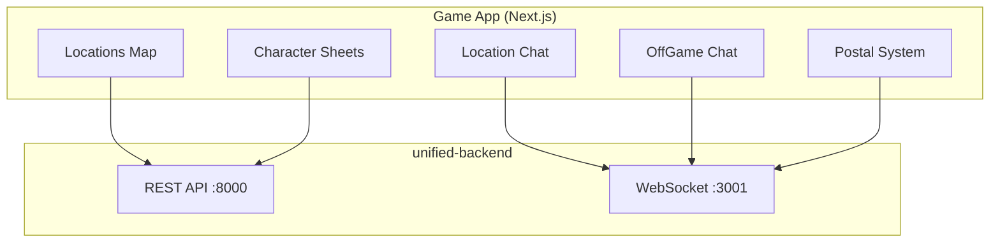
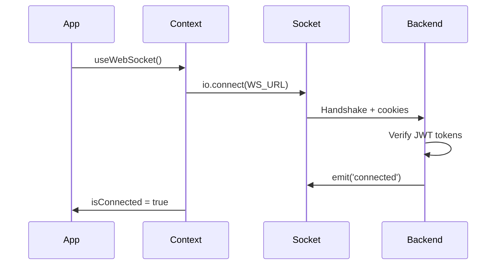

# Game App - Documentazione Tecnica Completa

**Interfaccia principale di gioco** - Chat, locations, character sheets, sessioni

---

## Overview

**Game App** è l'applicazione frontend principale dove i giocatori interagiscono con il mondo di gioco: esplorano locations, partecipano a chat real-time turn-based, gestiscono character sheets (sistema Call of Cthulhu), e comunicano via postal system vittoriano.

**Statistiche**:
- **Port**: 4001
- **Components**: 119
- **Zustand Stores**: 9
- **Custom Hooks**: 16
- **Lines of Code**: ~35,000 (escluso node_modules)
- **Bundle Size**: ~320 KB (gzipped)
- **Test Coverage**: 45% (target: 80%)

**URL Production**: https://game.tenpennynovels.com



---

## Technology Stack

| Technology | Version | Purpose |
|------------|---------|---------|
| Next.js | 16.1.6 | React framework (App Router) |
| React | 18.3 | UI library |
| Socket.IO Client | 4.8.3 | WebSocket real-time |
| Zustand | 5.0.3 | State management |
| TanStack Query | 5.62.11 | Server state + caching |
| TanStack Virtual | 3.13.19 | Virtual scrolling (1000+ messages) |
| SCSS Modules | 1.97.3 | Component-scoped styles |

---

## Message Types Catalog (12 tipi)

### 1. StandardMessage

**Purpose**: Messaggi in-character standard (azioni, dialoghi)

**Usage**: 90% dei messaggi in location chat

**Payload**:
```typescript
{
  _id: string;
  characterId: string;
  characterName: string;
  characterAvatar?: string;
  content: string;
  messageType: 'standard';
  visibility: 'public';
  timestamp: Date;
  tags?: string[];
}
```

**Visual Features**:
- Avatar + nome personaggio
- Contenuto editabile (se mittente)
- Menu edit/delete (se mittente, entro 5 min)
- Tags nel footer

**File**: [StandardMessage.tsx](../../../apps/game/src/components/chat/message-types/StandardMessage.tsx)

**Esempio**:
```
Lord Blackwood: "I've been investigating the disappearances. The pattern is disturbing."
```

---

### 2. OOCMessage

**Purpose**: Comunicazione out-of-character (OOC)

**Payload**:
```typescript
{
  _id: string;
  characterId: string;
  characterName: string;
  content: string;
  messageType: 'ooc';
  visibility: 'public';
  timestamp: Date;
}
```

**Visual Features**:
- Styling grigio/muted (distinzione visiva da IC)
- Badge `[OOC]`
- Avatar + menu standard

**File**: [OOCMessage.tsx](../../../apps/game/src/components/chat/message-types/OOCMessage.tsx)

**Esempio**:
```
[OOC] John: "AFK for 10 minutes, brb"
```

---

### 3. WhisperMessage

**Purpose**: Sussurri privati IC (visibili solo a mittente e target)

**Payload**:
```typescript
{
  _id: string;
  characterId: string;
  characterName: string;
  content: string;
  messageType: 'whisper';
  visibility: 'whisper';
  targetCharacters: string[]; // IDs destinatari
  timestamp: Date;
}
```

**Visual Features**:
- Styling corsivo
- 🤫 Icona sussurro
- Label "Sussurro a [Nome]"
- **Visibilità**: SOLO mittente e target

**File**: [WhisperMessage.tsx](../../../apps/game/src/components/chat/message-types/WhisperMessage.tsx)

**Esempio**:
```
🤫 Lord Blackwood sussurra a Inspector Legrasse: "I found the cult's meeting place."
```

---

### 4. MasterMessage

**Purpose**: Annunci e narrazione del master

**Payload**:
```typescript
{
  _id: string;
  characterId: string;
  characterName: string;
  content: string;
  messageType: 'master';
  visibility: 'master_only' | 'public';
  timestamp: Date;
}
```

**Visual Features**:
- Styling oro/dorato
- Badge ★ MASTER
- Visibilità elevata (si distingue dai messaggi player)
- Filtro visibilità opzionale (master_only)

**File**: [MasterMessage.tsx](../../../apps/game/src/components/chat/message-types/MasterMessage.tsx)

**Esempio**:
```
★ MASTER: "As you enter the library, you notice strange symbols on the floor."
```

---

### 5. DiceRollMessage

**Purpose**: Risultati tiri dado (sistema percentuale 1d100)

**Payload**:
```typescript
{
  _id: string;
  characterId: string;
  characterName: string;
  content?: string;
  messageType: 'dice_roll';
  diceResult: {
    dice: string; // "1d100"
    result: number; // 1-100
  };
  timestamp: Date;
}
```

**Visual Features**:
- 🎲 Icona dado grande
- Display risultato: `{result}/100`
- Numero in evidenza

**File**: [DiceRollMessage.tsx](../../../apps/game/src/components/chat/message-types/DiceRollMessage.tsx)

**Esempio**:
```
🎲 Lord Blackwood: "Attempting to decipher ancient text..."
Result: 73/100
```

---

### 6. SkillCheckMessage

**Purpose**: Tiri contrapposti (attaccante vs difensore)

**Payload**:
```typescript
{
  _id: string;
  characterId: string;
  characterName: string;
  content: string;
  messageType: 'skill_check';
  socialConflict: {
    attackSkill: string;    // "Persuade"
    attackRoll: number;
    attackDegree: string;   // "Success", "Hard Success"
    defenseSkill: string;   // "Psychology"
    defenseRoll: number;
    defenseDegree: string;
    isSuccess: boolean;
    margin: number;
  };
  hiddenContent?: string; // Intento nascosto (solo master)
  timestamp: Date;
}
```

**Visual Features**:
- ⚔️ Icona skill check
- Visualizzazione contrapposto: `Persuade (73) VS Psychology (45)`
- Gradi di successo (Normal, Hard, Extreme)
- Esito (✅ Success / ❌ Failure)
- Margine di successo/fallimento
- 🔒 Sezione intento nascosto (solo master)

**File**: [SkillCheckMessage.tsx](../../../apps/game/src/components/chat/message-types/SkillCheckMessage.tsx)

**Esempio**:
```
⚔️ Lord Blackwood: "I attempt to convince the guard."
Persuade (73) VS Psychology (45)
✅ Success (margin: +28)
🔒 True Intent (master): "Actually lying about identity."
```

---

### 7. StatCheckMessage

**Purpose**: Check su caratteristiche (STR, DEX, INT, etc.)

**Payload**:
```typescript
{
  _id: string;
  characterId: string;
  characterName: string;
  content: string;
  messageType: 'stat_check';
  statCheck: {
    stat: 'STR' | 'DEX' | 'INT' | 'CON' | 'APP' | 'POW' | 'SIZ' | 'EDU';
    roll: number;
    targetValue: number;
    success: boolean;
    degree: string;
  };
  timestamp: Date;
}
```

**Visual Features**:
- 💪 Icona stat (varia per tipo)
- Display: `Roll: 45 / Target: 60`
- Indicatore successo/fallimento
- Grado di successo

**File**: [StatCheckMessage.tsx](../../../apps/game/src/components/chat/message-types/StatCheckMessage.tsx)

---

### 8. CombatActionMessage

**Purpose**: Azioni di combattimento

**Payload**:
```typescript
{
  _id: string;
  characterId: string;
  characterName: string;
  content: string;
  messageType: 'combat_action';
  combatAction: {
    actionType: 'attack' | 'dodge' | 'parry' | 'damage';
    attackRoll?: number;
    defenseRoll?: number;
    damage?: number;
    weapon?: string;
    success: boolean;
  };
  timestamp: Date;
}
```

**File**: [CombatActionMessage.tsx](../../../apps/game/src/components/chat/message-types/CombatActionMessage.tsx)

---

### 9. ItemUseMessage

**Purpose**: Uso oggetti ed effetti

**Payload**:
```typescript
{
  _id: string;
  characterId: string;
  characterName: string;
  content: string;
  messageType: 'item_use';
  itemEffect: {
    itemId: string;
    itemName: string;
    effect: string;
  };
  timestamp: Date;
}
```

**File**: [ItemUseMessage.tsx](../../../apps/game/src/components/chat/message-types/ItemUseMessage.tsx)

---

### 10. ReactionRequestMessage

**Purpose**: Richiesta reazione player

**File**: [ReactionRequestMessage.tsx](../../../apps/game/src/components/chat/message-types/ReactionRequestMessage.tsx)

---

### 11. DefenderNotification

**Purpose**: Notifica difensore in combattimento

**File**: [DefenderNotification.tsx](../../../apps/game/src/components/chat/message-types/DefenderNotification.tsx)

---

### 12. ModerationMessage

**Purpose**: Azioni moderazione

**File**: [ModerationMessage.tsx](../../../apps/game/src/components/chat/message-types/ModerationMessage.tsx)

---

## Zustand Stores (9 stores)

### 1. authStore

**Purpose**: Autenticazione, personaggio selezionato, permessi

**File**: [authStore.ts](../../../apps/game/src/store/authStore.ts)

**State**:
```typescript
{
  user: User | null;
  selectedCharacter: Character | null;
  isAuthenticated: boolean;
  isLoading: boolean;
}
```

**Actions**: `setUser`, `setSelectedCharacter`, `logout`, `checkAuth`

---

### 2. chatStore

**Purpose**: Messaggi chat, typing indicators, stato location

**File**: [chatStore.ts](../../../apps/game/src/store/chatStore.ts)

**State**:
```typescript
{
  messagesByLocation: { [locationId: string]: ChatMessage[] };
  typingUsers: { [locationId: string]: TypingUser[] };
  currentLocationId: string | null;
  isLoadingMessages: boolean;
}
```

**Actions**: `addMessage`, `updateMessage`, `deleteMessage`, `setMessages`, `addTypingUser`, `removeTypingUser`

**Performance**: Messaggi indicizzati per locationId per accesso O(1)

---

### 3. locationStore

**Purpose**: Location corrente, favoriti, metadati

**File**: [locationStore.ts](../../../apps/game/src/store/locationStore.ts)

**State**:
```typescript
{
  currentLocation: Location | null;
  favoriteLocations: string[];
}
```

**Persistence**: `favoriteLocations` salvati in localStorage

---

### 4. windowManagerStore

**Purpose**: Gestione finestre (character sheets, chat panels, mail)

**File**: [windowManagerStore.ts](../../../apps/game/src/store/windowManagerStore.ts)

**State**:
```typescript
{
  windows: Array<{
    id: string;
    type: 'character_sheet' | 'chat_panel' | 'mail_viewer';
    title: string;
    data: any;
    position: { x: number; y: number };
    size: { width: number; height: number };
    zIndex: number;
    isMinimized: boolean;
  }>;
}
```

**Actions**: `openWindow`, `closeWindow`, `minimizeWindow`, `bringToFront`, `updateWindowPosition`

**Integration**: react-draggable per drag & drop finestre

---

### 5. presenceStore

**Purpose**: Utenti online, presenza in locations

**File**: [presenceStore.ts](../../../apps/game/src/store/presenceStore.ts)

**State**:
```typescript
{
  onlineUsers: User[];
  presenceByLocation: { [locationId: string]: Character[] };
}
```

**WebSocket Sync**: Eventi `global_presence_update`, `character_active`, `character_inactive`

---

### 6. gameStateStore

**Purpose**: Stato sessione, turni

**File**: [gameStateStore.ts](../../../apps/game/src/store/gameStateStore.ts)

---

### 7. wizardStore (41KB - IL PIÙ GRANDE)

**Purpose**: Wizard creazione personaggio (5 step)

**File**: [wizardStore.ts](../../../apps/game/src/store/wizardStore.ts)

**State**:
```typescript
{
  currentStep: number; // 1-5
  characterData: {
    // Step 1: Dati base
    name: string;
    occupation: string;
    age: number;
    sex: string;

    // Step 2: Stats (Call of Cthulhu)
    stats: { STR, DEX, INT, CON, APP, POW, SIZ, EDU };

    // Step 3: Skills (90 skills)
    skills: { [skillName: string]: number };

    // Step 4: Equipment
    equipment: string[];
    cash: number;

    // Step 5: Background
    description: string;
    personalHistory: string;
    significantPeople: string[];
    // ... molti altri campi
  };
  errors: { [field: string]: string };
}
```

**Persistence**: Auto-save localStorage ogni 30s

**Validation**: Per-step validation prima di nextStep()

---

### 8. forumStore

**Purpose**: Forum discussioni

**File**: [forumStore.ts](../../../apps/game/src/store/forumStore.ts)

---

### 9. uiStore

**Purpose**: Tema, sidebar, notifiche toast

**File**: [uiStore.ts](../../../apps/game/src/store/uiStore.ts)

**State**:
```typescript
{
  theme: 'light' | 'dark' | 'sepia';
  sidebarCollapsed: boolean;
  toasts: Toast[];
  modalStack: Modal[];
}
```

**Persistence**: `theme`, `sidebarCollapsed` in localStorage

---

## WebSocket Integration

### WebSocketContext

**File**: [WebSocketContext.tsx](../../../apps/game/src/contexts/WebSocketContext.tsx)

**Pattern**:
```typescript
const { onLocationEvent, isConnected } = useWebSocket();

useEffect(() => {
  const unsubscribe = onLocationEvent((event) => {
    switch (event.type) {
      case 'location_message_notification':
        handleNewMessage(event.data);
        break;
      case 'player_entered':
        handlePlayerEntered(event.data);
        break;
      case 'player_left':
        handlePlayerLeft(event.data);
        break;
    }
  });

  return unsubscribe; // Cleanup
}, [onLocationEvent]);
```

**Key Features**:
- Single connection condivisa
- Auto-reconnect con exponential backoff
- Keepalive ping ogni 30s
- Event subscription via callbacks (NO `socket.on()` diretto)

**Connection Flow**:


---

## Virtual Scrolling (TanStack Virtual)

**Purpose**: Rendering efficiente di 1000+ messaggi chat

**Implementation**:
```typescript
import { useVirtualizer } from '@tanstack/react-virtual';

function MessageList({ messages }) {
  const parentRef = useRef<HTMLDivElement>(null);

  const virtualizer = useVirtualizer({
    count: messages.length,
    getScrollElement: () => parentRef.current,
    estimateSize: () => 100, // Altezza stimata messaggio
    overscan: 10 // Render 10 extra sopra/sotto viewport
  });

  return (
    <div ref={parentRef} style={{ height: '600px', overflow: 'auto' }}>
      <div style={{ height: `${virtualizer.getTotalSize()}px` }}>
        {virtualizer.getVirtualItems().map((virtualItem) => (
          <div key={virtualItem.index} style={{ transform: `translateY(${virtualItem.start}px)` }}>
            <MessageCard message={messages[virtualItem.index]} />
          </div>
        ))}
      </div>
    </div>
  );
}
```

**Performance**:
- 1000 messaggi: 60 FPS (vs 15 FPS senza)
- DOM nodes: 20-30 (vs 1000 senza)
- Memory: ~50 MB (vs ~500 MB senza)

---

## Custom Hooks

| Hook | Purpose |
|------|---------|
| `useLocationChat` | Gestione chat location (messaggi, typing, send) |
| `useOffGameChat` | Chat private OOC |
| `useOnGameMail` | Sistema postale vittoriano |
| `useMessageInteractions` | Logica condivisa edit/delete/menu messaggi |
| `useAuth` | Helper autenticazione |
| `usePresence` | Tracking utenti online |
| `useWebSocket` | Accesso WebSocket context |
| `useWindowManager` | Gestione finestre |
| `useNotifications` | Toast notifications |
| `useDebounce` | Debounce input |

---

## Routing

| Route | Component | Purpose |
|-------|-----------|---------|
| `/` | index.tsx | Lista locations |
| `/locations` | locations/index.tsx | Mappa locations |
| `/locations/[slug]` | locations/[slug]/index.tsx | Dettaglio location |
| `/locations/[slug]/chat` | locations/[slug]/chat.tsx | Chat location |
| `/character/wizard` | character/wizard.tsx | Creazione personaggio |
| `/presenti-online` | presenti-online.tsx | Presenza online |

**Protected Routes**: Tutte richiedono autenticazione → redirect `/auth/login`

**Character Context Routes**: Chat e game routes richiedono `character_context` token → redirect `/characters/select`

---

## Performance Optimizations

### 1. Code Splitting

```typescript
import dynamic from 'next/dynamic';

const CharacterSheet = dynamic(() => import('@/components/character/CharacterSheet'), {
  loading: () => <Spinner />,
  ssr: false
});
```

### 2. React.memo

```typescript
const MessageCard = React.memo(({ message }) => {
  // Component logic
}, (prevProps, nextProps) => {
  return prevProps.message._id === nextProps.message._id &&
         prevProps.message.content === nextProps.message.content;
});
```

### 3. Debounced Search

```typescript
const debouncedQuery = useDebounce(searchQuery, 300);

const { data } = useQuery({
  queryKey: ['search', debouncedQuery],
  queryFn: () => searchAPI(debouncedQuery),
  enabled: debouncedQuery.length >= 3
});
```

---

## Environment Variables

| Variable | Descrizione | Esempio |
|----------|-------------|---------|
| `NEXT_PUBLIC_API_URL` | REST API base URL | `https://api.tenpennynovels.com` |
| `NEXT_PUBLIC_WS_URL` | WebSocket URL | `wss://ws.tenpennynovels.com` |
| `NEXT_PUBLIC_CDN_URL` | CDN immagini | `https://cdn.tenpennynovels.com` |

**File**: `.env.production` (vedi `deploy/env-templates/game.env`)

---

## Build & Deployment

### Development

```bash
cd apps/game
npm install
npm run dev # Port 4001
```

### Production

```bash
npm run build
npm run start
```

**PM2 Configuration**:
```javascript
{
  name: 'tenpennynovels-game',
  script: 'npm',
  args: 'start',
  cwd: '/var/www/tenpennynovels/apps/game',
  instances: 1,
  exec_mode: 'fork',
  env: { NODE_ENV: 'production', PORT: 4001 }
}
```

---

## Troubleshooting

### WebSocket Non Si Connette

**Sintomi**: `isConnected: false`, no real-time updates

**Checklist**:
1. Verifica `NEXT_PUBLIC_WS_URL`
2. Backend running: `pm2 status tenpennynovels-unified-backend`
3. Logs: `pm2 logs tenpennynovels-unified-backend`
4. Cookie `auth_token` presente (login required)

**Debug**:
```typescript
const { status } = useWebSocket();
console.log('WebSocket status:', status);
```

---

### Messaggi Non Appaiono

**Checklist**:
1. Cookie `character_context` presente
2. locationId corretto
3. Verifica store: `useChatStore.getState().messagesByLocation[locationId]`
4. WebSocket event subscription attiva

---

## Related Documentation

- [WebSocket Events](../backend/websocket-events.md) - Eventi WebSocket completi
- [Error Codes](../backend/error-codes.md) - Gestione errori
- [API Endpoints](../backend/api-endpoints.md) - REST API reference

---

**Maintained by**: TenPennyNovels Team
**Last Updated**: 2026-03-15
**Component Count**: 119
**Test Coverage**: 45% (target: 80%)
