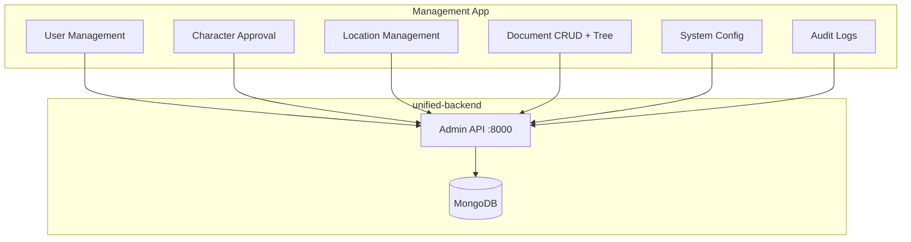
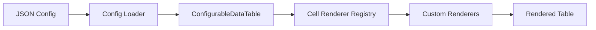

# Management App - Documentazione Tecnica Completa

**Pannello amministrazione** - ConfigurableDataTable pattern, TipTap editor, drag & drop

---

## Overview

**Management App** è l'interfaccia amministrativa di TenPennyNovels. Richiede `canAccessAdminPanel: true` e ruoli specifici. Implementa un sistema JSON-driven per tabelle dati, editor rich text (TipTap), e gestione gerarchica documenti con drag & drop.

**Statistiche**:
- **Port**: 4003
- **Base Path**: `/gestione` (production)
- **Components**: 83
- **Key Component**: ConfigurableDataTable (418 lines)
- **Bundle Size**: ~420 KB (gzipped)
- **Protected Routes**: 15

**URL Production**: https://tenpennynovels.com/gestione



---

## Technology Stack

| Technology | Version | Purpose |
|------------|---------|---------|
| Next.js | 16.1.6 | React framework (Pages Router) |
| React | 18.3 | UI library |
| Zustand | 5.0.3 | State management |
| TanStack Query | 5.62.11 | Server state + caching |
| React Hook Form | 7.71.2 | Form validation |
| Zod | 3.25.1 | Schema validation |
| **TipTap** | 2.27.2 | **Rich text editor** |
| **dnd-kit** | 6.3.1 | **Drag and drop** |
| Socket.IO Client | 4.8.3 | Real-time notifications |
| SCSS Modules | 1.97.3 | Component styles |

---

## Key Features

### Character Approval

- Review pending characters
- Approve/reject con motivo
- View character sheet completo
- Initialize finances on approval

### User Management

- User list con paginazione
- Edit roles, permissions
- Ban/unban users
- Audit trail su modifiche

### Location Management

- CRUD locations
- Hierarchical structure (città → quartieri → venues)
- Settings (chat, shop, visible, private)

### Document Management ⭐

- **Hierarchical tree** con drag & drop
- **TipTap rich text editor**
- Route creation/deletion
- Document types (ambientazione, regolamento)
- Reordering gerarchico

### System Configuration

- Game settings
- Maintenance mode toggle
- Broadcast system announcements
- Audit logs
- Deleted records recovery

---

## ConfigurableDataTable Pattern ⭐

### Concept

**JSON-driven data table component** che elimina duplicazione codice per elenchi admin.

**Problem Solved**: Prima 15 pagine diverse avevano codice quasi identico (tabella + paginazione + sorting + filtri). Ora 1 componente + JSON config.

**File**: [ConfigurableDataTable.tsx](../../../apps/management/src/components/shared/ConfigurableDataTable.tsx) (418 lines)

**Config File**: [schemas.ts](../../../apps/management/src/lib/config/schemas.ts) (178 lines)

---

### Architecture



---

### TableConfig Schema

**TypeScript Type**:
```typescript
export interface TableConfig {
  table: {
    name: string; // Unique table identifier
    title: string; // Display title
    sortable: boolean;
    searchable: boolean;
    selectable: boolean;
    pagination: boolean;
  };
  columns: TableColumn[];
  actions?: TableAction[];
  bulkActions?: BulkAction[];
  filters?: TableFilter[];
}

export interface TableColumn {
  key: string; // Data field path (supports nested: "user.name")
  label: string; // Column header
  sortable?: boolean;
  width?: string; // CSS width (e.g., "120px", "15%")
  renderer?: string; // Cell renderer key from registry
  rendererConfig?: Record<string, unknown>; // Renderer-specific config
  hidden?: boolean; // Hide column
}

export interface TableAction {
  key: string; // Action identifier
  label: string;
  icon?: string;
  variant?: 'primary' | 'danger' | 'warning';
  condition?: string; // Conditional rendering (e.g., "item.status === 'pending'")
}

export interface BulkAction {
  key: string;
  label: string;
  icon?: string;
  variant?: 'primary' | 'danger';
  requiresConfirmation?: boolean;
  confirmationMessage?: string;
}

export interface TableFilter {
  key: string; // Filter identifier
  label: string;
  type: 'text' | 'select' | 'boolean' | 'date';
  options?: Array<{ value: string; label: string }>; // For select
  defaultValue?: string | boolean;
}
```

---

### Example: User List Config

**File**: [user-list.json](../../../apps/management/src/lib/config/tables/user-list.json)

```json
{
  "table": {
    "name": "user-list",
    "title": "User Management",
    "sortable": true,
    "searchable": true,
    "selectable": true,
    "pagination": true
  },
  "columns": [
    {
      "key": "_id",
      "label": "ID",
      "width": "80px",
      "renderer": "text",
      "sortable": false
    },
    {
      "key": "username",
      "label": "Username",
      "width": "150px",
      "renderer": "text",
      "sortable": true
    },
    {
      "key": "email",
      "label": "Email",
      "width": "200px",
      "renderer": "email",
      "sortable": true
    },
    {
      "key": "userRoles",
      "label": "Roles",
      "width": "120px",
      "renderer": "badge-list",
      "rendererConfig": {
        "variant": "info"
      }
    },
    {
      "key": "isActive",
      "label": "Status",
      "width": "100px",
      "renderer": "boolean-badge",
      "rendererConfig": {
        "trueLabel": "Active",
        "falseLabel": "Banned",
        "trueVariant": "success",
        "falseVariant": "danger"
      },
      "sortable": true
    },
    {
      "key": "createdAt",
      "label": "Created",
      "width": "120px",
      "renderer": "date",
      "sortable": true
    }
  ],
  "actions": [
    {
      "key": "edit",
      "label": "Edit",
      "icon": "pencil",
      "variant": "primary"
    },
    {
      "key": "ban",
      "label": "Ban",
      "icon": "ban",
      "variant": "danger",
      "condition": "item.isActive === true"
    },
    {
      "key": "unban",
      "label": "Unban",
      "icon": "check",
      "variant": "warning",
      "condition": "item.isActive === false"
    }
  ],
  "bulkActions": [
    {
      "key": "delete",
      "label": "Delete Selected",
      "icon": "trash",
      "variant": "danger",
      "requiresConfirmation": true,
      "confirmationMessage": "Are you sure you want to delete {count} users?"
    }
  ],
  "filters": [
    {
      "key": "role",
      "label": "Role",
      "type": "select",
      "options": [
        { "value": "user", "label": "User" },
        { "value": "admin", "label": "Admin" },
        { "value": "master", "label": "Master" }
      ]
    },
    {
      "key": "isActive",
      "label": "Status",
      "type": "boolean",
      "defaultValue": true
    }
  ]
}
```

---

### Cell Renderer Registry

**File**: [cellRenderers/index.ts](../../../apps/management/src/lib/cellRenderers/index.ts)

**Registry Pattern**:
```typescript
export const cellRenderers: Record<string, CellRenderer> = {
  text: TextRenderer,
  email: EmailRenderer,
  date: DateRenderer,
  'boolean-badge': BooleanBadgeRenderer,
  'badge-list': BadgeListRenderer,
  image: ImageRenderer,
  link: LinkRenderer,
  actions: ActionsRenderer,
  // ... 15+ renderers total
};
```

**Custom Renderer Example**:
```typescript
// renderers/DateRenderer.tsx
export function DateRenderer({ value, config }: CellRendererProps) {
  if (!value) return <span className={styles.empty}>—</span>;

  const date = new Date(value);
  const format = config?.format || 'short'; // 'short', 'long', 'relative'

  let formatted: string;
  switch (format) {
    case 'long':
      formatted = date.toLocaleDateString('it-IT', {
        day: '2-digit',
        month: 'long',
        year: 'numeric',
        hour: '2-digit',
        minute: '2-digit'
      });
      break;
    case 'relative':
      formatted = formatDistanceToNow(date, { addSuffix: true, locale: it });
      break;
    default: // 'short'
      formatted = date.toLocaleDateString('it-IT');
  }

  return (
    <time dateTime={date.toISOString()} className={styles.date}>
      {formatted}
    </time>
  );
}
```

---

### Usage Pattern

**Page Component**:
```typescript
import { ConfigurableDataTable } from '@/components/shared/ConfigurableDataTable';
import { useQuery } from '@tanstack/react-query';
import { adminApi } from '@/lib/api/admin';

export default function UserListPage() {
  const { data, isLoading } = useQuery({
    queryKey: ['users'],
    queryFn: () => adminApi.getUsers()
  });

  const handleAction = (actionKey: string, user: User) => {
    switch (actionKey) {
      case 'edit':
        router.push(`/users/edit/${user._id}`);
        break;
      case 'ban':
        banUser(user._id);
        break;
      case 'unban':
        unbanUser(user._id);
        break;
    }
  };

  const handleBulkAction = (actionKey: string, users: User[]) => {
    if (actionKey === 'delete') {
      deleteUsers(users.map(u => u._id));
    }
  };

  return (
    <ConfigurableDataTable
      tableName="user-list"
      data={data?.list || []}
      loading={isLoading}
      onAction={handleAction}
      onBulkAction={handleBulkAction}
      pagination={{
        page: data?.pagination.page || 1,
        pageSize: data?.pagination.pageSize || 25,
        total: data?.pagination.totalItems || 0,
        onPageChange: (page) => setPage(page),
        onPageSizeChange: (size) => setPageSize(size)
      }}
    />
  );
}
```

**Result**: 30 linee invece di 300+ per implementare tabella completa con sorting, filtering, pagination, bulk actions.

---

### Features Implemented

1. **Sorting**: Click header → toggle asc/desc
2. **Searching**: Debounced 300ms, ricerca su tutte le colonne visibili
3. **Pagination**: Page numbers, page size selector (10, 25, 50, 100)
4. **Selection**: Checkbox per row, select all current page, select all pages
5. **Bulk Actions**: Agisci su selezionati, confirmation dialog opzionale
6. **Filters**: Text, select, boolean, date filters in sidebar
7. **Column Visibility**: Hide/show columns via settings
8. **Responsive**: Mobile-optimized con scroll orizzontale

---

## TipTap Rich Text Editor

### Integration

**Component**: [RichTextEditor.tsx](../../../apps/management/src/components/shared/RichTextEditor.tsx)

**Libraries**:
- `@tiptap/react` - React integration
- `@tiptap/starter-kit` - Basic extensions (bold, italic, headings, lists)
- `@tiptap/extension-link` - Link support
- `@tiptap/extension-image` - Image support
- `@tiptap/extension-table` - Table support
- `@tiptap/extension-code-block-lowlight` - Syntax highlighting

**Features**:
- WYSIWYG editing
- Markdown shortcuts (e.g., `**bold**`, `# heading`)
- Toolbar con buttons (bold, italic, link, image, etc.)
- Table editing (insert, delete row/column, merge cells)
- Code blocks con syntax highlighting
- Image upload integration
- Character/word counter

---

### Usage Pattern

```typescript
import { RichTextEditor } from '@/components/shared/RichTextEditor';
import { useState } from 'react';

export default function DocumentEditor() {
  const [content, setContent] = useState('<p>Initial content</p>');

  return (
    <RichTextEditor
      content={content}
      onChange={setContent}
      placeholder="Start writing..."
      characterLimit={50000}
    />
  );
}
```

**Output**: HTML string (stored in `document.content` field)

**Rendering**: `<div dangerouslySetInnerHTML={{ __html: content }} />`

---

## Drag & Drop System (dnd-kit)

### Document Tree Reordering

**Component**: [DocumentTree.tsx](../../../apps/management/src/components/documents/DocumentTree.tsx)

**Implementation**:
```typescript
import { DndContext, closestCenter } from '@dnd-kit/core';
import { SortableContext, verticalListSortingStrategy } from '@dnd-kit/sortable';
import { useSortable } from '@dnd-kit/sortable';
import { CSS } from '@dnd-kit/utilities';

function DocumentTreeNode({ node }: { node: DocumentNode }) {
  const {
    attributes,
    listeners,
    setNodeRef,
    transform,
    transition,
    isDragging
  } = useSortable({ id: node._id });

  const style = {
    transform: CSS.Transform.toString(transform),
    transition,
    opacity: isDragging ? 0.5 : 1
  };

  return (
    <div ref={setNodeRef} style={style} {...attributes} {...listeners}>
      <div className={styles.nodeContent}>
        <span className={styles.dragHandle}>⋮⋮</span>
        <span>{node.name}</span>
      </div>
      {node.children?.length > 0 && (
        <div className={styles.children}>
          {node.children.map(child => (
            <DocumentTreeNode key={child._id} node={child} />
          ))}
        </div>
      )}
    </div>
  );
}

function DocumentTree({ documents }: { documents: DocumentNode[] }) {
  const handleDragEnd = (event) => {
    const { active, over } = event;

    if (active.id !== over.id) {
      // Call API to reorder
      reorderDocuments(active.id, over.id);
    }
  };

  return (
    <DndContext collisionDetection={closestCenter} onDragEnd={handleDragEnd}>
      <SortableContext items={documents.map(d => d._id)} strategy={verticalListSortingStrategy}>
        {documents.map(doc => (
          <DocumentTreeNode key={doc._id} node={doc} />
        ))}
      </SortableContext>
    </DndContext>
  );
}
```

**API Endpoint**: `PATCH /admin/documents/reorder`

**Payload**:
```json
{
  "updates": [
    { "routeId": "507f1f77bcf86cd799439011", "newOrder": 0, "newParentId": null },
    { "routeId": "507f1f77bcf86cd799439012", "newOrder": 1, "newParentId": null }
  ]
}
```

---

## Routes & Pages

| Route | Component | Purpose |
|-------|-----------|---------|
| `/gestione` | Dashboard | Overview stats |
| `/gestione/users/user-list` | UserList | User management |
| `/gestione/users/ban-list` | BanList | Banned users |
| `/gestione/characters/character-list` | CharacterList | All characters |
| `/gestione/characters/character-pending` | CharacterPending | **Approval queue** |
| `/gestione/characters/permissions` | CharacterPermissions | Role management |
| `/gestione/locations/location-list` | LocationList | Location CRUD |
| `/gestione/documents/document-list` | DocumentList | **Document tree + CRUD** |
| `/gestione/documents/subtypes` | DocumentSubtypes | Document type config |
| `/gestione/system/configurations` | SystemConfig | Game settings |
| `/gestione/system/audit-logs` | AuditLogs | Admin action trail |
| `/gestione/system/broadcast` | Broadcast | System announcements |
| `/gestione/system/maintenance` | Maintenance | Maintenance mode |
| `/gestione/system/deleted-records` | DeletedRecords | Soft-delete recovery |

**Protected**: Tutte le route richiedono `canAccessAdminPanel: true`

**Middleware**: [middleware.ts](../../../apps/management/src/middleware.ts) - Redirect `/auth/login` se non autenticato

---

## Form Validation (React Hook Form + Zod)

### Pattern

```typescript
import { useForm } from 'react-hook-form';
import { zodResolver } from '@hookform/resolvers/zod';
import { z } from 'zod';

const userSchema = z.object({
  username: z.string().min(3).max(20).regex(/^[a-zA-Z0-9_]+$/),
  email: z.string().email(),
  password: z.string().min(8).optional(),
  userRoles: z.array(z.string()).min(1),
  isActive: z.boolean()
});

type UserFormData = z.infer<typeof userSchema>;

export default function UserEditForm({ user }: { user: User }) {
  const { register, handleSubmit, formState: { errors } } = useForm<UserFormData>({
    resolver: zodResolver(userSchema),
    defaultValues: user
  });

  const onSubmit = async (data: UserFormData) => {
    await adminApi.updateUser(user._id, data);
  };

  return (
    <form onSubmit={handleSubmit(onSubmit)}>
      <FormField
        label="Username"
        error={errors.username?.message}
        {...register('username')}
      />
      <FormField
        label="Email"
        type="email"
        error={errors.email?.message}
        {...register('email')}
      />
      {/* ... */}
      <button type="submit">Save</button>
    </form>
  );
}
```

**Benefits**:
- Type-safe forms
- Declarative validation
- Error messages auto-generated
- Zod schema reusable backend/frontend

---

## Real-Time Notifications (Socket.IO)

### Integration

**Context**: [WebSocketContext.tsx](../../../apps/management/src/contexts/WebSocketContext.tsx)

**Events**:
- `character_status_changed` - Character approved/rejected
- `user_status_change` - User banned/unbanned
- `document_updated` - Document modified
- `system_notification` - System announcements

**Usage**:
```typescript
import { useWebSocket } from '@/contexts/WebSocketContext';

export default function CharacterPendingPage() {
  const { onEvent } = useWebSocket();

  useEffect(() => {
    const unsubscribe = onEvent((event) => {
      if (event.type === 'character_status_changed') {
        // Refresh character list
        queryClient.invalidateQueries(['characters', 'pending']);

        // Show toast notification
        addToast({
          type: 'success',
          message: `Character ${event.data.characterName} approved!`
        });
      }
    });

    return unsubscribe;
  }, [onEvent]);

  // ...
}
```

---

## API Client

**File**: [lib/api/admin.ts](../../../apps/management/src/lib/api/admin.ts)

**Methods**:
```typescript
export const adminApi = {
  // Users
  getUsers: (params?: QueryParams) => get('/admin/users', params),
  updateUser: (userId: string, data: Partial<User>) => patch(`/admin/users/${userId}`, data),
  banUser: (userId: string, reason: string) => post(`/admin/users/${userId}/ban`, { reason }),

  // Characters
  getCharacters: (params?: QueryParams) => get('/admin/characters', params),
  approveCharacter: (characterId: string) => post(`/admin/characters/${characterId}/approve`),
  rejectCharacter: (characterId: string, reason: string) =>
    post(`/admin/characters/${characterId}/reject`, { reason }),

  // Documents
  getDocuments: (type: DocumentType) => get(`/admin/documents/routes/hierarchical?type=${type}`),
  createDocument: (data: CreateDocumentPayload) => post('/admin/documents', data),
  updateDocument: (documentId: string, data: Partial<Document>) =>
    patch(`/admin/documents/${documentId}`, data),
  deleteDocument: (documentId: string) => del(`/admin/documents/${documentId}`),
  reorderDocuments: (updates: ReorderUpdate[]) => patch('/admin/documents/reorder', { updates }),

  // System
  getSystemConfig: () => get('/admin/system/config'),
  updateSystemConfig: (config: Partial<SystemConfig>) => patch('/admin/system/config', config),
  getAuditLogs: (params?: QueryParams) => get('/admin/audit-logs', params),
  broadcast: (message: string) => post('/admin/broadcast', { message })
};
```

---

## State Management (Zustand)

**Stores**:
- `authStore` - Admin user auth (shared with landing app)
- `uiStore` - Theme, toasts, modals
- `documentTreeStore` - Cached document tree for quick access

**Example** (uiStore):
```typescript
interface UIStore {
  toasts: Toast[];
  addToast: (toast: Omit<Toast, 'id'>) => void;
  removeToast: (toastId: string) => void;
  theme: 'light' | 'dark';
  setTheme: (theme: 'light' | 'dark') => void;
}

export const useUIStore = create<UIStore>((set) => ({
  toasts: [],
  addToast: (toast) => set((state) => ({
    toasts: [...state.toasts, { ...toast, id: generateId() }]
  })),
  removeToast: (toastId) => set((state) => ({
    toasts: state.toasts.filter(t => t.id !== toastId)
  })),
  theme: 'light',
  setTheme: (theme) => set({ theme })
}));
```

---

## Environment Variables

| Variable | Descrizione | Esempio |
|----------|-------------|---------|
| `NEXT_PUBLIC_API_URL` | Backend API URL | `https://api.tenpennynovels.com` |
| `NEXT_PUBLIC_WS_URL` | WebSocket URL | `wss://ws.tenpennynovels.com` |
| `NEXT_PUBLIC_BASE_PATH` | Base path | `/gestione` |

**File**: `.env.production` (vedi `deploy/env-templates/management.env`)

---

## Build & Deployment

### Development

```bash
cd apps/management
npm install
npm run dev # Port 4003
```

### Production

```bash
npm run build
npm run start
```

**PM2 Configuration**:
```javascript
{
  name: 'tenpennynovels-management',
  script: 'npm',
  args: 'start',
  cwd: '/var/www/tenpennynovels/apps/management',
  instances: 1,
  exec_mode: 'fork',
  env: {
    NODE_ENV: 'production',
    PORT: 4003,
    NEXT_PUBLIC_BASE_PATH: '/gestione'
  }
}
```

**Nginx Configuration**:
```nginx
location /gestione {
    proxy_pass http://127.0.0.1:4003;
    proxy_http_version 1.1;
    proxy_set_header Upgrade $http_upgrade;
    proxy_set_header Connection 'upgrade';
    proxy_set_header Host $host;
    proxy_cache_bypass $http_upgrade;
}
```

---

## Troubleshooting

### ConfigurableDataTable Non Carica Config

**Sintomi**: Tabella vuota o errore "Config not found"

**Checklist**:
1. Verifica nome tabella: `tableName="user-list"` (deve matchare file JSON)
2. Check file esiste: `ls apps/management/src/lib/config/tables/user-list.json`
3. Verifica JSON valido: `cat user-list.json | jq .`
4. Check config loader: `console.log(loadTableConfig('user-list'))`

---

### TipTap Editor Non Salva

**Sintomi**: Contenuto perso dopo save

**Checklist**:
1. Verifica `onChange` callback chiamato
2. Check HTML string salvato in DB (non JSON object)
3. Verifica caratteri speciali escaped correttamente
4. Check `characterLimit` non superato

---

### Drag & Drop Non Funziona

**Sintomi**: Elementi non draggable

**Checklist**:
1. Verifica `useSortable` hook chiamato correttamente
2. Check `id` univoco per ogni elemento
3. Verifica `{...attributes} {...listeners}` applicati
4. Check CSS `touch-action: none` su drag handle

---

## Related Documentation

- [API Endpoints](../backend/api-endpoints.md) - Admin API reference
- [Error Codes](../backend/error-codes.md) - Error handling
- [WebSocket Events](../backend/websocket-events.md) - Real-time events

---

**Maintained by**: TenPennyNovels Team
**Last Updated**: 2026-03-15
**Component Count**: 83
**ConfigurableDataTable LOC**: 418 lines
