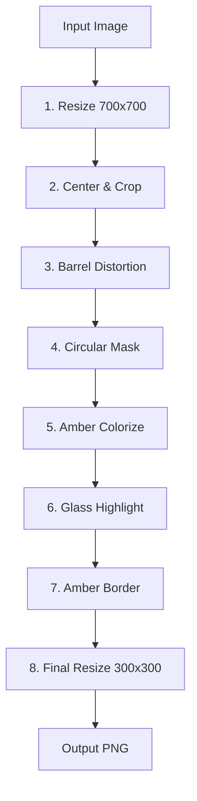

# Glass Ball Effect - Image Processing Script

**ImageMagick script per effetto palla di vetro** - Location thumbnails processing

---

## Overview

**Glass Ball** è uno script ImageMagick che applica un effetto realistico "palla di vetro" (crystal ball) alle immagini delle location, creando thumbnail caratteristiche per la mappa del gioco.

**Location**: [scripts/glass-ball/](../../../scripts/glass-ball/)

**Purpose**: Transform rectangular location images → circular "crystal ball" thumbnails

**Technology**: ImageMagick CLI

---

## Prerequisites

### Install ImageMagick

**macOS**:
```bash
brew install imagemagick
```

**Ubuntu/Debian**:
```bash
sudo apt-get install imagemagick
```

**Verify Installation**:
```bash
magick --version
# ImageMagick 7.1.0+ required
```

---

## Usage

### Single Image Processing

**Test su immagine singola**:

```bash
magick input/your-image.jpg \
  -resize 700x700^ \
  -gravity center \
  -extent 700x700 \
  -distort barrel "0.65 0.0 0.0 1.0" \
  -gravity center \
  -crop 400x400+0+0 +repage \
  -alpha set \
  \( +clone -channel A -evaluate set 0 +channel -fill white -draw "circle 200,200 200,0" -blur 0x4 \) \
  -compose dst-in -composite \
  -colorize 8,6,0 \
  -modulate 100,120,108 \
  \( -size 400x400 xc:none -fill "radial-gradient:rgba(255,255,255,0.35)-rgba(255,255,255,0)" -draw "ellipse 135,95 75,55 0,360" -blur 0x18 \) \
  -compose over -composite \
  \( -size 400x400 xc:none -fill none -stroke "rgba(220,160,60,0.5)" -strokewidth 16 -draw "circle 200,200 200,12" -blur 0x6 \) \
  -compose over -composite \
  \( -size 400x400 xc:none -fill none -stroke "rgba(255,200,100,0.3)" -strokewidth 8 -draw "circle 200,200 200,8" -blur 0x4 \) \
  -compose over -composite \
  -resize 300x300 \
  output/result.png
```

---

### Batch Processing

**Process All Images**:

```bash
./batch-process.sh
```

**Custom Directories**:

```bash
./batch-process.sh /path/to/input /path/to/output
```

**Example**:

```bash
# Process all location images
./batch-process.sh ~/Downloads/location-images output/
```

**Output**: Files named `{original-name}-glass.png` in output directory

---

## Effect Pipeline

### Step-by-Step Breakdown



---

### 1. Resize & Center (700x700)

```bash
-resize 700x700^ \
-gravity center \
-extent 700x700
```

**Purpose**: Create square canvas, maintain aspect ratio, crop center

**Result**: 700x700px centered square

---

### 2. Barrel Distortion (Crystal Ball Effect)

```bash
-distort barrel "0.65 0.0 0.0 1.0"
```

**Parameters**:
- `0.65` - Distortion amount (0.0 = none, 1.0 = maximum)
- `0.0 0.0 1.0` - X, Y offset + zoom

**Effect**: Creates curved glass ball appearance

**Visual**: Image appears as if viewed through spherical glass

---

### 3. Circular Mask with Soft Edges

```bash
-gravity center \
-crop 400x400+0+0 +repage \
-alpha set \
\( +clone -channel A -evaluate set 0 +channel -fill white -draw "circle 200,200 200,0" -blur 0x4 \) \
-compose dst-in -composite
```

**Purpose**: Cut circular shape with feathered edges

**Result**: 400x400px circle with 4px blur edge

---

### 4. Amber/Sepia Tone (Victorian Aesthetic)

```bash
-colorize 8,6,0 \
-modulate 100,120,108
```

**Parameters**:
- `-colorize 8,6,0` - Add 8% red, 6% green, 0% blue
- `-modulate 100,120,108`:
  - `100` - Brightness (unchanged)
  - `120` - Saturation (+20%)
  - `108` - Hue shift (+8° towards amber)

**Effect**: Warm, sepia-toned vintage look

---

### 5. Glass Highlight (Reflective Shine)

```bash
\( -size 400x400 xc:none \
   -fill "radial-gradient:rgba(255,255,255,0.35)-rgba(255,255,255,0)" \
   -draw "ellipse 135,95 75,55 0,360" \
   -blur 0x18 \) \
-compose over -composite
```

**Purpose**: Add realistic glass reflection highlight

**Position**: Top-left (135, 95)

**Size**: 75x55px ellipse

**Opacity**: 35% white → transparent gradient

**Blur**: 18px for soft diffusion

**Effect**: Mimics light reflecting off glass surface

---

### 6. Amber Border (Double Layer)

**Inner Border** (thicker, 16px):
```bash
\( -size 400x400 xc:none \
   -fill none \
   -stroke "rgba(220,160,60,0.5)" \
   -strokewidth 16 \
   -draw "circle 200,200 200,12" \
   -blur 0x6 \) \
-compose over -composite
```

**Outer Border** (thinner, 8px):
```bash
\( -size 400x400 xc:none \
   -fill none \
   -stroke "rgba(255,200,100,0.3)" \
   -strokewidth 8 \
   -draw "circle 200,200 200,8" \
   -blur 0x4 \) \
-compose over -composite
```

**Colors**:
- Inner: `rgba(220,160,60,0.5)` - Darker amber (50% opacity)
- Outer: `rgba(255,200,100,0.3)` - Lighter amber (30% opacity)

**Effect**: Layered antique brass/gold rim

---

### 7. Final Resize (300x300)

```bash
-resize 300x300 \
output/result.png
```

**Output Format**: PNG with transparency

**File Size**: ~150-200 KB per image

---

## Customization Parameters

### Distortion Strength

```bash
# Default (moderate curve)
-distort barrel "0.65 0.0 0.0 1.0"

# Stronger curve (more pronounced ball effect)
-distort barrel "0.85 0.0 0.0 1.0"

# Subtle curve (flatter)
-distort barrel "0.45 0.0 0.0 1.0"
```

---

### Color Tone Adjustment

**Warmer Tone** (more amber):
```bash
-colorize 12,8,0 \
-modulate 100,130,112
```

**Cooler Tone** (less amber):
```bash
-colorize 4,3,0 \
-modulate 100,110,104
```

**Sepia (vintage photography)**:
```bash
-sepia-tone 80% \
-modulate 100,120,100
```

---

### Border Color Change

**Silver/Chrome Border**:
```bash
-stroke "rgba(200,200,220,0.5)" # Inner
-stroke "rgba(230,230,250,0.3)" # Outer
```

**Copper Border**:
```bash
-stroke "rgba(184,115,51,0.5)" # Inner
-stroke "rgba(229,142,63,0.3)" # Outer
```

**Gold Border**:
```bash
-stroke "rgba(218,165,32,0.5)" # Inner
-stroke "rgba(255,215,0,0.3)"  # Outer
```

---

### Output Size

**Smaller (200x200)**:
```bash
-resize 200x200 \
output/result.png
```

**Larger (500x500)**:
```bash
-resize 500x500 \
output/result.png
```

**⚠️ Note**: Larger sizes → larger file sizes (~500KB for 500x500)

---

## Batch Processing Script

**File**: [batch-process.sh](../../../scripts/glass-ball/batch-process.sh)

**Implementation**:
```bash
#!/bin/bash

INPUT_DIR="${1:-input}"
OUTPUT_DIR="${2:-output}"

BARREL_DISTORTION="0.65"
OUTPUT_SIZE="300"

mkdir -p "$OUTPUT_DIR"

for img in "$INPUT_DIR"/*.{jpg,jpeg,png,JPG,JPEG,PNG}; do
  [ -f "$img" ] || continue

  filename=$(basename "$img")
  name="${filename%.*}"
  output="$OUTPUT_DIR/${name}-glass.png"

  echo "Processing: $filename → ${name}-glass.png"

  magick "$img" \
    -resize 700x700^ \
    -gravity center \
    -extent 700x700 \
    -distort barrel "$BARREL_DISTORTION 0.0 0.0 1.0" \
    -gravity center \
    -crop 400x400+0+0 +repage \
    -alpha set \
    \( +clone -channel A -evaluate set 0 +channel -fill white -draw "circle 200,200 200,0" -blur 0x4 \) \
    -compose dst-in -composite \
    -colorize 8,6,0 \
    -modulate 100,120,108 \
    \( -size 400x400 xc:none -fill "radial-gradient:rgba(255,255,255,0.35)-rgba(255,255,255,0)" -draw "ellipse 135,95 75,55 0,360" -blur 0x18 \) \
    -compose over -composite \
    \( -size 400x400 xc:none -fill none -stroke "rgba(220,160,60,0.5)" -strokewidth 16 -draw "circle 200,200 200,12" -blur 0x6 \) \
    -compose over -composite \
    \( -size 400x400 xc:none -fill none -stroke "rgba(255,200,100,0.3)" -strokewidth 8 -draw "circle 200,200 200,8" -blur 0x4 \) \
    -compose over -composite \
    -resize ${OUTPUT_SIZE}x${OUTPUT_SIZE} \
    "$output"

  echo "✓ Saved: $output"
done

echo ""
echo "✓ Batch processing complete!"
echo "  Input: $INPUT_DIR"
echo "  Output: $OUTPUT_DIR"
```

**Usage**:
```bash
chmod +x batch-process.sh
./batch-process.sh
```

---

## Performance

| Metric | Value |
|--------|-------|
| **Processing Time** | ~2-3 seconds per image |
| **Output Size** | ~150-200 KB (PNG) |
| **Batch (50 images)** | ~2 minutes total |
| **Input Formats** | JPG, JPEG, PNG |
| **Output Format** | PNG with transparency |

---

## Example Use Cases

### 1. Location Map Thumbnails

**Input**: `whitechapel-tavern.jpg` (1920x1080, landscape)
**Output**: `whitechapel-tavern-glass.png` (300x300, circular)

**Usage**: Display on game map as clickable location icon

---

### 2. Character Portrait Orbs

**Input**: Character headshot (square or portrait)
**Output**: Circular portrait with glass effect

**Customization**: Reduce distortion for portraits:
```bash
-distort barrel "0.35 0.0 0.0 1.0" # Subtle curve
```

---

### 3. Item Icons (Future)

**Input**: Item image (weapon, artifact)
**Output**: Circular icon with glass orb effect

---

## Troubleshooting

### ImageMagick Not Found

**Symptoms**: `command not found: magick`

**Fix**:
```bash
# macOS
brew install imagemagick

# Ubuntu
sudo apt-get install imagemagick

# Verify
magick --version
```

---

### Output Images Too Dark

**Symptoms**: Result darker than expected

**Fix**: Increase brightness in `-modulate`:
```bash
-modulate 110,120,108 # 110% brightness
```

Or reduce colorize:
```bash
-colorize 4,3,0 # Less amber overlay
```

---

### Distortion Too Strong

**Symptoms**: Image too curved/fish-eye

**Fix**: Reduce barrel distortion:
```bash
-distort barrel "0.45 0.0 0.0 1.0" # From 0.65 to 0.45
```

---

### Border Not Visible

**Symptoms**: Amber border missing or too faint

**Fix**: Increase opacity:
```bash
-stroke "rgba(220,160,60,0.8)" # From 0.5 to 0.8
```

Or increase strokewidth:
```bash
-strokewidth 20 # From 16 to 20
```

---

## Related Documentation

- [LocationSeeder](./seeders.md#2-locationseeder) - Seed location data
- [Management App](../frontend/management-app.md) - Upload location images
- [Documents App](../frontend/documents-app.md) - Display location map

---

**Maintained by**: TenPennyNovels Team
**Last Updated**: 2026-03-15
**ImageMagick Version**: 7.1.0+
**Processing Time**: ~2-3s per image
